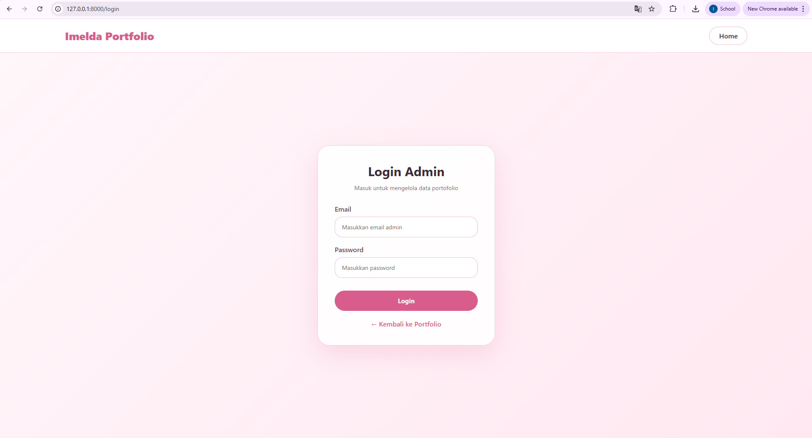
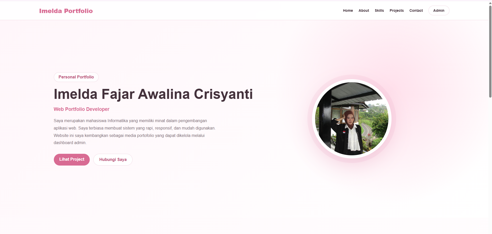
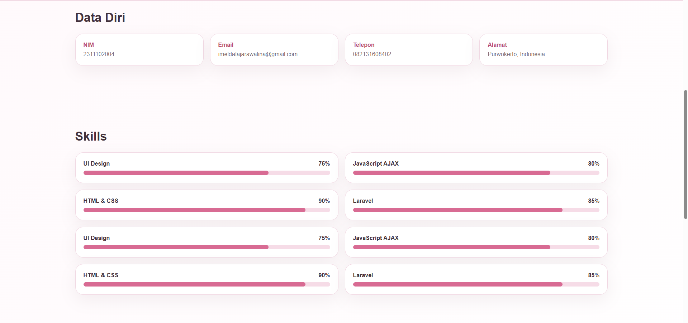
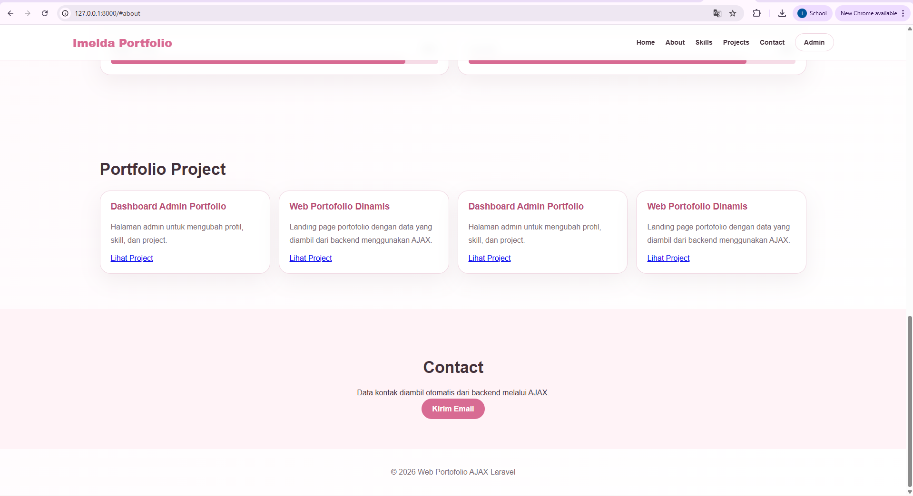
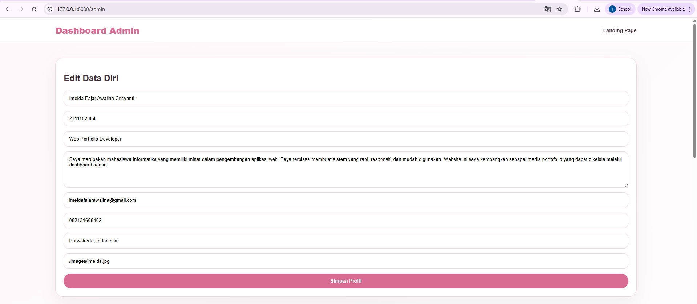
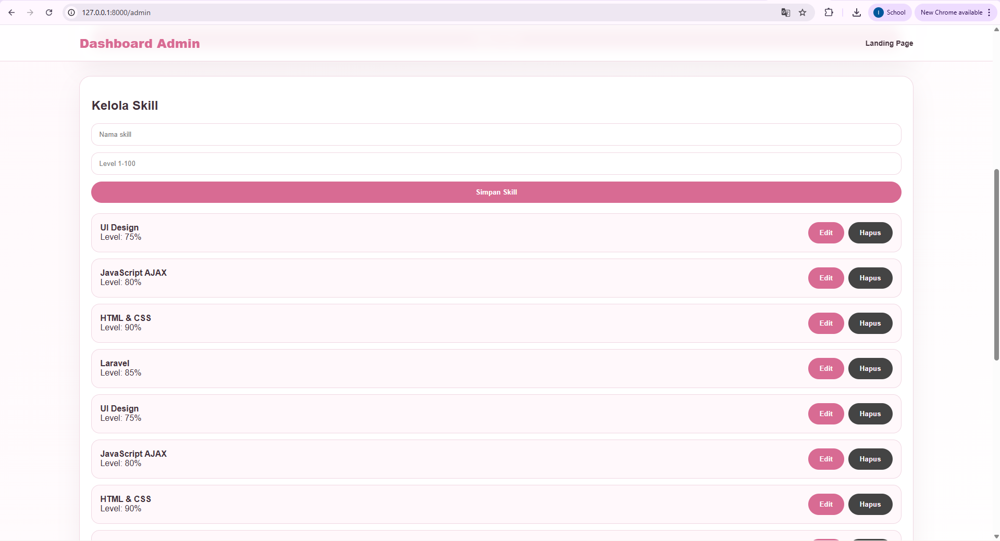
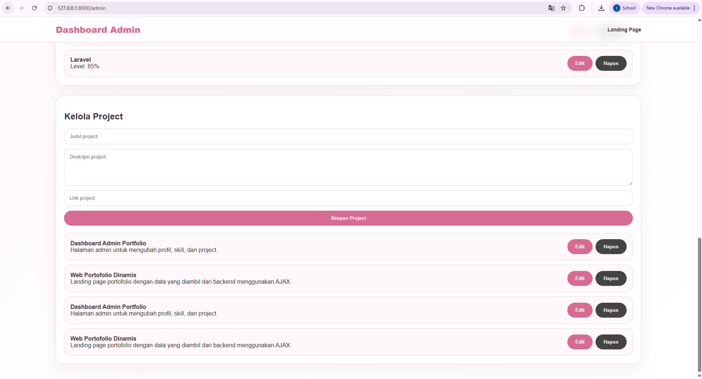
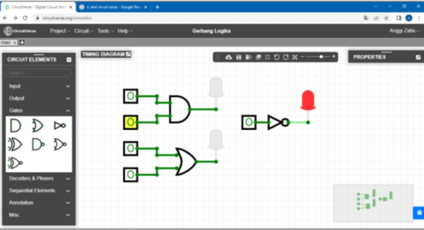

<h1 align="center">LAPORAN PRAKTIKUM</h1> <h1 align="center">APLIKASI BERBASIS PLATFORM</h1> <br> <h2 align="center">UJIAN-UTS</h2> <h2 align="center">WEB PORTOFOLIO</h2> <br><br> <p align="center">  </p> <br><br> <h2 align="center">Disusun Oleh :</h2> <p align="center" style="font-size:28px;"> <b>Imelda Fajar</b><br> <b>2311102004</b><br> <b>SI IF 11 REG 01</b> </p> <br> <h2 align="center">Dosen Pengampu :</h2> <p align="center" style="font-size:28px;"> <b>Dimas Fanny Hebrasianto Permadi, S.ST., M.Kom</b> </p> <br> <h2 align="center">Asisten Praktikum :</h2> <p align="center" style="font-size:28px;"> <b>Apri Pandu Wicaksono</b><br> <b>Rangga Pradarrell Fathi</b> </p> <br> <h1 align="center">LABORATORIUM HIGH PERFORMANCE</h1> <h1 align="center">FAKULTAS INFORMATIKA</h1> <h1 align="center">UNIVERSITAS TELKOM PURWOKERTO</h1> <h1 align="center">TAHUN 2026</h1> <hr> ## DASAR TEORI Laravel merupakan framework PHP modern yang menggunakan arsitektur MVC (Model-View-Controller) untuk membangun aplikasi web secara terstruktur dan efisien. Dengan konsep ini, pengelolaan kode menjadi lebih rapi karena setiap bagian aplikasi memiliki tanggung jawab masing-masing, seperti pengolahan data, tampilan, dan logika program. Pada project web profile ini, Laravel digunakan sebagai backend untuk mengelola data seperti informasi diri, daftar skill, dan project. Data tersebut disimpan di dalam database dan diakses melalui Model, kemudian diproses oleh Controller sebelum ditampilkan ke pengguna melalui View. Selain itu, project ini memanfaatkan API (Application Programming Interface) yang dibuat menggunakan Laravel. API berfungsi sebagai penghubung antara backend dan frontend, sehingga data profile, skill, dan project tidak ditampilkan secara langsung, melainkan diambil terlebih dahulu dari server. Untuk meningkatkan interaktivitas, digunakan teknologi AJAX (Asynchronous JavaScript and XML) dalam pengambilan data. Dengan AJAX, halaman web dapat menampilkan atau memperbarui data tanpa perlu melakukan reload halaman. Hal ini membuat website profile menjadi lebih dinamis dan memberikan pengalaman pengguna yang lebih baik. Laravel juga menyediakan fitur migration dan seeder yang digunakan untuk mengatur struktur database serta mengisi data awal. Fitur ini membantu dalam proses pengembangan karena memudahkan pembuatan tabel dan pengelolaan data secara sistematis. Dengan kombinasi Laravel, API, dan AJAX, web profile yang dibuat mampu menampilkan informasi secara dinamis serta menyediakan dashboard admin untuk mengelola konten seperti deskripsi, foto profile, skill, dan project. Hal ini menjadikan aplikasi lebih fleksibel dan mudah dikembangkan di masa depan. ## SOURCE CODE Source code untuk pengerjaan project PORTOFOLIO secara lengkap dapat dilihat pada repositori dan folder proyek aplikasi ini, khususnya berada di dalam folder /portfolio. ### login.blade.php
<!DOCTYPE html>
<html lang="id">
<head>
    <meta charset="UTF-8">
    <meta name="viewport" content="width=device-width, initial-scale=1.0">
    <title>Login Admin | Imelda Portfolio</title>

    <style>
        * {
            margin: 0;
            padding: 0;
            box-sizing: border-box;
            font-family: 'Segoe UI', sans-serif;
        }

        body {
            min-height: 100vh;
            background: linear-gradient(135deg, #fff7fb, #ffe8f1);
            color: #3b2c35;
        }

        .navbar {
            height: 80px;
            padding: 0 8%;
            display: flex;
            justify-content: space-between;
            align-items: center;
            background: #fff;
            border-bottom: 1px solid #f5cddd;
        }

        .logo {
            font-size: 26px;
            font-weight: 800;
            color: #d85c8c;
        }

        .nav-link {
            text-decoration: none;
            color: #3b2c35;
            font-weight: 600;
            padding: 10px 22px;
            border: 1px solid #f2bdd2;
            border-radius: 25px;
        }

        .login-wrapper {
            min-height: calc(100vh - 80px);
            display: flex;
            justify-content: center;
            align-items: center;
            padding: 40px;
        }

        .login-card {
            width: 420px;
            background: rgba(255, 255, 255, 0.9);
            border-radius: 28px;
            padding: 40px;
            box-shadow: 0 20px 60px rgba(216, 92, 140, 0.18);
            border: 1px solid #f6cfe0;
        }

        .login-card h2 {
            text-align: center;
            margin-bottom: 10px;
            color: #3b2c35;
            font-size: 30px;
        }

        .login-card p {
            text-align: center;
            margin-bottom: 30px;
            color: #8a6f7d;
            font-size: 14px;
        }

        .form-group {
            margin-bottom: 18px;
        }

        label {
            display: block;
            margin-bottom: 8px;
            font-weight: 600;
            color: #6a4a5a;
        }

        input {
            width: 100%;
            padding: 14px 16px;
            border-radius: 18px;
            border: 1px solid #f1bfd3;
            outline: none;
            font-size: 14px;
            background: #fff;
        }

        input:focus {
            border-color: #d85c8c;
            box-shadow: 0 0 0 4px rgba(216, 92, 140, 0.12);
        }

        .btn-login {
            width: 100%;
            margin-top: 12px;
            padding: 14px;
            border: none;
            border-radius: 25px;
            background: #d85c8c;
            color: white;
            font-weight: 700;
            font-size: 15px;
            cursor: pointer;
        }

        .btn-login:hover {
            background: #c9487b;
        }

        .error {
            background: #ffe1e8;
            color: #c0395f;
            padding: 12px;
            border-radius: 14px;
            margin-bottom: 20px;
            text-align: center;
        }

        .back-home {
            display: block;
            text-align: center;
            margin-top: 20px;
            color: #d85c8c;
            text-decoration: none;
            font-weight: 600;
        }
    </style>
</head>
<body>

    <div class="navbar">
        <div class="logo">Imelda Portfolio</div>
        <a href="/" class="nav-link">Home</a>
    </div>

    <div class="login-wrapper">
        <div class="login-card">
            <h2>Login Admin</h2>
            <p>Masuk untuk mengelola data portofolio</p>

            @if(session('error'))
                <div class="error">{{ session('error') }}</div>
            @endif

            <form method="POST" action="/login">
                @csrf

                <div class="form-group">
                    <label>Email</label>
                    <input type="email" name="email" placeholder="Masukkan email admin" required>
                </div>

                <div class="form-group">
                    <label>Password</label>
                    <input type="password" name="password" placeholder="Masukkan password" required>
                </div>

                <button type="submit" class="btn-login">Login</button>
            </form>

            <a href="/" class="back-home">← Kembali ke Portfolio</a>
        </div>
    </div>

</body>
</html>
### home.blade.php
<!DOCTYPE html>
<html lang="id">
<head>
    <meta charset="UTF-8">
    <meta name="viewport" content="width=device-width, initial-scale=1.0">
    <meta name="csrf-token" content="{{ csrf_token() }}">
    <title>Web Portofolio</title>
    <link rel="stylesheet" href="/css/style.css">
</head>
<body>
    <header class="navbar">
        <div class="brand" id="brandName">My Portfolio</div>
        <nav>
            <a href="#home">Home</a>
            <a href="#about">About</a>
            <a href="#skills">Skills</a>
            <a href="#projects">Projects</a>
            <a href="#contact">Contact</a>
            <a href="/admin" class="nav-button">Admin</a>
        </nav>
    </header>

    <main>
        <section class="hero" id="home">
            <div class="hero-text">
                <span class="badge">Personal Portfolio</span>
                <h1 id="profileName">Memuat data...</h1>
                <h3 id="profileRole"></h3>
                <p id="profileDescription"></p>
                <div class="hero-actions">
                    <a href="#projects" class="primary-button">Lihat Project</a>
                    <a href="#contact" class="secondary-button">Hubungi Saya</a>
                </div>
            </div>
            <div class="hero-photo-wrap">
                
            </div>
        </section>

        <section class="section" id="about">
            <h2>Data Diri</h2>
            <div class="info-grid">
                <div class="info-card"><b>NIM</b><span id="profileNim"></span></div>
                <div class="info-card"><b>Email</b><span id="profileEmail"></span></div>
                <div class="info-card"><b>Telepon</b><span id="profilePhone"></span></div>
                <div class="info-card"><b>Alamat</b><span id="profileAddress"></span></div>
            </div>
        </section>

        <section class="section" id="skills">
            <h2>Skills</h2>
            <div id="skillList" class="skill-list"></div>
        </section>

        <section class="section" id="projects">
            <h2>Portfolio Project</h2>
            <div id="projectList" class="project-grid"></div>
        </section>

        <section class="section contact" id="contact">
            <h2>Contact</h2>
            <p>Data kontak diambil otomatis dari backend melalui AJAX.</p>
            <a id="emailButton" href="#" class="primary-button">Kirim Email</a>
        </section>
    </main>

    <footer>
        <p>© 2026 Web Portofolio AJAX Laravel</p>
    </footer>

    <script src="/js/portfolio.js"></script>
</body>
</html>
### admin.blade.php
<!DOCTYPE html>
<html lang="id">
<head>
    <meta charset="UTF-8">
    <meta name="viewport" content="width=device-width, initial-scale=1.0">
    <meta name="csrf-token" content="{{ csrf_token() }}">
    <title>Dashboard Admin</title>
    <link rel="stylesheet" href="/css/style.css">
</head>
<body class="admin-body">
    <header class="navbar">
        <div class="brand">Dashboard Admin</div>
        <nav>
            <a href="/">Landing Page</a>
        </nav>
    </header>

    <main class="admin-container">
        <section class="admin-card">
            <h2>Edit Data Diri</h2>
            <form id="profileForm">
                <input name="name" placeholder="Nama lengkap" required>
                <input name="nim" placeholder="NIM">
                <input name="role" placeholder="Role / Bidang">
                <textarea name="description" placeholder="Deskripsi singkat"></textarea>
                <input name="email" placeholder="Email">
                <input name="phone" placeholder="No HP">
                <input name="address" placeholder="Alamat">
                <input name="photo" placeholder="Path foto, contoh: /images/profile.svg">
                <button type="submit">Simpan Profil</button>
            </form>
        </section>

        <section class="admin-card">
            <h2>Kelola Skill</h2>
            <form id="skillForm">
                <input type="hidden" name="id">
                <input name="name" placeholder="Nama skill" required>
                <input name="level" type="number" min="1" max="100" placeholder="Level 1-100" required>
                <button type="submit">Simpan Skill</button>
            </form>
            <div id="adminSkillList" class="admin-list"></div>
        </section>

        <section class="admin-card">
            <h2>Kelola Project</h2>
            <form id="projectForm">
                <input type="hidden" name="id">
                <input name="title" placeholder="Judul project" required>
                <textarea name="description" placeholder="Deskripsi project"></textarea>
                <input name="link" placeholder="Link project">
                <button type="submit">Simpan Project</button>
            </form>
            <div id="adminProjectList" class="admin-list"></div>
        </section>
    </main>

    <script src="/js/admin.js"></script>
</body>
</html>
## OUTPUT ### Login <p align="center">  </p> ### Landing Page <p align="center">  </p> <p align="center">  </p> <p align="center">  </p> ### Admin <p align="center">  </p> <p align="center">  </p> <p align="center">  </p> <p align="center">  </p>
```

### Output 
Output program menampilkan sebuah tabel sederhana yang berada di tengah halaman. Tabel tersebut memiliki 3 kolom, yaitu Nama Lengkap, Kota Kelahiran, dan Age, serta berisi 3 baris data.


### Pembahasan Source Code
Program ini dibuat menggunakan HTML untuk menampilkan sebuah tabel sederhana yang berisi data nama, kota kelahiran, dan usia. Struktur dasar dokumen HTML diawali dengan <!DOCTYPE html> yang berfungsi sebagai deklarasi bahwa file menggunakan standar HTML5, sehingga browser dapat menampilkan halaman dengan benar. 
Tag <html> merupakan elemen utama yang membungkus seluruh isi dokumen HTML. Di dalamnya terdapat dua bagian utama, yaitu <head> dan <body>. Bagian <head> digunakan untuk menyimpan informasi yang tidak ditampilkan langsung di halaman, seperti judul halaman yang dituliskan dalam tag <title>. Judul tersebut akan muncul pada tab browser. 
Bagian <body> merupakan bagian utama yang berisi semua elemen yang akan ditampilkan kepada pengguna. Pada program ini, digunakan beberapa tag <br> untuk memberikan jarak atau spasi ke bawah agar tampilan tabel tidak berada terlalu atas, sehingga terlihat lebih rapi di tengah halaman secara vertikal. 
Untuk mengatur posisi tabel agar berada di tengah secara horizontal, digunakan tag <center>. Tag ini berfungsi untuk menempatkan elemen di tengah halaman, meskipun dalam praktik modern biasanya digantikan dengan CSS. 
Pembuatan tabel dilakukan dengan menggunakan tag <table>. Pada tag ini terdapat atribut border="1" yang berfungsi untuk menampilkan garis pada tabel sehingga batas antar sel terlihat jelas. Selain itu, digunakan atribut cellspacing="0" untuk menghilangkan jarak antar sel, sehingga garis tabel tampak menyatu dan lebih rapi. 
Di dalam tabel, digunakan tag <tr> (table row) untuk membuat baris. Baris pertama digunakan sebagai header tabel yang berisi judul kolom. Untuk membuat judul kolom digunakan tag <th> (table header), yaitu "Nama Lengkap", "Kota Kelahiran", dan "Age". Tag <th> secara otomatis membuat teks menjadi tebal dan berada di tengah. 
Baris berikutnya digunakan untuk menampilkan data. Setiap data dimasukkan menggunakan tag <td> (table data). Pada program ini terdapat tiga baris data, yaitu: 
Imelda, Pati, 20 
Fajar, Purwokerto, 21 
Crisyanti, Semarang, 28 
Setiap baris data dipisahkan menggunakan tag <tr>, sehingga tabel tersusun secara terstruktur dalam bentuk baris dan kolom. Secara keseluruhan, program ini berhasil menampilkan tabel sederhana yang berisi data identitas dengan rapi. Meskipun tidak menggunakan CSS, tampilan tetap dapat diatur dengan memanfaatkan tag HTML dasar seperti <center> dan <br>. Program ini menunjukkan pemahaman dasar dalam penggunaan struktur HTML dan pembuatan tabel.

### Kesimpulan
Berdasarkan hasil praktikum yang telah dilakukan, dapat disimpulkan bahwa HTML mampu digunakan untuk membuat tampilan halaman web sederhana, khususnya dalam menampilkan data berbentuk tabel. Pada program yang dibuat, data berupa nama, kota kelahiran, dan usia berhasil ditampilkan dengan baik menggunakan tabel. Selain itu, meskipun tidak menggunakan CSS, tampilan tetap dapat diatur agar terlihat lebih rapi dengan memanfaatkan tag <center> untuk penempatan di tengah dan <br> untuk memberikan jarak antar elemen. Dengan demikian, praktikum ini membantu dalam memahami dasar penggunaan HTML, khususnya dalam pembuatan tabel serta pengaturan tampilan sederhana. Hasil yang diperoleh sudah sesuai dengan tujuan praktikum, yaitu menampilkan data dalam bentuk tabel secara jelas dan terorganisir. 
