<div align="center">

## LAPORAN PRAKTIKUM <br> APLIKASI BERBASIS PLATFORM

<br>

### UTS
### WEB PORTOFOLIO LARAVEL

<br>
<br>


<br>
<br>
<br>

**Disusun oleh:**

**Diva Octaviani**  
**2311102006**

<br>

**KELAS PS1IF-11-REG01**

**Dosen: Dimas Fanny Hebrasianto Permadi, S.ST., M.Kom**

<br><br>

## PROGRAM STUDI S1 TEKNIK INFORMATIKA <br> FAKULTAS INFORMATIKA <br> UNIVERSITAS TELKOM PURWOKERTO <br> 2026 <br><br>

</div>

---

## 1. Dasar Teori

**Laravel** adalah framework PHP berbasis MVC (*Model-View-Controller*) yang menyediakan struktur pengembangan aplikasi web yang rapi dan terorganisir. Laravel menyediakan berbagai fitur bawaan seperti routing, Eloquent ORM, Blade templating engine, migration, seeder, dan sistem autentikasi berbasis session yang memudahkan pembangunan aplikasi web secara cepat dan aman.

**MVC (Model-View-Controller)** adalah pola arsitektur yang memisahkan logika aplikasi menjadi tiga bagian: Model untuk mengelola data dan interaksi database, View untuk menampilkan antarmuka pengguna, dan Controller sebagai penghubung antara Model dan View yang menangani request dari pengguna.

**Eloquent ORM** adalah fitur Laravel yang memungkinkan interaksi dengan database menggunakan sintaks PHP berbasis objek tanpa perlu menulis query SQL secara langsung. Setiap tabel database direpresentasikan oleh sebuah Model.

**Migration** adalah fitur Laravel untuk mengelola skema database menggunakan kode PHP. Migration memungkinkan perubahan struktur database terdokumentasi dan dapat dijalankan ulang kapan saja menggunakan perintah `php artisan migrate`.

**AJAX (Asynchronous JavaScript and XML)** adalah teknik pengembangan web yang memungkinkan halaman web berkomunikasi dengan server secara asinkron tanpa perlu me-reload halaman. Dalam proyek ini, AJAX diimplementasikan menggunakan **Fetch API** bawaan JavaScript untuk mengambil data dari endpoint backend Laravel sebelum ditampilkan ke halaman publik.

**REST API** adalah arsitektur komunikasi antara client dan server menggunakan protokol HTTP. Laravel menyediakan route API yang mengembalikan data dalam format JSON, yang kemudian diproses dan dirender oleh JavaScript di sisi client.

**Tailwind CSS** adalah framework CSS utility-first yang memungkinkan styling langsung di HTML menggunakan kelas-kelas utilitas. Tailwind digunakan untuk styling keseluruhan tampilan aplikasi CV DIVA, baik halaman publik maupun dashboard admin.

**Blade Templating Engine** adalah sistem template bawaan Laravel yang memungkinkan penulisan kode PHP dalam file view dengan sintaks yang lebih bersih, termasuk fitur layout inheritance, komponen, dan direktif seperti `@foreach`, `@if`, `@csrf`, dan `@section`.

---

## 2. Hasil Praktikum

### **a. Struktur Project**

Project ini dikembangkan menggunakan Laravel dengan nama folder `CV_DIVA` dan database SQLite. Aplikasi terdiri dari dua bagian utama: halaman publik (landing page) dan dashboard admin untuk mengelola konten. Struktur file utama yang digunakan adalah sebagai berikut:

```
CV_DIVA/
├── app/
│   ├── Http/
│   │   └── Controllers/
│   │       ├── Admin/
│   │       │   ├── DashboardController.php
│   │       │   ├── EducationController.php
│   │       │   ├── ExperienceController.php
│   │       │   ├── OrganizationController.php
│   │       │   ├── PortfolioController.php
│   │       │   ├── ProfileController.php
│   │       │   └── SkillController.php
│   │       ├── Auth/
│   │       │   └── AuthenticatedSessionController.php
│   │       └── HomeController.php
│   │
│   └── Models/
│       ├── Education.php
│       ├── Experience.php
│       ├── Organization.php
│       ├── Portfolio.php
│       ├── Profile.php
│       ├── Skill.php
│       └── User.php
│
├── database/
│   ├── migrations/
│   │   ├── create_users_table.php
│   │   ├── create_profile_table.php
│   │   ├── create_educations_table.php
│   │   ├── create_skills_table.php
│   │   ├── create_portfolios_table.php
│   │   ├── create_experiences_table.php
│   │   ├── create_organizations_table.php
│   │   └── add_sort_order_to_experiences_and_organizations_table.php
│   └── database.sqlite
│
├── resources/
│   └── views/
│       ├── admin/
│       │   ├── education/
│       │   │   ├── index.blade.php
│       │   │   └── form.blade.php
│       │   ├── experience/
│       │   │   ├── index.blade.php
│       │   │   └── form.blade.php
│       │   ├── organization/
│       │   │   ├── index.blade.php
│       │   │   └── form.blade.php
│       │   ├── portofolio/
│       │   │   ├── index.blade.php
│       │   │   └── form.blade.php
│       │   ├── skill/
│       │   │   ├── index.blade.php
│       │   │   └── form.blade.php
│       │   └── profile/
│       │       └── edit.blade.php
│       ├── auth/
│       │   └── login.blade.php
│       ├── layouts/
│       │   ├── admin.blade.php
│       │   ├── app.blade.php
│       │   └── guest.blade.php
│       └── home.blade.php
│
└── routes/
    ├── auth.php
    └── web.php
```

### **b. Source Code**

Berikut adalah beberapa source code yang digunakan (untuk lebih lengkap lihat sendiri di file):

#### `routes/web.php`

```php
<?php
use Illuminate\Support\Facades\Route;
use App\Http\Controllers\HomeController;
use App\Http\Controllers\Admin\ProfileController;
use App\Http\Controllers\Admin\EducationController;
use App\Http\Controllers\Admin\ExperienceController;
use App\Http\Controllers\Admin\OrganizationController;
use App\Http\Controllers\Admin\SkillController;
use App\Http\Controllers\Admin\PortfolioController;

// Halaman Publik
Route::get('/', [HomeController::class, 'index'])->name('home');

// API Endpoint (AJAX)
Route::get('/api/profile',       fn() => \App\Models\Profile::first());
Route::get('/api/educations',    fn() => \App\Models\Education::orderBy('sort_order')->get());
Route::get('/api/skills',        fn() => \App\Models\Skill::orderBy('sort_order')->get());
Route::get('/api/portfolios',    fn() => \App\Models\Portfolio::orderBy('sort_order')->get());
Route::get('/api/experiences',   fn() => \App\Models\Experience::orderBy('sort_order')->get());
Route::get('/api/organizations', fn() => \App\Models\Organization::orderBy('sort_order')->get());

// Dashboard Admin (protected)
Route::middleware(['auth'])->prefix('admin')->name('admin.')->group(function () {
    Route::resource('education',    EducationController::class);
    Route::resource('experience',   ExperienceController::class);
    Route::resource('organization', OrganizationController::class);
    Route::resource('skill',        SkillController::class);
    Route::resource('portfolio',    PortfolioController::class);
    Route::get('profile/edit',      [ProfileController::class, 'edit'])->name('profile.edit');
    Route::put('profile',           [ProfileController::class, 'update'])->name('profile.update');
});
```

#### `app/Http/Controllers/Admin/ProfileController.php`

```php
<?php
namespace App\Http\Controllers\Admin;
use App\Http\Controllers\Controller;
use App\Models\Profile;
use Illuminate\Http\Request;

class ProfileController extends Controller {
    public function edit() {
        $profile = Profile::firstOrCreate(['id' => 1]);
        return view('admin.profile.edit', compact('profile'));
    }

    public function update(Request $request) {
        $data = $request->validate([
            'name'              => 'required|string|max:255',
            'title'             => 'required|string|max:255',
            'description'       => 'nullable|string',
            'about_description' => 'nullable|string',
            'email'             => 'nullable|email',
            'github_url'        => 'nullable|url|max:255',
            'instagram_url'     => 'nullable|url|max:255',
            'linkedin_url'      => 'nullable|url|max:255',
            'whatsapp_url'      => 'nullable|url|max:255',
            'image'             => 'nullable|image|max:2048',
        ]);

        if ($request->hasFile('image')) {
            $data['image_url'] = $request->file('image')->store('profile', 'public');
            unset($data['image']);
        }

        Profile::firstOrCreate(['id' => 1])->update($data);
        return back()->with('success', 'Profile berhasil diupdate!');
    }
}
```

#### `app/Http/Controllers/Admin/EducationController.php`

```php
<?php
namespace App\Http\Controllers\Admin;
use App\Http\Controllers\Controller;
use App\Models\Education;
use Illuminate\Http\Request;

class EducationController extends Controller {
    public function index() {
        return view('admin.education.index', ['items' => Education::orderBy('sort_order')->get()]);
    }
    public function create() { return view('admin.education.form', ['item' => new Education()]); }
    public function store(Request $r) {
        Education::create($this->validateData($r));
        return redirect()->route('admin.education.index')->with('success', 'Ditambahkan!');
    }
    public function edit(Education $education) {
        return view('admin.education.form', ['item' => $education]);
    }
    public function update(Request $r, Education $education) {
        $education->update($this->validateData($r));
        return redirect()->route('admin.education.index')->with('success', 'Diupdate!');
    }
    public function destroy(Education $education) {
        $education->delete();
        return back()->with('success', 'Dihapus!');
    }
    private function validateData(Request $r) {
        return $r->validate([
            'period'      => 'required|string|max:100',
            'institution' => 'required|string|max:255',
            'major'       => 'nullable|string|max:255',
            'description' => 'nullable|string',
            'sort_order'  => 'nullable|integer',
        ]);
    }
}
```

#### `app/Http/Controllers/Admin/ExperienceController.php`

```php
<?php
namespace App\Http\Controllers\Admin;
use App\Http\Controllers\Controller;
use App\Models\Experience;
use Illuminate\Http\Request;

class ExperienceController extends Controller {
    public function index() {
        return view('admin.experience.index', ['experiences' => Experience::orderBy('sort_order')->get()]);
    }
    public function create() { return view('admin.experience.form', ['experience' => new Experience()]); }
    public function store(Request $r) {
        $data = $this->validateData($r);
        $data['responsibilities'] = $this->parseResponsibilities($r->responsibilities);
        Experience::create($data);
        return redirect()->route('admin.experience.index')->with('success', 'Ditambahkan!');
    }
    public function edit(Experience $experience) {
        return view('admin.experience.form', compact('experience'));
    }
    public function update(Request $r, Experience $experience) {
        $data = $this->validateData($r);
        $data['responsibilities'] = $this->parseResponsibilities($r->responsibilities);
        $experience->update($data);
        return redirect()->route('admin.experience.index')->with('success', 'Diupdate!');
    }
    public function destroy(Experience $experience) {
        $experience->delete();
        return back()->with('success', 'Dihapus!');
    }
    private function validateData(Request $r) {
        return $r->validate([
            'period'     => 'required|string|max:100',
            'position'   => 'required|string|max:255',
            'company'    => 'required|string|max:255',
            'sort_order' => 'nullable|integer',
        ]);
    }
    private function parseResponsibilities(?string $text): array {
        return collect(explode("\n", $text ?? ''))
            ->map(fn($l) => trim($l))->filter()->values()->all();
    }
}
```

#### `database/migrations/create_profile_table.php`

```php
<?php
use Illuminate\Database\Migrations\Migration;
use Illuminate\Database\Schema\Blueprint;
use Illuminate\Support\Facades\Schema;

return new class extends Migration {
    public function up(): void {
        Schema::create('profile', function (Blueprint $table) {
            $table->id();
            $table->string('name');
            $table->string('title');
            $table->text('description')->nullable();
            $table->text('about_description')->nullable();
            $table->string('image_url')->nullable();
            $table->string('cv_url')->nullable();
            $table->string('email')->nullable();
            $table->string('github_url')->nullable();
            $table->string('instagram_url')->nullable();
            $table->string('linkedin_url')->nullable();
            $table->string('whatsapp_url')->nullable();
            $table->timestamps();
        });
    }

    public function down(): void {
        Schema::dropIfExists('profile');
    }
};
```

#### `database/migrations/create_educations_table.php`

```php
return new class extends Migration {
    public function up(): void {
        Schema::create('educations', function (Blueprint $table) {
            $table->id();
            $table->string('period');
            $table->string('institution');
            $table->string('major')->nullable();
            $table->text('description')->nullable();
            $table->integer('sort_order')->default(0);
            $table->timestamps();
        });
    }
};
```

#### `database/migrations/create_experiences_table.php`

```php
return new class extends Migration {
    public function up(): void {
        Schema::create('experiences', function (Blueprint $table) {
            $table->id();
            $table->string('period');
            $table->string('position');
            $table->string('company');
            $table->json('responsibilities')->nullable();
            $table->integer('sort_order')->default(0);
            $table->timestamps();
        });
    }
};
```

#### `database/migrations/create_organizations_table.php`

```php
return new class extends Migration {
    public function up(): void {
        Schema::create('organizations', function (Blueprint $table) {
            $table->id();
            $table->string('period');
            $table->string('position');
            $table->string('organization_name');
            $table->json('responsibilities')->nullable();
            $table->integer('sort_order')->default(0);
            $table->timestamps();
        });
    }
};
```

#### `resources/views/home.blade.php` — Fetch API (AJAX)

```javascript
document.addEventListener('DOMContentLoaded', function () {

    // Fetch Profile
    fetch('/api/profile')
        .then(r => r.json())
        .then(p => {
            if (!p) return;
            document.getElementById('hero-name').textContent    = p.name        ?? '';
            document.getElementById('hero-title').textContent   = p.title       ?? '';
            document.getElementById('hero-tagline').textContent = p.description ?? '';

            const aboutText = document.getElementById('about-text');
            if (aboutText) aboutText.textContent = p.about_description ?? '';

            const wrapper = document.getElementById('hero-image-wrapper');
            if (p.image_url && !p.image_url.startsWith('http')) {
                wrapper.innerHTML = ``;
            } else {
                const initial = p.name ? p.name.charAt(0).toUpperCase() : 'D';
                wrapper.innerHTML = `<span class="gold-gradient">${initial}</span>`;
            }
        });

    // Fetch Education
    fetch('/api/educations')
        .then(r => r.json())
        .then(items => {
            const el = document.getElementById('education-list');
            el.innerHTML = items.length
                ? items.map(e => `
                    <div class="bg-navy-800 border border-gold/20 rounded-xl p-6">
                        <p class="text-gold text-sm mb-2">${e.period ?? ''}</p>
                        <h3 class="text-2xl font-bold mb-1">${e.institution ?? ''}</h3>
                        <p class="mb-3">${e.major ?? ''}</p>
                        <p class="text-gray-400 text-sm">${e.description ?? ''}</p>
                    </div>`).join('')
                : '<div class="text-gray-400">Belum ada data</div>';
        });

    // Fetch Experiences
    fetch('/api/experiences')
        .then(r => r.json())
        .then(items => {
            const el = document.getElementById('experiences-list');
            el.innerHTML = items.length
                ? items.map(e => `
                    <div class="bg-navy-700 border border-gold/20 rounded-xl p-4">
                        <span class="text-xs font-semibold text-gold">${e.period}</span>
                        <h4 class="text-white font-bold">${e.position}</h4>
                        <p class="text-gray-400 italic text-sm">${e.company}</p>
                        ${e.responsibilities?.length
                            ? `<ul>${e.responsibilities.map(r =>
                                `<li class="text-gray-300 text-sm flex gap-2">
                                    <span class="text-gold">•</span>${r}
                                </li>`).join('')}</ul>`
                            : ''}
                    </div>`).join('')
                : '<div class="text-gray-400">Belum ada data</div>';
        });

    // Fetch Skills
    fetch('/api/skills')
        .then(r => r.json())
        .then(items => {
            const el = document.getElementById('skills-list');
            el.innerHTML = items.length
                ? items.map(s => `
                    <div class="bg-navy-700 border border-gold/20 rounded-lg p-4 text-center">
                        <p class="font-semibold">${s.name}</p>
                        ${s.category ? `<p class="text-xs text-gold mt-1">${s.category}</p>` : ''}
                    </div>`).join('')
                : '<div class="text-gray-400">Belum ada data</div>';
        });
});
```

#### `resources/views/admin/profile/edit.blade.php`

```php
@extends('layouts.admin')
@section('title', 'Edit Profile')
@section('content')

@if(session('success'))
    <div class="mb-4 p-4 bg-green-500/20 border border-green-500/40 text-green-300 rounded-lg">
        {{ session('success') }}
    </div>
@endif

<h1 class="text-3xl font-bold text-amber-400 mb-6">Edit Profile</h1>

<form method="POST" action="{{ route('admin.profile.update') }}" enctype="multipart/form-data"
      class="bg-slate-800 p-6 rounded-xl border border-amber-500/20 space-y-4 max-w-4xl w-full">
    @csrf @method('PUT')

    @foreach([
        'name'         => 'Nama Lengkap',
        'title'        => 'Judul/Profesi',
        'email'        => 'Email',
        'github_url'   => 'GitHub URL',
        'instagram_url'=> 'Instagram URL',
        'linkedin_url' => 'LinkedIn URL',
        'whatsapp_url' => 'WhatsApp URL',
    ] as $f => $l)
    <div>
        <label class="text-slate-300 text-sm">{{ $l }}</label>
        <input type="text" name="{{ $f }}" value="{{ old($f, $profile->$f) }}"
               class="w-full mt-1 px-4 py-2 bg-slate-900 border border-slate-700 rounded-lg text-white">
        @error($f)<p class="text-red-400 text-xs mt-1">{{ $message }}</p>@enderror
    </div>
    @endforeach

    <div>
        <label class="text-slate-300 text-sm">Bio / Tagline</label>
        <textarea name="description" rows="3"
                  class="w-full mt-1 px-4 py-2 bg-slate-900 border border-slate-700 rounded-lg text-white">
            {{ old('description', $profile->description) }}
        </textarea>
    </div>

    <div>
        <label class="text-slate-300 text-sm">About Description</label>
        <textarea name="about_description" rows="3"
                  class="w-full mt-1 px-4 py-2 bg-slate-900 border border-slate-700 rounded-lg text-white">
            {{ old('about_description', $profile->about_description) }}
        </textarea>
    </div>

    <div>
        <label class="text-slate-300 text-sm">Foto Profile</label>
        @if($profile->image_url)
            image_url) }}"
                 class="w-40 h-40 rounded-full object-cover mb-2 border-2 border-amber-500">
        @endif
        <input type="file" name="image" accept="image/*"
               class="w-full mt-1 px-4 py-2 bg-slate-900 border border-slate-700 rounded-lg text-white">
    </div>

    <button class="px-6 py-2 bg-amber-500 text-slate-900 font-bold rounded-lg">Simpan</button>
</form>
@endsection
```

#### `resources/views/admin/education/index.blade.php`

```php
@extends('layouts.admin')
@section('content')

@if(session('success'))
    <div class="mb-4 p-4 bg-green-500/20 border border-green-500/40 text-green-300 rounded-lg">
        {{ session('success') }}
    </div>
@endif

<div class="flex justify-between mb-6">
    <h1 class="text-3xl font-bold text-amber-400">Education</h1>
    <a href="{{ route('admin.education.create') }}"
       class="px-4 py-2 bg-amber-500 text-slate-900 font-semibold rounded-lg">+ Tambah</a>
</div>
<div class="bg-slate-800 rounded-xl border border-amber-500/20 overflow-hidden">
    <table class="w-full">
        <thead class="bg-slate-900"><tr class="text-left text-amber-400">
            <th class="p-3">Periode</th><th class="p-3">Institusi</th>
            <th class="p-3">Jurusan</th><th class="p-3 text-right">Aksi</th>
        </tr></thead>
        <tbody>
            @forelse($items as $item)
            <tr class="border-t border-slate-700">
                <td class="p-3">{{ $item->period }}</td>
                <td class="p-3">{{ $item->institution }}</td>
                <td class="p-3">{{ $item->major }}</td>
                <td class="p-3 text-right space-x-2">
                    <a href="{{ route('admin.education.edit', $item) }}" class="text-amber-400">Edit</a>
                    <form method="POST" action="{{ route('admin.education.destroy', $item) }}"
                          class="inline" onsubmit="return confirm('Yakin?')">
                        @csrf @method('DELETE')
                        <button class="text-red-400">Hapus</button>
                    </form>
                </td>
            </tr>
            @empty
            <tr><td colspan="4" class="p-6 text-center text-slate-500">Belum ada data</td></tr>
            @endforelse
        </tbody>
    </table>
</div>
@endsection
```

#### `resources/views/admin/education/form.blade.php`

```php
@extends('layouts.admin')
@section('content')

@if(session('success'))
    <div class="mb-4 p-4 bg-green-500/20 border border-green-500/40 text-green-300 rounded-lg">
        {{ session('success') }}
    </div>
@endif

<h1 class="text-3xl font-bold text-amber-400 mb-6">
    {{ $item->exists ? 'Edit' : 'Tambah' }} Education
</h1>

<form method="POST"
      action="{{ $item->exists ? route('admin.education.update',$item) : route('admin.education.store') }}"
      class="bg-slate-800 p-6 rounded-xl border border-amber-500/20 space-y-4 max-w-4xl w-full">
    @csrf @if($item->exists) @method('PUT') @endif

    <div>
        <label class="text-slate-300 text-sm">Periode (cth: 2021-2025)</label>
        <input type="text" name="period" value="{{ old('period', $item->period) }}"
               class="w-full mt-1 px-4 py-2 bg-slate-900 border border-slate-700 rounded-lg text-white">
        @error('period')<p class="text-red-400 text-xs mt-1">{{ $message }}</p>@enderror
    </div>

    <div>
        <label class="text-slate-300 text-sm">Institusi</label>
        <input type="text" name="institution" value="{{ old('institution', $item->institution) }}"
               class="w-full mt-1 px-4 py-2 bg-slate-900 border border-slate-700 rounded-lg text-white">
        @error('institution')<p class="text-red-400 text-xs mt-1">{{ $message }}</p>@enderror
    </div>

    <div>
        <label class="text-slate-300 text-sm">Jurusan</label>
        <input type="text" name="major" value="{{ old('major', $item->major) }}"
               class="w-full mt-1 px-4 py-2 bg-slate-900 border border-slate-700 rounded-lg text-white">
    </div>

    <div>
        <label class="text-slate-300 text-sm">Urutan</label>
        <input type="number" name="sort_order" value="{{ old('sort_order', $item->sort_order) }}"
               class="w-full mt-1 px-4 py-2 bg-slate-900 border border-slate-700 rounded-lg text-white">
    </div>

    <div>
        <label class="text-slate-300 text-sm">Deskripsi</label>
        <textarea name="description" rows="3"
                  class="w-full mt-1 px-4 py-2 bg-slate-900 border border-slate-700 rounded-lg text-white">
            {{ old('description', $item->description) }}
        </textarea>
    </div>

    <button class="px-6 py-2 bg-amber-500 text-slate-900 font-bold rounded-lg">Simpan</button>
</form>
@endsection
```

---

Kode di atas dapat dijelaskan per bagian sebagai berikut:

- **routes/web.php**: Mendefinisikan seluruh URL aplikasi. Route publik (`/`) menampilkan landing page. Route `/api/*` mengembalikan data JSON yang dikonsumsi oleh Fetch API di frontend secara asinkron. Route admin dilindungi middleware `auth` sehingga hanya bisa diakses setelah login.

- **ProfileController.php**: Menangani tampilan dan pembaruan data profil. Method `update()` memvalidasi input, menyimpan foto ke storage publik menggunakan `store('profile', 'public')`, dan menyimpan path file ke kolom `image_url` di database.

- **EducationController.php**: Menangani operasi CRUD data pendidikan. Data diurutkan berdasarkan `sort_order` sehingga admin dapat mengatur urutan tampil. Setiap operasi berhasil mengembalikan pesan sukses menggunakan `with('success', ...)`.

- **ExperienceController.php**: Menangani CRUD pengalaman kerja. Field `responsibilities` disimpan dalam format JSON array, dimana setiap baris textarea dikonversi menjadi satu elemen array menggunakan `explode` dan `filter`.

- **Migration**: Mendefinisikan struktur tabel database untuk setiap entitas (profile, educations, experiences, organizations, skills, portfolios). Dijalankan menggunakan perintah `php artisan migrate` dengan database SQLite.

- **home.blade.php (Fetch API)**: Halaman publik tidak mengambil data langsung dari Blade, melainkan menggunakan JavaScript Fetch API untuk memanggil endpoint `/api/*` setelah halaman dimuat (`DOMContentLoaded`). Data JSON yang diterima kemudian dirender secara dinamis ke elemen HTML yang sesuai.

- **admin/profile/edit.blade.php**: Form edit profil dengan input untuk nama, judul, bio, deskripsi about, seluruh link sosial media, dan upload foto. Menggunakan `enctype="multipart/form-data"` untuk mendukung upload file gambar.

- **admin/education/index.blade.php & form.blade.php**: Halaman daftar dan form pendidikan. Dilengkapi notifikasi sukses (hijau) menggunakan `session('success')` dan validasi error (merah) pada field wajib yang kosong.

### **c. Screenshot Output**

Berikut merupakan tampilan output yang dihasilkan dari aplikasi web portfolio CV DIVA.

### 1. Halaman Login

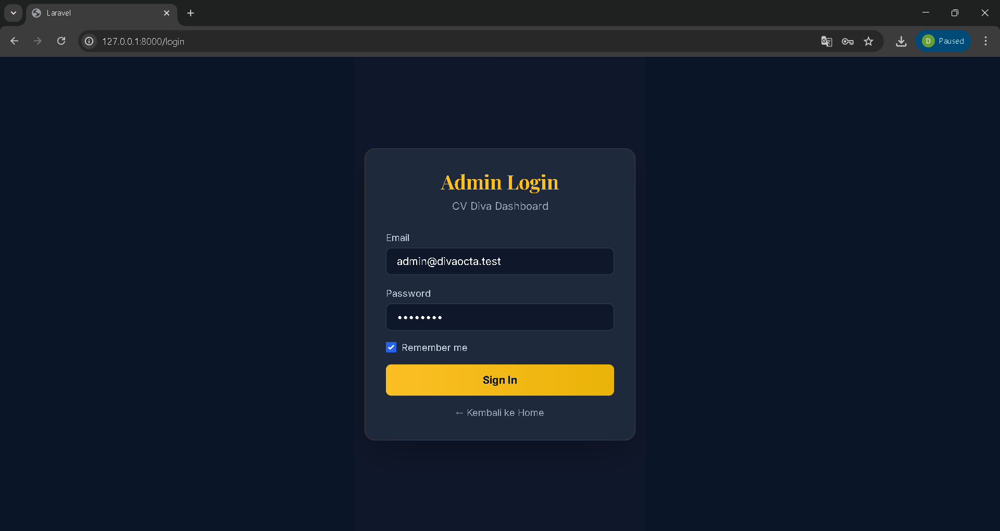

Halaman login menampilkan form autentikasi dengan email dan password. Sistem menggunakan session Laravel sehingga pengguna yang belum login akan diarahkan ke halaman ini secara otomatis jika mencoba mengakses halaman dashboard admin.

### 2. Halaman Publik — Hero Section

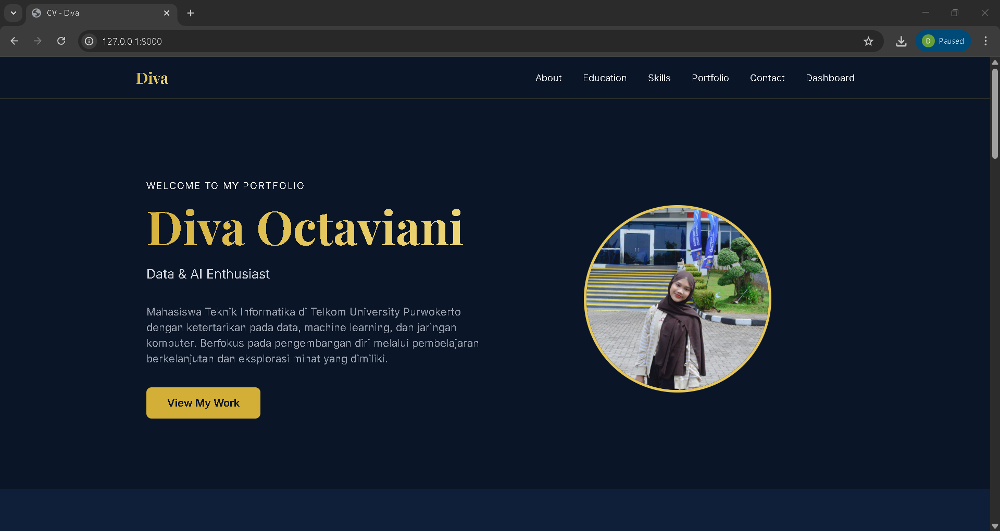

Halaman utama portfolio menampilkan nama, judul profesi, dan foto profil pada hero section. Data ditampilkan secara dinamis menggunakan Fetch API yang memanggil endpoint `/api/profile`. Jika foto profil tersedia, gambar ditampilkan; jika tidak, inisial nama ditampilkan sebagai fallback.

### 3. Halaman Publik — About & Education

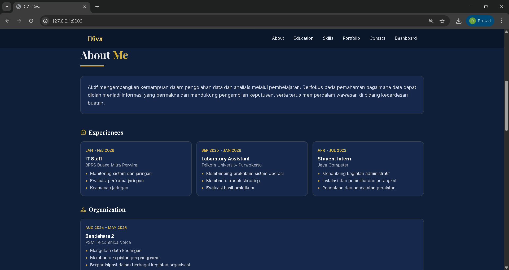

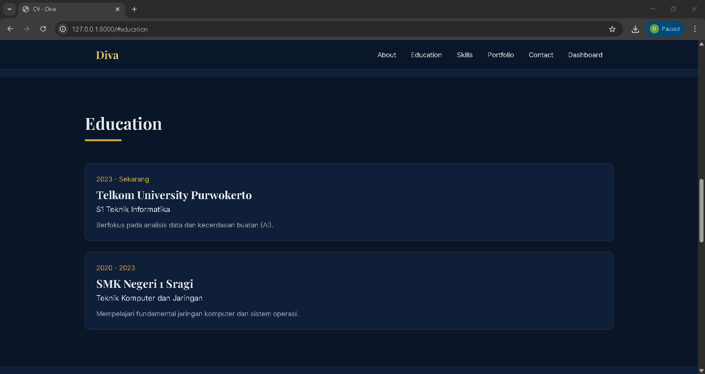

Bagian About menampilkan deskripsi diri. Bagian Experience dan Organization menampilkan kartu-kartu berisi periode, posisi, nama perusahaan/organisasi, dan daftar tanggung jawab. Bagian Education menampilkan riwayat pendidikan.  

### 4. Halaman Publik — Skills, Portfolio, & Contact

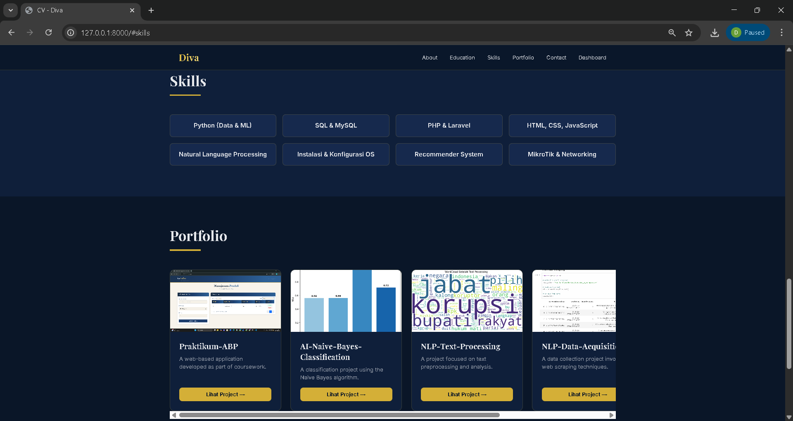

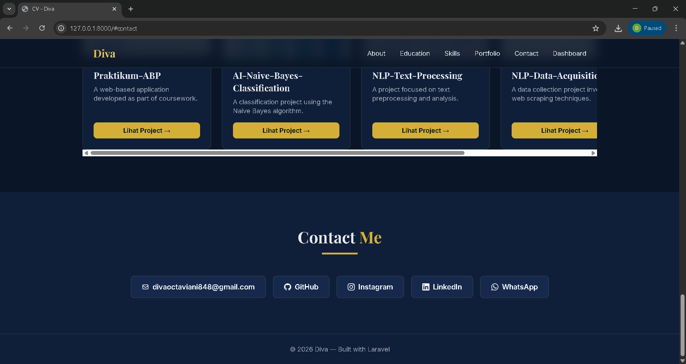

Bagian Skills menampilkan kartu-kartu skill dalam grid. Bagian Portfolio menampilkan proyek-proyek dalam format card horizontal yang dapat di-scroll. Bagian Contact menampilkan media yang bisa dihubungi.
Semua data diambil dari API menggunakan Fetch secara asinkron.

### 5. Dashboard Admin — Edit Profile

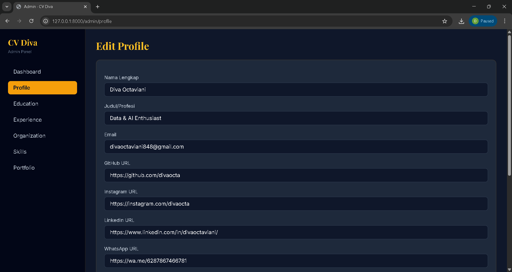


Halaman edit profil memungkinkan admin memperbarui nama, judul, bio, deskripsi about, seluruh link sosial media, dan foto profil. Foto yang berhasil diupload akan tersimpan di storage publik Laravel dan ditampilkan sebagai preview di atas input file.

### 6. Dashboard Admin — Manajemen Education

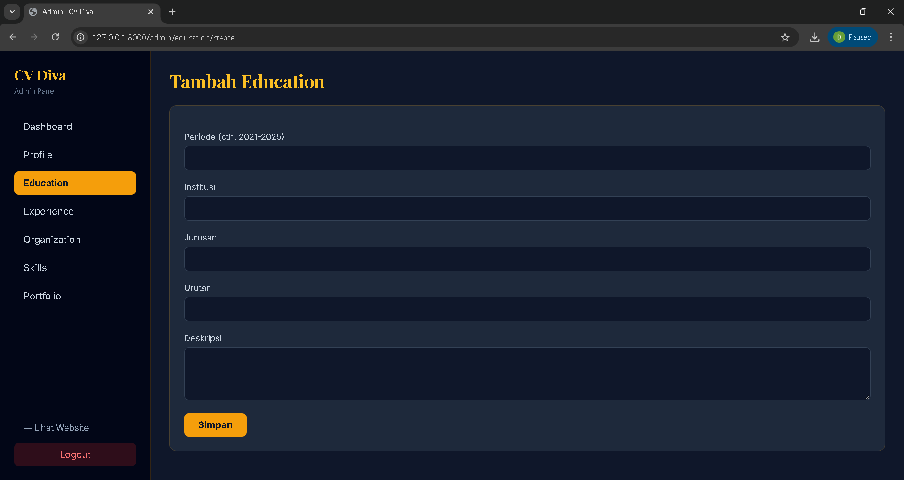

Halaman manajemen pendidikan menampilkan daftar data dalam tabel beserta tombol Edit dan Hapus. Notifikasi hijau muncul setelah operasi berhasil. Form dilengkapi validasi sehingga muncul pesan error merah jika field wajib tidak diisi.

### 7. Dashboard Admin — Manajemen Experience & Organization

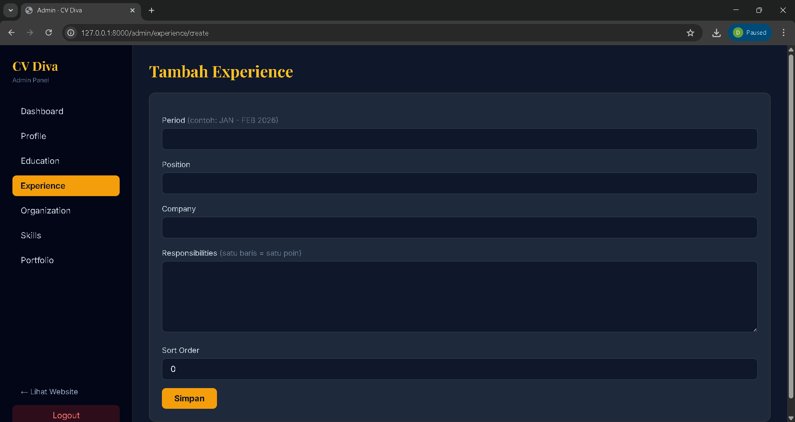

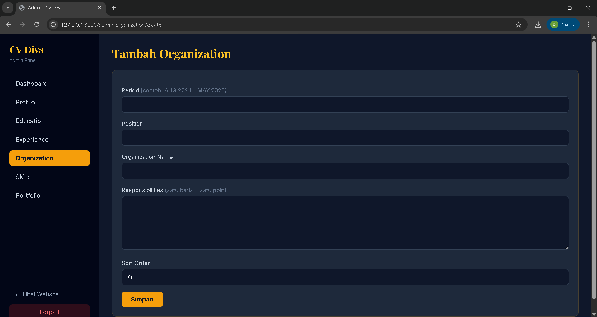

Field `responsibilities` menggunakan textarea dimana setiap baris dikonversi menjadi satu poin daftar yang ditampilkan di halaman publik. Sort order menentukan urutan tampil data di landing page.

### 8. Dashboard Admin — Manajemen Skill & Portfolio

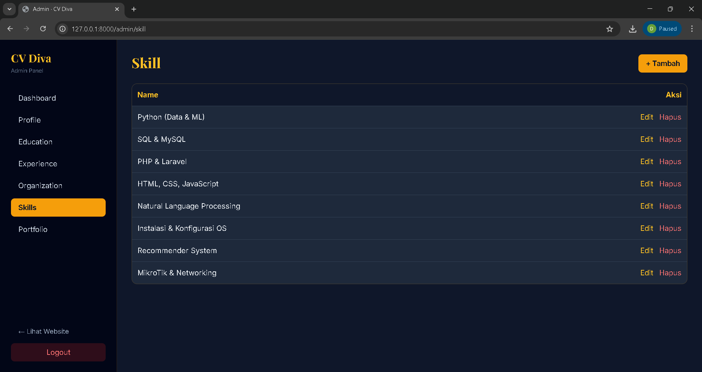

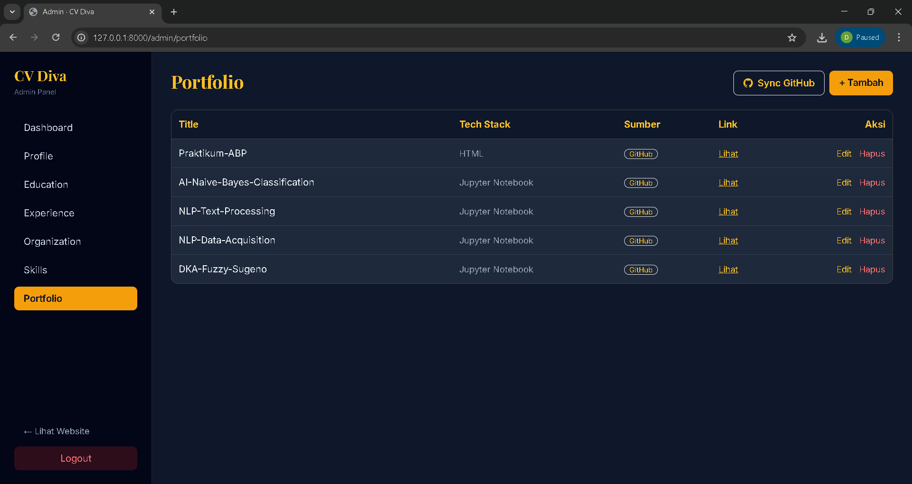

Halaman skill memungkinkan admin menambah, mengedit, dan menghapus skill. Halaman portfolio memungkinkan pengelolaan proyek termasuk upload gambar thumbnail dan pengaturan link proyek.

---

## 3. Kesimpulan

Pada tugas web portfolio ini, telah berhasil dikembangkan aplikasi CV DIVA berbasis Laravel dengan fitur-fitur sebagai berikut:

1. **Sistem Autentikasi Admin** — Login dan logout menggunakan sistem autentikasi bawaan Laravel dengan middleware `auth` untuk melindungi seluruh route dashboard admin dari akses tanpa izin.

2. **Landing Page Dinamis dengan AJAX** — Halaman publik tidak menampilkan data secara langsung dari Blade, melainkan menggunakan JavaScript Fetch API untuk memanggil endpoint `/api/*` dan merender data secara dinamis setelah halaman dimuat.

3. **REST API Backend** — Laravel menyediakan enam endpoint API (profile, educations, skills, portfolios, experiences, organizations) yang mengembalikan data JSON untuk dikonsumsi oleh frontend.

4. **Dashboard Admin CRUD Lengkap** — Admin dapat menambah, mengedit, dan menghapus data untuk semua entitas (profil, pendidikan, pengalaman, organisasi, skill, portfolio) melalui antarmuka dashboard yang intuitif.

5. **Upload & Manajemen Foto** — Foto profil dan gambar portfolio dapat diupload dan disimpan menggunakan fitur Storage Laravel, dengan path disimpan di database dan diakses melalui symbolic link public storage.

6. **Notifikasi dan Validasi** — Setiap operasi CRUD dilengkapi notifikasi sukses (warna hijau) dan validasi form dengan pesan error (warna merah) pada field wajib yang kosong.

7. **Styling dengan Tailwind CSS** — Seluruh tampilan aplikasi menggunakan Tailwind CSS dengan tema warna navy dan gold yang konsisten antara halaman publik dan dashboard admin.

Penggunaan Laravel sebagai framework memberikan struktur kode yang terorganisir dengan pola MVC, kemudahan pengelolaan database melalui Eloquent ORM dan Migration, serta keamanan yang lebih baik melalui sistem autentikasi dan validasi bawaan. Penerapan AJAX melalui Fetch API memisahkan concern antara tampilan dan pengambilan data sehingga halaman dapat memuat konten secara asinkron tanpa perlu reload penuh.
