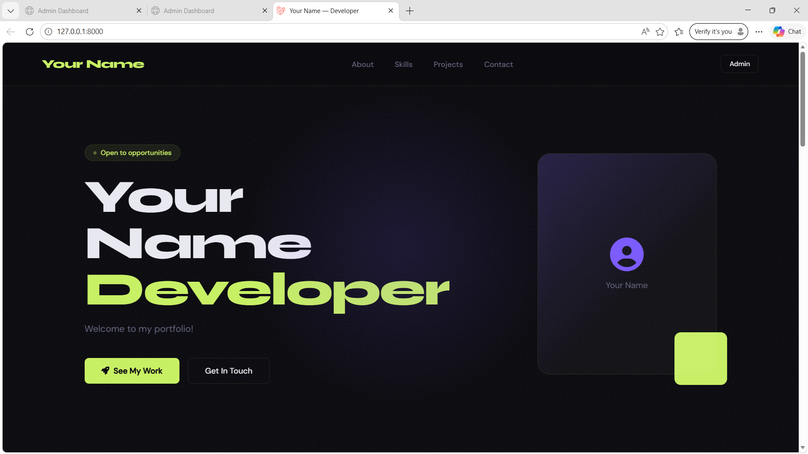
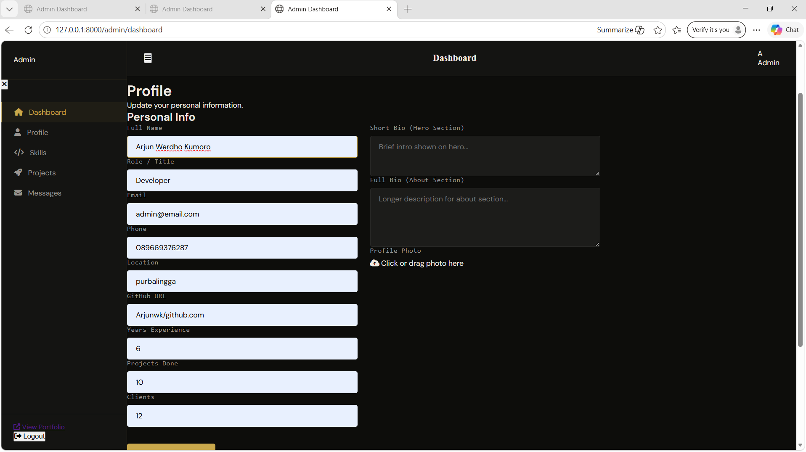

<div align="center">
  <br />
  <h1>LAPORAN PRAKTIKUM <br>APLIKASI BERBASIS PLATFORM</h1>
  <br />
  <h3>UTS <br> WEB PROFILE LARAVEL  </h3>
  <br />
   
  <br />
  <br />
  <br />
  <h3>Disusun Oleh :</h3>
  <p>
    <strong>Arjun Werdho Kumoro</strong><br>
    <strong>2311102009</strong><br>
    <strong>IF-11-REG01</strong>
  </p>
  <br />
  <h3>Dosen Pengampu :</h3>
  <p>
    <strong>Dimas Fanny Hebrasianto Permadi, S.ST., M.Kom</strong>
  </p>
  <br />
  <br />
    <h4>Asisten Praktikum :</h4>
    <strong> Apri Pandu Wicaksono </strong> <br>
    <strong>Rangga Pradarrell Fathi</strong>
  <br />
  <h3>LABORATORIUM HIGH PERFORMANCE
 <br>FAKULTAS INFORMATIKA <br>UNIVERSITAS TELKOM PURWOKERTO <br>2026</h3>
</div>


---
## 2. Struktur Folder
``` 
├── app/
│   ├── Http/
│   │   ├── Controllers/
│   │   │   ├── PortfolioController.php
│   │   │   └── Admin/
│   │   │       ├── AuthController.php
│   │   │       ├── DashboardController.php
│   │   │       ├── ProfileController.php
│   │   │       ├── SkillController.php
│   │   │       ├── ProjectController.php
│   │   │       └── ContactController.php
│   │   │
│   ├── Models/
│   │   ├── Profile.php
│   │   ├── Skill.php
│   │   ├── Project.php
│   │   └── Contact.php
│
├── bootstrap/
├── config/
├── database/
│   ├── migrations/
│   │   ├── create_profiles_table.php
│   │   ├── create_skill_table.php
│   │   ├── create_project_table.php
│   │   └── create_contacts_table.php
│   │
│   └── database.sqlite
│
├── public/
│   ├── index.php
│   ├── css/
│   │   └── admin.css
│   ├── js/
│   │   └── admin.js
│   └── storage/   ← hasil upload foto
│
├── resources/
│   ├── views/
│   │   ├── portfolio/
│   │   │   └── index.blade.php  
│   │   │
│   │   └── admin/
│   │       ├── dashboard.blade.php  
│   │       └── login.blade.php
│
├── routes/
│   ├── web.php
│   └── api.php (opsional)
│
├── storage/
├── vendor/
└── .env
```
---
## 3. Source Code 
### 3.1 AuthController.php
```php
<?php

namespace App\Http\Controllers\Admin;

use App\Http\Controllers\Controller;
use Illuminate\Http\Request;
use Illuminate\Support\Facades\Auth;

class AuthController extends Controller
{
    public function showLogin()
    {
        if (Auth::check()) {
            return redirect()->route('admin.dashboard');
        }
        return view('admin.login');
    }

    public function login(Request $request)
    {
        $request->validate([
            'email'    => 'required|email',
            'password' => 'required',
        ]);

        $credentials = $request->only('email', 'password');

        if (Auth::attempt($credentials)) {
            $request->session()->regenerate();
            return redirect()->route('admin.dashboard');
        }

        return back()->withErrors([
            'email' => 'Email atau password salah.',
        ])->withInput($request->except('password'));
    }

    public function logout(Request $request)
    {
        Auth::logout();
        $request->session()->invalidate();
        $request->session()->regenerateToken();
        return redirect()->route('admin.login');
    }
}
```
### 3.2 ContactController
```php
<?php

namespace App\Http\Controllers\Admin;

use App\Http\Controllers\Controller;
use App\Models\Contact;
use Illuminate\Http\Request;

class ContactController extends Controller
{
    // Public: Simpan pesan dari landing page
    public function store(Request $request)
    {
        $request->validate([
            'name'    => 'required|string|max:100',
            'email'   => 'required|email|max:100',
            'subject' => 'nullable|string|max:200',
            'message' => 'required|string|max:2000',
        ]);

        $contact = Contact::create($request->only(['name', 'email', 'subject', 'message']));

        return response()->json([
            'message' => 'Message sent successfully! I\'ll get back to you soon.',
            'data'    => $contact
        ], 201);
    }

    // Admin: Lihat semua pesan
    public function index()
    {
        $contacts = Contact::orderBy('created_at', 'desc')->get();
        return response()->json(['data' => $contacts]);
    }

    // Admin: Hapus pesan
    public function destroy(Contact $contact)
    {
        $contact->delete();
        return response()->json(['message' => 'Message deleted.']);
    }
}
```
### 3.3 ProfileController.php
```php
<?php

namespace App\Http\Controllers\Admin;

use App\Http\Controllers\Controller;
use App\Models\Profile;
use Illuminate\Http\Request;
use Illuminate\Support\Facades\Storage;

class ProfileController extends Controller
{
    public function show()
    {
        $profile = Profile::first();
        return response()->json(['data' => $profile]);
    }

    public function update(Request $request)
    {
        $request->validate([
            'name'             => 'nullable|string|max:100',
            'role'             => 'nullable|string|max:100',
            'email'            => 'nullable|email|max:100',
            'phone'            => 'nullable|string|max:30',
            'location'         => 'nullable|string|max:100',
            'github'           => 'nullable|string|max:200',
            'short_bio'        => 'nullable|string|max:300',
            'bio'              => 'nullable|string',
            'experience_years' => 'nullable|integer|min:0',
            'projects_done'    => 'nullable|integer|min:0',
            'clients'          => 'nullable|integer|min:0',
            'photo'            => 'nullable|image|max:2048',
        ]);

        $profile = Profile::firstOrNew([]);
        $data = $request->except(['_token', '_method', 'photo']);
        $profile->fill($data);

        if ($request->hasFile('photo')) {
            // Hapus foto lama jika ada
            if ($profile->photo && Storage::disk('public')->exists($profile->photo)) {
                Storage::disk('public')->delete($profile->photo);
            }
            $path = $request->file('photo')->store('photos', 'public');
            $profile->photo = $path;
        }

        $profile->save();

        return response()->json([
            'message' => 'Profile updated successfully.',
            'data'    => $profile
        ]);
    }
}
```

### 3.4 SkillController.php
```php
<?php

namespace App\Http\Controllers\Admin;

use App\Http\Controllers\Controller;
use App\Models\Skill;
use Illuminate\Http\Request;

class SkillController extends Controller
{
    public function index()
    {
        return response()->json(['data' => Skill::orderBy('level', 'desc')->get()]);
    }

    public function store(Request $request)
    {
        $request->validate([
            'name'     => 'required|string|max:100',
            'level'    => 'nullable|integer|min:0|max:100',
            'category' => 'nullable|string|max:100',
        ]);

        $skill = Skill::create($request->only(['name', 'level', 'category']));

        return response()->json(['message' => 'Skill added.', 'data' => $skill], 201);
    }

    public function update(Request $request, Skill $skill)
    {
        $request->validate([
            'name'     => 'required|string|max:100',
            'level'    => 'nullable|integer|min:0|max:100',
            'category' => 'nullable|string|max:100',
        ]);

        $skill->update($request->only(['name', 'level', 'category']));

        return response()->json(['message' => 'Skill updated.', 'data' => $skill]);
    }

    public function destroy(Skill $skill)
    {
        $skill->delete();
        return response()->json(['message' => 'Skill deleted.']);
    }
}
```

### 3.5 ProjectController.php
```php
<?php

namespace App\Http\Controllers\Admin;

use App\Http\Controllers\Controller;
use App\Models\Project;
use Illuminate\Http\Request;
use Illuminate\Support\Facades\Storage;

class ProjectController extends Controller
{
    public function index()
    {
        return response()->json(['data' => Project::orderBy('created_at', 'desc')->get()]);
    }

    public function store(Request $request)
    {
        $request->validate([
            'title'       => 'required|string|max:200',
            'description' => 'nullable|string',
            'link'        => 'nullable|string|max:300',
            'image'       => 'nullable|image|max:3072',
        ]);

        $data = $request->only(['title', 'description', 'link']);

        if ($request->hasFile('image')) {
            $data['image'] = $request->file('image')->store('projects', 'public');
        }

        $project = Project::create($data);

        return response()->json(['message' => 'Project added.', 'data' => $project], 201);
    }

    public function update(Request $request, Project $project)
    {
        $request->validate([
            'title'       => 'required|string|max:200',
            'description' => 'nullable|string',
            'link'        => 'nullable|string|max:300',
            'image'       => 'nullable|image|max:3072',
        ]);

        $data = $request->only(['title', 'description', 'link']);

        if ($request->hasFile('image')) {
            if ($project->image && Storage::disk('public')->exists($project->image)) {
                Storage::disk('public')->delete($project->image);
            }
            $data['image'] = $request->file('image')->store('projects', 'public');
        }

        $project->update($data);

        return response()->json(['message' => 'Project updated.', 'data' => $project]);
    }

    public function destroy(Project $project)
    {
        if ($project->image && Storage::disk('public')->exists($project->image)) {
            Storage::disk('public')->delete($project->image);
        }
        $project->delete();
        return response()->json(['message' => 'Project deleted.']);
    }
}
```

### 3.6 ContactController.php
```php
<?php

namespace App\Http\Controllers\Admin;

use App\Http\Controllers\Controller;
use App\Models\Contact;
use Illuminate\Http\Request;

class ContactController extends Controller
{
    // Public: Simpan pesan dari landing page
    public function store(Request $request)
    {
        $request->validate([
            'name'    => 'required|string|max:100',
            'email'   => 'required|email|max:100',
            'subject' => 'nullable|string|max:200',
            'message' => 'required|string|max:2000',
        ]);

        $contact = Contact::create($request->only(['name', 'email', 'subject', 'message']));

        return response()->json([
            'message' => 'Message sent successfully! I\'ll get back to you soon.',
            'data'    => $contact
        ], 201);
    }

    // Admin: Lihat semua pesan
    public function index()
    {
        $contacts = Contact::orderBy('created_at', 'desc')->get();
        return response()->json(['data' => $contacts]);
    }

    // Admin: Hapus pesan
    public function destroy(Contact $contact)
    {
        $contact->delete();
        return response()->json(['message' => 'Message deleted.']);
    }
}
```

### 3.7 PortfolioController.php (Http/Controller/)
```php
<?php

namespace App\Http\Controllers;

use Illuminate\Http\Request;
use App\Models\Profile;
use App\Models\Skill;
use App\Models\Project;
use App\Models\Contact;

class PortfolioController extends Controller
{
    public function index()
    {
        return view('portfolio.index');
    }

    public function profile()
    {
        $profile = Profile::first();
        return response()->json([
            'data' => $profile ?: (object)[],
        ]);
    }

    public function skills()
    {
        $skills = Skill::orderBy('order')->orderBy('name')->get();
        return response()->json(['data' => $skills]);
    }

    public function projects()
    {
        $projects = Project::orderBy('order')->orderBy('name')->get()->map(function ($p) {
            $p->tech_stack = $p->tech_stack ? json_decode($p->tech_stack, true) : [];
            return $p;
        });
        return response()->json(['data' => $projects]);
    }

    public function contact()
    {
        $contact = Contact::first();
        return response()->json([
            'data' => $contact ?: (object)[],
        ]);
    }
}
```

### 3.8 Profile.php
```php
<?php

namespace App\Models;

use Illuminate\Database\Eloquent\Factories\HasFactory;
use Illuminate\Database\Eloquent\Model;

class Profile extends Model
{
    use HasFactory;

    protected $fillable = [
        'name',
        'role',
        'email',
        'phone',
        'location',
        'github',
        'short_bio',
        'bio',
        'photo',
        'experience_years',
        'projects_done',
        'clients',
    ];
}
```
### 3.9 Skill.php
```php
<?php

namespace App\Models;

use Illuminate\Database\Eloquent\Factories\HasFactory;
use Illuminate\Database\Eloquent\Model;

class Skill extends Model
{
    use HasFactory;

    protected $fillable = ['name', 'level', 'category'];
}
```
### 3.10 Project.php
```php
<?php

namespace App\Models;

use Illuminate\Database\Eloquent\Factories\HasFactory;
use Illuminate\Database\Eloquent\Model;

class Project extends Model
{
    use HasFactory;

    protected $fillable = ['title', 'description', 'link', 'image'];
}
```
### 3.11 Contact.php
```php
<?php

namespace App\Models;

use Illuminate\Database\Eloquent\Factories\HasFactory;
use Illuminate\Database\Eloquent\Model;

class Contact extends Model
{
    use HasFactory;

    protected $fillable = ['name', 'email', 'subject', 'message'];
}
```
### 3.12 create_profiles_table.php
```php
<?php

use Illuminate\Database\Migrations\Migration;
use Illuminate\Database\Schema\Blueprint;
use Illuminate\Support\Facades\Schema;

return new class extends Migration
{
    public function up(): void
    {
        Schema::create('profiles', function (Blueprint $table) {
            $table->id();
            $table->string('name')->nullable();
            $table->string('role')->nullable();
            $table->string('email')->nullable();
            $table->string('phone')->nullable();
            $table->string('location')->nullable();
            $table->string('github')->nullable();
            $table->string('short_bio', 300)->nullable();
            $table->text('bio')->nullable();
            $table->string('photo')->nullable();
            $table->unsignedInteger('experience_years')->default(0);
            $table->unsignedInteger('projects_done')->default(0);
            $table->unsignedInteger('clients')->default(0);
            $table->timestamps();
        });
    }

    public function down(): void
    {
        Schema::dropIfExists('profiles');
    }
};
```
### 3.13 create_skill_table.php
```php
<?php

use Illuminate\Database\Migrations\Migration;
use Illuminate\Database\Schema\Blueprint;
use Illuminate\Support\Facades\Schema;

return new class extends Migration
{
    public function up(): void
    {
        Schema::create('skills', function (Blueprint $table) {
            $table->id();
            $table->string('name', 100);
            $table->unsignedTinyInteger('level')->default(0)->comment('0-100');
            $table->string('category', 100)->nullable();
            $table->timestamps();
        });
    }

    public function down(): void
    {
        Schema::dropIfExists('skills');
    }
};
```
### 3.14 create_project_table.php
```php
<?php

use Illuminate\Database\Migrations\Migration;
use Illuminate\Database\Schema\Blueprint;
use Illuminate\Support\Facades\Schema;

return new class extends Migration
{
    public function up(): void
    {
        Schema::create('projects', function (Blueprint $table) {
            $table->id();
            $table->string('title', 200);
            $table->text('description')->nullable();
            $table->string('link', 300)->nullable();
            $table->string('image')->nullable()->comment('path relatif di storage/app/public');
            $table->timestamps();
        });
    }

    public function down(): void
    {
        Schema::dropIfExists('projects');
    }
};
```
### 3.15 create_contacts_table.php
```php
<?php

use Illuminate\Database\Migrations\Migration;
use Illuminate\Database\Schema\Blueprint;
use Illuminate\Support\Facades\Schema;

return new class extends Migration
{
    public function up(): void
    {
        Schema::create('contacts', function (Blueprint $table) {
            $table->id();
            $table->string('name', 100);
            $table->string('email', 100);
            $table->string('subject', 200)->nullable();
            $table->text('message');
            $table->timestamps();
        });
    }

    public function down(): void
    {
        Schema::dropIfExists('contacts');
    }
};
```
### 3.16 admin.js (public/resource/views/admin)
```js
// ===========================
// ADMIN.JS — Portfolio Admin
// ===========================

const CSRF = document.querySelector('meta[name="csrf-token"]')?.content || '';
const API = { profile: '/api/profile', skills: '/api/skills', projects: '/api/projects', contacts: '/api/contacts' };

function req(url, opts = {}) {
    return fetch(url, {
        headers: { 'Accept': 'application/json', 'X-CSRF-TOKEN': CSRF, ...(opts.headers || {}) },
        ...opts
    }).then(async r => {
        const json = await r.json().catch(() => ({}));
        if (!r.ok) throw new Error(json.message || `Error ${r.status}`);
        return json;
    });
}

function showAlert(id, msg, type = 'success') {
    const el = document.getElementById(id);
    if (!el) return;
    el.className = `alert-inline ${type} show`;
    el.textContent = msg;
    setTimeout(() => { el.className = 'alert-inline'; }, 4000);
}

// ===== TAB NAVIGATION =====
const tabs = document.querySelectorAll('.nav-item[data-tab]');
const panels = document.querySelectorAll('.tab-content');
const pageTitle = document.getElementById('page-title');

function switchTab(name) {
    tabs.forEach(t => t.classList.toggle('active', t.dataset.tab === name));
    panels.forEach(p => p.classList.toggle('active', p.id === `tab-${name}`));
    pageTitle.textContent = name.charAt(0).toUpperCase() + name.slice(1);

    if (name === 'dashboard') loadDashboard();
    if (name === 'skills') loadSkills();
    if (name === 'projects') loadProjects();
    if (name === 'messages') loadMessages();
}

tabs.forEach(t => t.addEventListener('click', e => { e.preventDefault(); switchTab(t.dataset.tab); }));

// ===== MOBILE SIDEBAR =====
document.getElementById('menuBtn')?.addEventListener('click', () => {
    document.getElementById('sidebar').classList.toggle('open');
});
document.getElementById('sidebarClose')?.addEventListener('click', () => {
    document.getElementById('sidebar').classList.remove('open');
});

// ===== DASHBOARD =====
async function loadDashboard() {
    try {
        const [profile, skills, projects, contacts] = await Promise.all([
            req(API.profile), req(API.skills), req(API.projects), req(API.contacts)
        ]);
        const p = profile.data || profile;
        const skCount = (skills.data || skills).length;
        const prCount = (projects.data || projects).length;
        const msgs = contacts.data || contacts;

        document.getElementById('dash-stats').innerHTML = `
            <div class="stat-box">
                <div class="stat-icon" style="background:rgba(200,240,101,0.1);color:var(--accent)"><i class="fas fa-user"></i></div>
                <div class="stat-num">${p.name ? '✓' : '—'}</div>
                <div class="stat-lbl">Profile Status</div>
            </div>
            <div class="stat-box">
                <div class="stat-icon" style="background:rgba(124,92,252,0.1);color:var(--accent2)"><i class="fas fa-code"></i></div>
                <div class="stat-num">${skCount}</div>
                <div class="stat-lbl">Skills Listed</div>
            </div>
            <div class="stat-box">
                <div class="stat-icon" style="background:rgba(200,240,101,0.1);color:var(--accent)"><i class="fas fa-rocket"></i></div>
                <div class="stat-num">${prCount}</div>
                <div class="stat-lbl">Projects</div>
            </div>
            <div class="stat-box">
                <div class="stat-icon" style="background:rgba(255,170,85,0.1);color:#ffaa55"><i class="fas fa-envelope"></i></div>
                <div class="stat-num">${msgs.length}</div>
                <div class="stat-lbl">Messages</div>
            </div>
        `;

        const recent = msgs.slice(0, 5);
        document.getElementById('recent-messages').innerHTML = recent.length
            ? recent.map(m => `
                <div class="msg-card">
                    <div class="msg-meta"><span class="msg-name">${m.name}</span><span class="msg-email">${m.email}</span></div>
                    <div class="msg-subject">${m.subject || '(no subject)'}</div>
                    <div class="msg-body">${m.message.substring(0, 120)}${m.message.length > 120 ? '...' : ''}</div>
                </div>
            `).join('')
            : '<div class="empty"><i class="fas fa-inbox"></i>No messages yet.</div>';

        const badge = document.getElementById('msg-badge');
        if (msgs.length > 0) { badge.textContent = msgs.length; badge.style.display = 'inline'; }
    } catch(e) { console.error('Dashboard error:', e); }
}

// ===== PROFILE =====
async function loadProfile() {
    try {
        const data = await req(API.profile);
        const p = data.data || data;
        ['name','role','email','phone','location','github','bio','short_bio'].forEach(f => {
            const el = document.getElementById(`p_${f}`);
            if (el) el.value = p[f] || '';
        });
        ['exp','proj','clients'].forEach(f => {
            const map = { exp: 'experience_years', proj: 'projects_done', clients: 'clients' };
            const el = document.getElementById(`p_${f}`);
            if (el) el.value = p[map[f]] || '';
        });
        if (p.photo) {
            document.getElementById('photo-preview').innerHTML = ``;
        }
    } catch(e) { console.error('Profile load:', e); }
}

document.getElementById('photo-area')?.addEventListener('click', () => {
    document.getElementById('photo-input').click();
});

document.getElementById('photo-input')?.addEventListener('change', function() {
    if (this.files[0]) {
        const reader = new FileReader();
        reader.onload = e => {
            document.getElementById('photo-preview').innerHTML = ``;
        };
        reader.readAsDataURL(this.files[0]);
    }
});

document.getElementById('profile-form')?.addEventListener('submit', async function(e) {
    e.preventDefault();
    const fd = new FormData(this);
    try {
        await req('/admin/profile', { method: 'POST', body: fd });
        showAlert('profile-alert', '✓ Profile saved successfully!', 'success');
        loadProfile(); // reload form dengan data terbaru
    } catch(err) {
        showAlert('profile-alert', err.message, 'error');
    }
});

// ===== SKILLS =====
async function loadSkills() {
    try {
        const data = await req(API.skills);
        const skills = data.data || data;
        const list = document.getElementById('skills-list');
        list.innerHTML = skills.length
            ? skills.map(s => `
                <div class="list-row" id="skill-row-${s.id}">
                    <div>
                        <div class="list-name">${s.name}</div>
                        <div class="list-meta">${s.category || ''}</div>
                    </div>
                    <div class="mini-bar"><div class="mini-fill" style="width:${s.level || 0}%"></div></div>
                    <span class="list-meta">${s.level || 0}%</span>
                    <div class="list-actions">
                        <button class="btn-icon" onclick="editSkill(${JSON.stringify(s).replace(/"/g,'&quot;')})"><i class="fas fa-edit"></i></button>
                        <button class="btn-icon danger" onclick="deleteSkill(${s.id})"><i class="fas fa-trash"></i></button>
                    </div>
                </div>
            `).join('')
            : '<div class="empty"><i class="fas fa-code"></i>No skills yet. Add your first skill!</div>';
    } catch(e) { console.error('Skills:', e); }
}

function openModal(id) { document.getElementById(id)?.classList.add('open'); }
function closeModal(id) { document.getElementById(id)?.classList.remove('open'); }

document.querySelectorAll('[data-close]').forEach(btn => {
    btn.addEventListener('click', () => closeModal(btn.dataset.close));
});
document.querySelectorAll('.modal-overlay').forEach(overlay => {
    overlay.addEventListener('click', function(e) {
        if (e.target === this) closeModal(this.id);
    });
});

document.getElementById('add-skill-btn')?.addEventListener('click', () => {
    document.getElementById('skill-modal-title').textContent = 'Add Skill';
    document.getElementById('skill-form').reset();
    document.getElementById('skill_id').value = '';
    document.getElementById('range-fill').style.width = '0%';
    openModal('skill-modal');
});

document.getElementById('skill_level')?.addEventListener('input', function() {
    document.getElementById('range-fill').style.width = (this.value || 0) + '%';
});

function editSkill(s) {
    document.getElementById('skill-modal-title').textContent = 'Edit Skill';
    document.getElementById('skill_id').value = s.id;
    document.getElementById('skill_name').value = s.name;
    document.getElementById('skill_level').value = s.level || 0;
    document.getElementById('skill_category').value = s.category || '';
    document.getElementById('range-fill').style.width = (s.level || 0) + '%';
    openModal('skill-modal');
}

document.getElementById('skill-form')?.addEventListener('submit', async function(e) {
    e.preventDefault();
    const id = document.getElementById('skill_id').value;
    const body = JSON.stringify({
        name: document.getElementById('skill_name').value,
        level: document.getElementById('skill_level').value,
        category: document.getElementById('skill_category').value
    });
    try {
        if (id) {
            await req(`/admin/skills/${id}`, { method: 'PUT', body, headers: { 'Content-Type': 'application/json' } });
        } else {
            await req('/admin/skills', { method: 'POST', body, headers: { 'Content-Type': 'application/json' } });
        }
        closeModal('skill-modal');
        loadSkills();
    } catch(err) { alert(err.message); }
});

async function deleteSkill(id) {
    if (!confirm('Delete this skill?')) return;
    try {
        await req(`/admin/skills/${id}`, { method: 'DELETE' });
        loadSkills();
    } catch(err) { alert(err.message); }
}

// ===== PROJECTS =====
async function loadProjects() {
    try {
        const data = await req(API.projects);
        const projects = data.data || data;
        const list = document.getElementById('projects-list');
        list.innerHTML = projects.length
            ? projects.map(p => `
                <div class="list-row" id="proj-row-${p.id}">
                    <div style="flex:1">
                        <div class="list-name">${p.title}</div>
                        <div class="list-meta">${p.description ? p.description.substring(0, 80) + '...' : ''}</div>
                    </div>
                    ${p.link ? `<a href="${p.link}" target="_blank" class="list-meta" style="color:var(--accent);font-size:0.8rem">View →</a>` : ''}
                    <div class="list-actions">
                        <button class="btn-icon" onclick="editProject(${JSON.stringify(p).replace(/"/g,'&quot;')})"><i class="fas fa-edit"></i></button>
                        <button class="btn-icon danger" onclick="deleteProject(${p.id})"><i class="fas fa-trash"></i></button>
                    </div>
                </div>
            `).join('')
            : '<div class="empty"><i class="fas fa-rocket"></i>No projects yet. Add your first project!</div>';
    } catch(e) { console.error('Projects:', e); }
}

document.getElementById('add-project-btn')?.addEventListener('click', () => {
    document.getElementById('project-modal-title').textContent = 'Add Project';
    document.getElementById('project-form').reset();
    document.getElementById('project_id').value = '';
    openModal('project-modal');
});

function editProject(p) {
    document.getElementById('project-modal-title').textContent = 'Edit Project';
    document.getElementById('project_id').value = p.id;
    document.getElementById('proj_title').value = p.title;
    document.getElementById('proj_desc').value = p.description || '';
    document.getElementById('proj_link').value = p.link || '';
    openModal('project-modal');
}

document.getElementById('project-form')?.addEventListener('submit', async function(e) {
    e.preventDefault();
    const id = document.getElementById('project_id').value;
    const fd = new FormData(this);
    if (id) fd.append('_method', 'PUT');
    try {
        await req(id ? `/admin/projects/${id}` : '/admin/projects', { method: 'POST', body: fd });
        closeModal('project-modal');
        loadProjects();
    } catch(err) { alert(err.message); }
});

async function deleteProject(id) {
    if (!confirm('Delete this project?')) return;
    try {
        await req(`/admin/projects/${id}`, { method: 'DELETE' });
        loadProjects();
    } catch(err) { alert(err.message); }
}

// ===== MESSAGES =====
async function loadMessages() {
    try {
        const data = await req(API.contacts);
        const msgs = data.data || data;
        const list = document.getElementById('messages-list');
        list.innerHTML = msgs.length
            ? msgs.map(m => `
                <div class="msg-card">
                    <div class="msg-meta">
                        <span class="msg-name">${m.name}</span>
                        <span class="msg-email">${m.email}</span>
                    </div>
                    <div class="msg-subject">${m.subject || '(no subject)'}</div>
                    <div class="msg-body">${m.message}</div>
                    <div class="msg-date">${new Date(m.created_at).toLocaleString('id-ID')}</div>
                </div>
            `).join('')
            : '<div class="empty"><i class="fas fa-inbox"></i>No messages received yet.</div>';

        const badge = document.getElementById('msg-badge');
        if (msgs.length) { badge.textContent = msgs.length; badge.style.display = 'inline'; }
    } catch(e) { console.error('Messages:', e); }
}

// ===== INIT =====
loadProfile();
loadDashboard();
```
### 3.17 dashboard.blade.php (public/resource/views/admin)
```php
<!DOCTYPE html>
<html lang="id">
<head>
    <meta charset="UTF-8">
    <meta name="viewport" content="width=device-width, initial-scale=1.0">
    <title>Admin Dashboard</title>
    <meta name="csrf-token" content="{{ csrf_token() }}">
    <link href="https://fonts.googleapis.com/css2?family=Syne:wght@400;600;700;800&family=DM+Sans:wght@300;400;500;600&display=swap" rel="stylesheet">
    <link rel="stylesheet" href="https://cdnjs.cloudflare.com/ajax/libs/font-awesome/6.5.0/css/all.min.css">
    <link rel="stylesheet" href="{{ asset('css/admin.css') }}">
</head>
<body>

<!-- SIDEBAR -->
<aside class="sidebar" id="sidebar">
    <div class="sidebar-header">
        <div class="sidebar-logo">Admin</div>
        <button class="sidebar-close" id="sidebarClose"><i class="fas fa-times"></i></button>
    </div>
    <nav class="sidebar-nav">
        <a href="#" class="nav-item active" data-tab="dashboard">
            <i class="fas fa-home"></i> Dashboard
        </a>
        <a href="#" class="nav-item" data-tab="profile">
            <i class="fas fa-user"></i> Profile
        </a>
        <a href="#" class="nav-item" data-tab="skills">
            <i class="fas fa-code"></i> Skills
        </a>
        <a href="#" class="nav-item" data-tab="projects">
            <i class="fas fa-rocket"></i> Projects
        </a>
        <a href="#" class="nav-item" data-tab="messages">
            <i class="fas fa-envelope"></i> Messages
            <span class="badge" id="msg-badge" style="display:none">0</span>
        </a>
    </nav>
    <div class="sidebar-footer">
        <a href="{{ route('portfolio') }}" target="_blank" class="sidebar-link"><i class="fas fa-external-link-alt"></i> View Portfolio</a>
        <form method="POST" action="{{ route('admin.logout') }}">
            @csrf
            <button type="submit" class="logout-btn"><i class="fas fa-sign-out-alt"></i> Logout</button>
        </form>
    </div>
</aside>

<!-- MAIN -->
<main class="main">
    <header class="topbar">
        <button class="menu-btn" id="menuBtn"><i class="fas fa-bars"></i></button>
        <div class="topbar-title" id="page-title">Dashboard</div>
        <div class="topbar-user">
            <div class="user-avatar">{{ strtoupper(substr(auth()->user()->name ?? 'A', 0, 1)) }}</div>
            <span>{{ auth()->user()->name ?? 'Admin' }}</span>
        </div>
    </header>

    <div class="content">

        <!-- DASHBOARD TAB -->
        <div class="tab-content active" id="tab-dashboard">
            <div class="page-header"><h1>Overview</h1><p>Welcome back to your portfolio admin.</p></div>
            <div class="stats-row" id="dash-stats">
                <div class="stat-box skeleton"></div>
                <div class="stat-box skeleton"></div>
                <div class="stat-box skeleton"></div>
                <div class="stat-box skeleton"></div>
            </div>
            <div class="card">
                <div class="card-header"><h2>Recent Messages</h2></div>
                <div id="recent-messages"><div class="skeleton" style="height:60px;border-radius:8px"></div></div>
            </div>
        </div>

        <!-- PROFILE TAB -->
        <div class="tab-content" id="tab-profile">
            <div class="page-header">
                <h1>Profile</h1><p>Update your personal information.</p>
            </div>
            <form id="profile-form" class="card" enctype="multipart/form-data">
                @csrf
                <div class="card-header"><h2>Personal Info</h2></div>
                <div class="form-grid">
                    <div class="form-col">
                        <div class="form-group">
                            <label>Full Name</label>
                            <input type="text" name="name" id="p_name" placeholder="Your Name">
                        </div>
                        <div class="form-group">
                            <label>Role / Title</label>
                            <input type="text" name="role" id="p_role" placeholder="Full Stack Developer">
                        </div>
                        <div class="form-group">
                            <label>Email</label>
                            <input type="email" name="email" id="p_email" placeholder="you@email.com">
                        </div>
                        <div class="form-group">
                            <label>Phone</label>
                            <input type="text" name="phone" id="p_phone" placeholder="+62 ...">
                        </div>
                        <div class="form-group">
                            <label>Location</label>
                            <input type="text" name="location" id="p_location" placeholder="City, Country">
                        </div>
                        <div class="form-group">
                            <label>GitHub URL</label>
                            <input type="text" name="github" id="p_github" placeholder="https://github.com/...">
                        </div>
                        <div class="form-row">
                            <div class="form-group">
                                <label>Years Experience</label>
                                <input type="number" name="experience_years" id="p_exp" placeholder="3">
                            </div>
                            <div class="form-group">
                                <label>Projects Done</label>
                                <input type="number" name="projects_done" id="p_proj" placeholder="20">
                            </div>
                            <div class="form-group">
                                <label>Clients</label>
                                <input type="number" name="clients" id="p_clients" placeholder="10">
                            </div>
                        </div>
                    </div>
                    <div class="form-col">
                        <div class="form-group">
                            <label>Short Bio (Hero Section)</label>
                            <textarea name="short_bio" id="p_short_bio" rows="3" placeholder="Brief intro shown on hero..."></textarea>
                        </div>
                        <div class="form-group">
                            <label>Full Bio (About Section)</label>
                            <textarea name="bio" id="p_bio" rows="5" placeholder="Longer description for about section..."></textarea>
                        </div>
                        <div class="form-group">
                            <label>Profile Photo</label>
                            <div class="photo-upload-area" id="photo-area">
                                <div class="photo-preview" id="photo-preview">
                                    <i class="fas fa-cloud-upload-alt"></i>
                                    <span>Click or drag photo here</span>
                                </div>
                                <input type="file" name="photo" id="photo-input" accept="image/*" style="display:none">
                            </div>
                        </div>
                    </div>
                </div>
                <div class="form-actions">
                    <div id="profile-alert" class="alert-inline"></div>
                    <button type="submit" class="btn-save"><i class="fas fa-save"></i> Save Profile</button>
                </div>
            </form>
        </div>

        <!-- SKILLS TAB -->
        <div class="tab-content" id="tab-skills">
            <div class="page-header">
                <h1>Skills</h1>
                <button class="btn-add" id="add-skill-btn"><i class="fas fa-plus"></i> Add Skill</button>
            </div>
            <div class="card">
                <div id="skills-list"></div>
            </div>
            <!-- Skill Modal -->
            <div class="modal-overlay" id="skill-modal">
                <div class="modal">
                    <div class="modal-header">
                        <h3 id="skill-modal-title">Add Skill</h3>
                        <button class="modal-close" data-close="skill-modal"><i class="fas fa-times"></i></button>
                    </div>
                    <form id="skill-form">
                        <input type="hidden" name="skill_id" id="skill_id">
                        <div class="form-group">
                            <label>Skill Name</label>
                            <input type="text" name="name" id="skill_name" placeholder="e.g. Laravel" required>
                        </div>
                        <div class="form-group">
                            <label>Level (0-100)</label>
                            <input type="number" name="level" id="skill_level" min="0" max="100" placeholder="85">
                            <div class="range-preview">
                                <div class="range-bar"><div class="range-fill" id="range-fill"></div></div>
                            </div>
                        </div>
                        <div class="form-group">
                            <label>Category (optional)</label>
                            <input type="text" name="category" id="skill_category" placeholder="Frontend / Backend / DevOps">
                        </div>
                        <div class="modal-actions">
                            <button type="button" class="btn-cancel" data-close="skill-modal">Cancel</button>
                            <button type="submit" class="btn-save">Save Skill</button>
                        </div>
                    </form>
                </div>
            </div>
        </div>

        <!-- PROJECTS TAB -->
        <div class="tab-content" id="tab-projects">
            <div class="page-header">
                <h1>Projects</h1>
                <button class="btn-add" id="add-project-btn"><i class="fas fa-plus"></i> Add Project</button>
            </div>
            <div class="card">
                <div id="projects-list"></div>
            </div>
            <!-- Project Modal -->
            <div class="modal-overlay" id="project-modal">
                <div class="modal">
                    <div class="modal-header">
                        <h3 id="project-modal-title">Add Project</h3>
                        <button class="modal-close" data-close="project-modal"><i class="fas fa-times"></i></button>
                    </div>
                    <form id="project-form" enctype="multipart/form-data">
                        <input type="hidden" name="project_id" id="project_id">
                        <div class="form-group">
                            <label>Project Title</label>
                            <input type="text" name="title" id="proj_title" placeholder="My Awesome Project" required>
                        </div>
                        <div class="form-group">
                            <label>Description</label>
                            <textarea name="description" id="proj_desc" rows="3" placeholder="What's this project about?"></textarea>
                        </div>
                        <div class="form-group">
                            <label>Project URL</label>
                            <input type="text" name="link" id="proj_link" placeholder="https://...">
                        </div>
                        <div class="form-group">
                            <label>Project Image (optional)</label>
                            <input type="file" name="image" id="proj_image" accept="image/*">
                        </div>
                        <div class="modal-actions">
                            <button type="button" class="btn-cancel" data-close="project-modal">Cancel</button>
                            <button type="submit" class="btn-save">Save Project</button>
                        </div>
                    </form>
                </div>
            </div>
        </div>

        <!-- MESSAGES TAB -->
        <div class="tab-content" id="tab-messages">
            <div class="page-header"><h1>Messages</h1><p>Contact form submissions.</p></div>
            <div class="card">
                <div id="messages-list"></div>
            </div>
        </div>

    </div>
</main>

<script src="{{ asset('js/admin.js') }}"></script>
</body>
</html>
```
### 3.19 web.php (routes/)
```php
<?php
// routes/web.php

use Illuminate\Support\Facades\Route;
use App\Http\Controllers\PortfolioController;
use App\Http\Controllers\Admin\AuthController;
use App\Http\Controllers\Admin\DashboardController;
use App\Http\Controllers\Admin\ProfileController;
use App\Http\Controllers\Admin\SkillController;
use App\Http\Controllers\Admin\ProjectController;
use App\Http\Controllers\Admin\ContactController;

// ── PUBLIC PORTFOLIO ──────────────────────────────
Route::get('/', [PortfolioController::class, 'index'])->name('portfolio');

// ── PUBLIC API ─────────────────────────────
Route::prefix('api/portfolio')->group(function () {
    Route::get('/profile',  [PortfolioController::class, 'profile']);
    Route::get('/skills',   [PortfolioController::class, 'skills']);
    Route::get('/projects', [PortfolioController::class, 'projects']);
    Route::get('/contact',  [PortfolioController::class, 'contact']);
});

// ── ADMIN ─────────────────────────────────
Route::prefix('admin')->name('admin.')->group(function () {

    Route::get('/login',  [AuthController::class, 'showLogin'])->name('login');
    Route::post('/login', [AuthController::class, 'login'])->name('login.post');
    Route::get('/logout', [AuthController::class, 'logout'])->name('logout');

    Route::middleware('auth')->group(function () {

        Route::get('/', [DashboardController::class, 'index'])->name('dashboard');

        // ✅ INI YANG BENAR
        Route::prefix('api')->group(function () {

            // Profile
            Route::get('/profile',  [ProfileController::class, 'show']);
            Route::match(['put', 'post'], '/profile',  [ProfileController::class, 'update']);

            // Skills
            Route::get('/skills',          [SkillController::class, 'index']);
            Route::post('/skills',         [SkillController::class, 'store']);
            Route::put('/skills/{skill}',  [SkillController::class, 'update']);
            Route::delete('/skills/{skill}', [SkillController::class, 'destroy']);

            // Projects
            Route::get('/projects',             [ProjectController::class, 'index']);
            Route::post('/projects',            [ProjectController::class, 'store']);
            Route::put('/projects/{project}',   [ProjectController::class, 'update']);
            Route::delete('/projects/{project}', [ProjectController::class, 'destroy']);

            // Contact
            Route::get('/contact', [ContactController::class, 'show']);
            Route::put('/contact', [ContactController::class, 'update']);
        });
    });
});
```
### 3.20 index.blade.php (resource/views/portofolio)
```php
<!DOCTYPE html>
<html lang="id">
<head>
    <meta charset="UTF-8">
    <meta name="viewport" content="width=device-width, initial-scale=1.0">
    <title>Portfolio</title>
    <link href="https://fonts.googleapis.com/css2?family=Syne:wght@400;600;700;800&family=DM+Sans:ital,wght@0,300;0,400;0,500;1,300&display=swap" rel="stylesheet">
    <link rel="stylesheet" href="https://cdnjs.cloudflare.com/ajax/libs/font-awesome/6.5.0/css/all.min.css">
    <style>
        *, *::before, *::after { box-sizing: border-box; margin: 0; padding: 0; }

        :root {
            --bg: #0a0a0f;
            --bg2: #111118;
            --accent: #c8f065;
            --accent2: #7c5cfc;
            --text: #e8e8f0;
            --muted: #666680;
            --border: rgba(200,240,101,0.12);
            --card: rgba(255,255,255,0.03);
        }

        html { scroll-behavior: smooth; }

        body {
            background: var(--bg);
            color: var(--text);
            font-family: 'DM Sans', sans-serif;
            overflow-x: hidden;
        }

        /* NOISE TEXTURE */
        body::before {
            content: '';
            position: fixed; inset: 0;
            background-image: url("data:image/svg+xml,%3Csvg viewBox='0 0 256 256' xmlns='http://www.w3.org/2000/svg'%3E%3Cfilter id='noise'%3E%3CfeTurbulence type='fractalNoise' baseFrequency='0.9' numOctaves='4' stitchTiles='stitch'/%3E%3C/filter%3E%3Crect width='100%25' height='100%25' filter='url(%23noise)' opacity='0.04'/%3E%3C/svg%3E");
            pointer-events: none; z-index: 0;
        }

        /* NAV */
        nav {
            position: fixed; top: 0; left: 0; right: 0;
            padding: 1.5rem 5%;
            display: flex; align-items: center; justify-content: space-between;
            border-bottom: 1px solid var(--border);
            backdrop-filter: blur(20px);
            background: rgba(10,10,15,0.8);
            z-index: 100;
        }

        .nav-logo {
            font-family: 'Syne', sans-serif;
            font-size: 1.4rem; font-weight: 800;
            color: var(--accent);
            letter-spacing: -0.02em;
        }

        .nav-links { display: flex; gap: 2.5rem; list-style: none; }
        .nav-links a {
            color: var(--muted); text-decoration: none;
            font-size: 0.9rem; font-weight: 500;
            transition: color 0.2s;
        }
        .nav-links a:hover { color: var(--text); }

        /* HERO */
        .hero {
            min-height: 100vh;
            display: flex; align-items: center;
            padding: 8rem 5% 4rem;
            position: relative;
        }

        .hero-glow {
            position: absolute;
            width: 600px; height: 600px;
            background: radial-gradient(circle, rgba(124,92,252,0.15) 0%, transparent 70%);
            top: 50%; left: 50%;
            transform: translate(-50%, -50%);
            pointer-events: none;
        }

        .hero-inner {
            max-width: 1200px; width: 100%;
            margin: 0 auto;
            display: grid; grid-template-columns: 1fr 1fr;
            gap: 4rem; align-items: center;
        }

        .hero-tag {
            display: inline-flex; align-items: center; gap: 0.5rem;
            background: rgba(200,240,101,0.08);
            border: 1px solid var(--border);
            color: var(--accent);
            padding: 0.4rem 1rem; border-radius: 99px;
            font-size: 0.8rem; font-weight: 500;
            margin-bottom: 1.5rem;
        }

        .hero-tag span { width: 6px; height: 6px; background: var(--accent); border-radius: 50%; animation: pulse 2s infinite; }

        @keyframes pulse { 0%,100% { opacity:1; } 50% { opacity:0.3; } }

        .hero-name {
            font-family: 'Syne', sans-serif;
            font-size: clamp(3rem, 6vw, 5.5rem);
            font-weight: 800;
            line-height: 1.0;
            letter-spacing: -0.03em;
            margin-bottom: 1rem;
        }

        .hero-name .line2 { color: var(--accent); }

        .hero-desc {
            color: var(--muted);
            font-size: 1.1rem;
            line-height: 1.7;
            max-width: 480px;
            margin-bottom: 2.5rem;
        }

        .hero-cta { display: flex; gap: 1rem; flex-wrap: wrap; }

        .btn-primary {
            background: var(--accent); color: #0a0a0f;
            padding: 0.85rem 2rem; border-radius: 8px;
            font-weight: 600; font-size: 0.95rem;
            text-decoration: none;
            transition: all 0.2s;
            display: inline-flex; align-items: center; gap: 0.5rem;
        }
        .btn-primary:hover { transform: translateY(-2px); box-shadow: 0 8px 30px rgba(200,240,101,0.3); }

        .btn-outline {
            border: 1px solid var(--border); color: var(--text);
            padding: 0.85rem 2rem; border-radius: 8px;
            font-weight: 500; font-size: 0.95rem;
            text-decoration: none;
            transition: all 0.2s;
        }
        .btn-outline:hover { border-color: var(--accent); color: var(--accent); }

        /* PHOTO */
        .hero-photo-wrap {
            display: flex; justify-content: flex-end;
            position: relative;
        }

        .photo-frame {
            width: 340px; height: 420px;
            border-radius: 24px;
            overflow: hidden;
            border: 1px solid var(--border);
            position: relative;
            background: var(--card);
        }

        .photo-frame::before {
            content: '';
            position: absolute; inset: 0;
            background: linear-gradient(135deg, rgba(124,92,252,0.2), transparent 60%);
            z-index: 1;
        }

        .photo-frame img {
            width: 100%; height: 100%;
            object-fit: cover;
        }

        .photo-placeholder {
            width: 100%; height: 100%;
            display: flex; flex-direction: column;
            align-items: center; justify-content: center;
            gap: 1rem; color: var(--muted);
        }
        .photo-placeholder i { font-size: 4rem; color: var(--accent2); }

        .photo-decoration {
            position: absolute;
            bottom: -20px; right: -20px;
            width: 100px; height: 100px;
            border-radius: 12px;
            background: var(--accent);
            z-index: -1;
        }

        /* SECTIONS */
        section { padding: 6rem 5%; }
        .section-inner { max-width: 1200px; margin: 0 auto; }

        .section-label {
            font-size: 0.75rem; font-weight: 600;
            letter-spacing: 0.15em; text-transform: uppercase;
            color: var(--accent);
            margin-bottom: 0.75rem;
        }

        .section-title {
            font-family: 'Syne', sans-serif;
            font-size: clamp(2rem, 4vw, 3rem);
            font-weight: 800;
            letter-spacing: -0.02em;
            margin-bottom: 3rem;
            line-height: 1.1;
        }

        /* ABOUT */
        #about { background: var(--bg2); }

        .about-grid {
            display: grid; grid-template-columns: 1fr 1fr;
            gap: 4rem; align-items: start;
        }

        .about-text { color: var(--muted); line-height: 1.8; font-size: 1.05rem; }

        .about-stats {
            display: grid; grid-template-columns: 1fr 1fr;
            gap: 1rem;
        }

        .stat-card {
            background: var(--card);
            border: 1px solid var(--border);
            border-radius: 16px;
            padding: 1.5rem;
            text-align: center;
        }

        .stat-number {
            font-family: 'Syne', sans-serif;
            font-size: 2.5rem; font-weight: 800;
            color: var(--accent);
        }

        .stat-label { font-size: 0.85rem; color: var(--muted); margin-top: 0.25rem; }

        /* SKILLS */
        .skills-grid {
            display: grid;
            grid-template-columns: repeat(auto-fill, minmax(200px, 1fr));
            gap: 1rem;
        }

        .skill-card {
            background: var(--card);
            border: 1px solid var(--border);
            border-radius: 14px;
            padding: 1.25rem 1.5rem;
            transition: all 0.25s;
            position: relative;
            overflow: hidden;
        }

        .skill-card::before {
            content: '';
            position: absolute;
            top: 0; left: 0; right: 0; height: 2px;
            background: linear-gradient(90deg, var(--accent2), var(--accent));
            opacity: 0; transition: opacity 0.25s;
        }

        .skill-card:hover { border-color: rgba(200,240,101,0.3); transform: translateY(-3px); }
        .skill-card:hover::before { opacity: 1; }

        .skill-name { font-weight: 600; margin-bottom: 0.75rem; }
        .skill-bar-bg {
            height: 4px; background: rgba(255,255,255,0.06);
            border-radius: 99px; overflow: hidden;
        }
        .skill-bar {
            height: 100%;
            background: linear-gradient(90deg, var(--accent2), var(--accent));
            border-radius: 99px;
            width: 0%;
            transition: width 1s ease;
        }
        .skill-level {
            font-size: 0.78rem; color: var(--muted);
            margin-top: 0.5rem;
            text-align: right;
        }

        /* PROJECTS */
        #projects { background: var(--bg2); }

        .projects-grid {
            display: grid;
            grid-template-columns: repeat(auto-fill, minmax(340px, 1fr));
            gap: 1.5rem;
        }

        .project-card {
            background: var(--card);
            border: 1px solid var(--border);
            border-radius: 20px;
            overflow: hidden;
            transition: all 0.3s;
        }

        .project-card:hover { border-color: rgba(200,240,101,0.25); transform: translateY(-4px); }

        .project-img {
            width: 100%; height: 200px;
            object-fit: cover;
            background: linear-gradient(135deg, rgba(124,92,252,0.3), rgba(200,240,101,0.1));
            display: flex; align-items: center; justify-content: center;
        }

        .project-img i { font-size: 3rem; color: var(--muted); }

        .project-body { padding: 1.5rem; }
        .project-title {
            font-family: 'Syne', sans-serif;
            font-size: 1.2rem; font-weight: 700;
            margin-bottom: 0.5rem;
        }
        .project-desc { color: var(--muted); font-size: 0.9rem; line-height: 1.6; margin-bottom: 1rem; }
        .project-link {
            color: var(--accent); font-size: 0.85rem; font-weight: 600;
            text-decoration: none;
            display: inline-flex; align-items: center; gap: 0.3rem;
        }
        .project-link:hover { gap: 0.6rem; }

        /* CONTACT */
        .contact-grid {
            display: grid; grid-template-columns: 1fr 1fr;
            gap: 4rem; align-items: start;
        }

        .contact-info { display: flex; flex-direction: column; gap: 1.5rem; }

        .contact-item {
            display: flex; align-items: center; gap: 1rem;
            background: var(--card);
            border: 1px solid var(--border);
            border-radius: 12px;
            padding: 1.25rem;
        }

        .contact-icon {
            width: 42px; height: 42px;
            background: rgba(200,240,101,0.1);
            border-radius: 10px;
            display: flex; align-items: center; justify-content: center;
            color: var(--accent); flex-shrink: 0;
        }

        .contact-detail { font-size: 0.85rem; color: var(--muted); }
        .contact-value { font-weight: 500; color: var(--text); margin-top: 0.15rem; }

        .contact-form-wrapper {
            background: var(--card);
            border: 1px solid var(--border);
            border-radius: 20px;
            padding: 2rem;
        }

        .form-group { margin-bottom: 1.25rem; }
        .form-group label {
            display: block; font-size: 0.85rem;
            font-weight: 500; color: var(--muted);
            margin-bottom: 0.5rem;
        }
        .form-group input, .form-group textarea {
            width: 100%;
            background: rgba(255,255,255,0.04);
            border: 1px solid var(--border);
            border-radius: 10px;
            padding: 0.85rem 1rem;
            color: var(--text); font-family: inherit;
            font-size: 0.95rem;
            transition: border-color 0.2s;
            outline: none;
        }
        .form-group input:focus, .form-group textarea:focus {
            border-color: var(--accent);
        }
        .form-group textarea { min-height: 120px; resize: vertical; }

        .form-submit {
            background: var(--accent); color: #0a0a0f;
            border: none; border-radius: 10px;
            padding: 0.85rem 2rem;
            font-weight: 600; font-size: 0.95rem;
            cursor: pointer; width: 100%;
            transition: all 0.2s;
        }
        .form-submit:hover { opacity: 0.9; }

        /* FOOTER */
        footer {
            border-top: 1px solid var(--border);
            padding: 2rem 5%;
            text-align: center;
            color: var(--muted); font-size: 0.85rem;
        }

        /* LOADING */
        .skeleton {
            background: linear-gradient(90deg, rgba(255,255,255,0.04) 25%, rgba(255,255,255,0.08) 50%, rgba(255,255,255,0.04) 75%);
            background-size: 200% 100%;
            animation: shimmer 1.5s infinite;
            border-radius: 8px;
        }
        @keyframes shimmer { 0% { background-position: -200% 0; } 100% { background-position: 200% 0; } }

        .alert {
            padding: 0.75rem 1rem; border-radius: 10px;
            margin-bottom: 1rem; font-size: 0.9rem;
            display: none;
        }
        .alert-success { background: rgba(200,240,101,0.1); color: var(--accent); border: 1px solid rgba(200,240,101,0.2); }
        .alert-error { background: rgba(255,80,80,0.1); color: #ff8080; border: 1px solid rgba(255,80,80,0.2); }

        @media (max-width: 768px) {
            .hero-inner, .about-grid, .contact-grid { grid-template-columns: 1fr; }
            .hero-photo-wrap { justify-content: center; }
            .nav-links { display: none; }
        }
    </style>
</head>
<body>

<nav>
    <div class="nav-logo" id="nav-name">Portfolio</div>
    <ul class="nav-links">
        <li><a href="#about">About</a></li>
        <li><a href="#skills">Skills</a></li>
        <li><a href="#projects">Projects</a></li>
        <li><a href="#contact">Contact</a></li>
    </ul>
    <a href="{{ route('admin.login') }}" class="btn-outline" style="font-size:0.8rem; padding:0.5rem 1rem;">Admin</a>
</nav>

<!-- HERO -->
<section class="hero" id="home">
    <div class="hero-glow"></div>
    <div class="hero-inner">
        <div class="hero-content">
            <div class="hero-tag"><span></span> Open to opportunities</div>
            <h1 class="hero-name">
                <div class="line1" id="hero-name-line1">Loading...</div>
                <div class="line2" id="hero-role"></div>
            </h1>
            <p class="hero-desc" id="hero-desc">—</p>
            <div class="hero-cta">
                <a href="#projects" class="btn-primary"><i class="fas fa-rocket"></i> See My Work</a>
                <a href="#contact" class="btn-outline">Get In Touch</a>
            </div>
        </div>
        <div class="hero-photo-wrap">
            <div style="position:relative">
                <div class="photo-frame" id="photo-frame">
                    <div class="photo-placeholder">
                        <i class="fas fa-user-circle"></i>
                        <span>Loading photo...</span>
                    </div>
                </div>
                <div class="photo-decoration"></div>
            </div>
        </div>
    </div>
</section>

<!-- ABOUT -->
<section id="about">
    <div class="section-inner">
        <div class="section-label">About Me</div>
        <h2 class="section-title">A little bit<br>about myself.</h2>
        <div class="about-grid">
            <div>
                <p class="about-text" id="about-bio">Loading...</p>
            </div>
            <div class="about-stats" id="about-stats">
                <div class="stat-card skeleton" style="height:110px"></div>
                <div class="stat-card skeleton" style="height:110px"></div>
                <div class="stat-card skeleton" style="height:110px"></div>
                <div class="stat-card skeleton" style="height:110px"></div>
            </div>
        </div>
    </div>
</section>

<!-- SKILLS -->
<section id="skills">
    <div class="section-inner">
        <div class="section-label">Expertise</div>
        <h2 class="section-title">Skills &<br>Technologies.</h2>
        <div class="skills-grid" id="skills-container">
            <div class="skill-card skeleton" style="height:90px"></div>
            <div class="skill-card skeleton" style="height:90px"></div>
            <div class="skill-card skeleton" style="height:90px"></div>
            <div class="skill-card skeleton" style="height:90px"></div>
        </div>
    </div>
</section>

<!-- PROJECTS -->
<section id="projects">
    <div class="section-inner">
        <div class="section-label">Portfolio</div>
        <h2 class="section-title">Featured<br>Projects.</h2>
        <div class="projects-grid" id="projects-container">
            <div class="project-card skeleton" style="height:320px"></div>
            <div class="project-card skeleton" style="height:320px"></div>
        </div>
    </div>
</section>

<!-- CONTACT -->
<section id="contact">
    <div class="section-inner">
        <div class="section-label">Get In Touch</div>
        <h2 class="section-title">Let's work<br>together.</h2>
        <div class="contact-grid">
            <div class="contact-info" id="contact-info">
                <div class="stat-card skeleton" style="height:70px"></div>
                <div class="stat-card skeleton" style="height:70px"></div>
                <div class="stat-card skeleton" style="height:70px"></div>
            </div>
            <div class="contact-form-wrapper">
                <div id="form-alert" class="alert"></div>
                <form id="contact-form">
                    @csrf
                    <div class="form-group">
                        <label>Arjun Werdho Kumoro</label>
                        <input type="text" name="name" placeholder="John Doe" required>
                    </div>
                    <div class="form-group">
                        <label>Email Address</label>
                        <input type="email" name="email" placeholder="john@email.com" required>
                    </div>
                    <div class="form-group">
                        <label>Subject</label>
                        <input type="text" name="subject" placeholder="Project Collaboration">
                    </div>
                    <div class="form-group">
                        <label>Message</label>
                        <textarea name="message" placeholder="Tell me about your project..." required></textarea>
                    </div>
                    <button type="submit" class="form-submit" id="form-btn">
                        <i class="fas fa-paper-plane"></i> Send Message
                    </button>
                </form>
            </div>
        </div>
    </div>
</section>

<footer>
    <p>© <span id="year"></span> <span id="footer-name">Portfolio</span>. Built with Laravel &amp; ❤️</p>
</footer>

<script>
document.getElementById('year').textContent = new Date().getFullYear();

const API = {
    profile: '/api/profile',
    skills: '/api/skills',
    projects: '/api/projects',
    contact: '/api/contact'
};

async function fetchData(url) {
    const r = await fetch(url, { headers: { 'Accept': 'application/json' } });
    if (!r.ok) throw new Error(`HTTP ${r.status}`);
    return r.json();
}

// Load Profile
async function loadProfile() {
    try {
        const data = await fetchData(API.profile);
        const p = data.data || data;

        document.getElementById('nav-name').textContent = p.name || 'Portfolio';
        document.getElementById('footer-name').textContent = p.name || 'Portfolio';
        document.getElementById('hero-name-line1').textContent = p.name || 'My Name';
        document.getElementById('hero-role').textContent = p.role || 'Developer';
        document.getElementById('hero-desc').textContent = p.short_bio || '';
        document.getElementById('about-bio').textContent = p.bio || p.short_bio || '';

        // Photo
        const frame = document.getElementById('photo-frame');
        if (p.photo) {
            frame.innerHTML = ``;
        } else {
            frame.innerHTML = `<div class="photo-placeholder"><i class="fas fa-user-circle"></i><span>${p.name || 'No Photo'}</span></div>`;
        }

        // Stats
        document.getElementById('about-stats').innerHTML = `
            <div class="stat-card"><div class="stat-number">${p.experience_years || '0'}+</div><div class="stat-label">Years Exp.</div></div>
            <div class="stat-card"><div class="stat-number">${p.projects_done || '0'}+</div><div class="stat-label">Projects Done</div></div>
            <div class="stat-card"><div class="stat-number">${p.clients || '0'}+</div><div class="stat-label">Clients</div></div>
            <div class="stat-card"><div class="stat-number">100%</div><div class="stat-label">Dedication</div></div>
        `;

        // Contact info
        document.getElementById('contact-info').innerHTML = `
            ${p.email ? `<div class="contact-item"><div class="contact-icon"><i class="fas fa-envelope"></i></div><div><div class="contact-detail">Email</div><div class="contact-value">${p.email}</div></div></div>` : ''}
            ${p.phone ? `<div class="contact-item"><div class="contact-icon"><i class="fas fa-phone"></i></div><div><div class="contact-detail">Phone</div><div class="contact-value">${p.phone}</div></div></div>` : ''}
            ${p.location ? `<div class="contact-item"><div class="contact-icon"><i class="fas fa-map-marker-alt"></i></div><div><div class="contact-detail">Location</div><div class="contact-value">${p.location}</div></div></div>` : ''}
            ${p.github ? `<div class="contact-item"><div class="contact-icon"><i class="fab fa-github"></i></div><div><div class="contact-detail">GitHub</div><div class="contact-value">${p.github}</div></div></div>` : ''}
        `;

        document.title = `${p.name || 'Portfolio'} — ${p.role || ''}`;
    } catch(e) {
        console.error('Profile load error:', e);
    }
}

// Load Skills
async function loadSkills() {
    try {
        const data = await fetchData(API.skills);
        const skills = data.data || data;
        const container = document.getElementById('skills-container');
        if (!skills.length) { container.innerHTML = '<p style="color:var(--muted)">No skills yet.</p>'; return; }
        container.innerHTML = skills.map(s => `
            <div class="skill-card">
                <div class="skill-name">${s.name}</div>
                <div class="skill-bar-bg"><div class="skill-bar" data-level="${s.level || 0}"></div></div>
                <div class="skill-level">${s.level || 0}%</div>
            </div>
        `).join('');
        setTimeout(() => {
            document.querySelectorAll('.skill-bar').forEach(bar => {
                bar.style.width = bar.dataset.level + '%';
            });
        }, 200);
    } catch(e) { console.error('Skills error:', e); }
}

// Load Projects
async function loadProjects() {
    try {
        const data = await fetchData(API.projects);
        const projects = data.data || data;
        const container = document.getElementById('projects-container');
        if (!projects.length) { container.innerHTML = '<p style="color:var(--muted)">No projects yet.</p>'; return; }
        container.innerHTML = projects.map(p => `
            <div class="project-card">
                <div class="project-img">${p.image ? `` : '<i class="fas fa-code"></i>'}</div>
                <div class="project-body">
                    <div class="project-title">${p.title}</div>
                    <div class="project-desc">${p.description || ''}</div>
                    ${p.link ? `<a href="${p.link}" target="_blank" class="project-link">View Project <i class="fas fa-arrow-right"></i></a>` : ''}
                </div>
            </div>
        `).join('');
    } catch(e) { console.error('Projects error:', e); }
}

// Contact Form
document.getElementById('contact-form').addEventListener('submit', async function(e) {
    e.preventDefault();
    const btn = document.getElementById('form-btn');
    const alert = document.getElementById('form-alert');
    btn.disabled = true; btn.textContent = 'Sending...';

    const fd = new FormData(this);
    try {
        const r = await fetch(API.contact, {
            method: 'POST',
            headers: { 'Accept': 'application/json', 'X-CSRF-TOKEN': document.querySelector('[name=_token]').value },
            body: fd
        });
        const res = await r.json();
        if (r.ok) {
            alert.className = 'alert alert-success'; alert.style.display = 'block';
            alert.textContent = res.message || 'Message sent successfully!';
            this.reset();
        } else {
            throw new Error(res.message || 'Failed to send');
        }
    } catch(err) {
        alert.className = 'alert alert-error'; alert.style.display = 'block';
        alert.textContent = err.message;
    }
    btn.disabled = false; btn.innerHTML = '<i class="fas fa-paper-plane"></i> Send Message';
});

// Initialize
loadProfile();
loadSkills();
loadProjects();
</script>
</body>
</html>
```

---
## 4. Hasil Tampilan Web Profile
### 4.1 HOME PAGE

### 4.2 ADMIN PAGE
#### jika mau ngubah tampilan tinggal isi pada admin page setelah selesaii tinggal klik save otomatis halaman hompage akan menyesuaikan 


### Login Admin
email = admin@email.com
password = password

