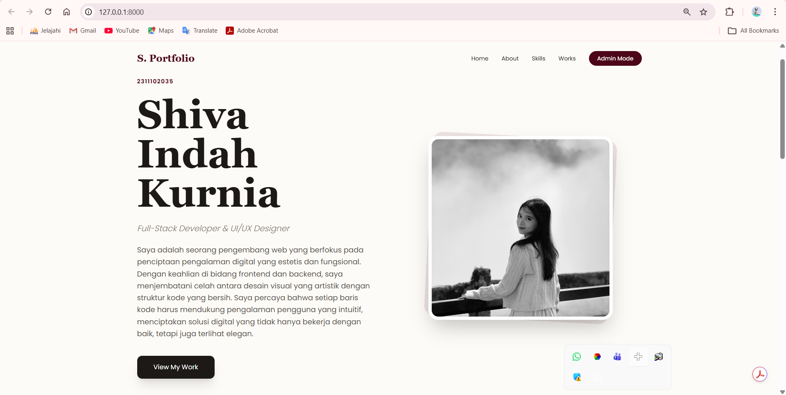
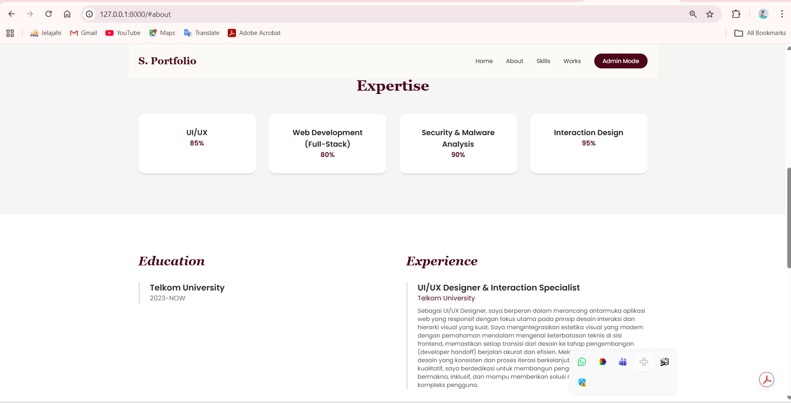
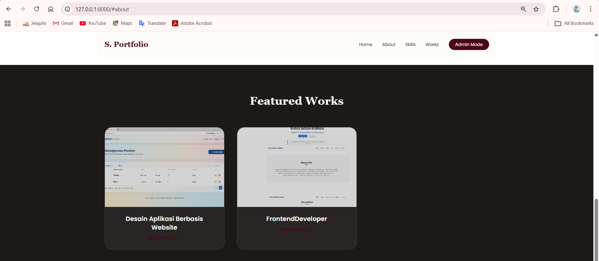
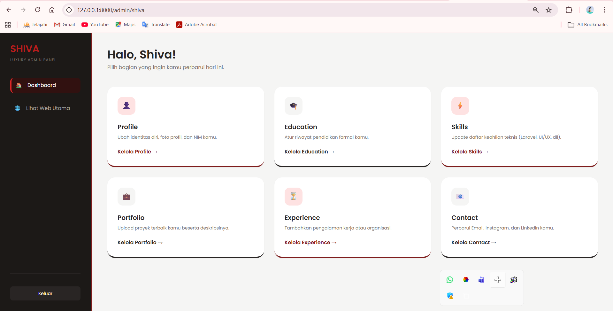

<h1 align="center">LAPORAN PRAKTIKUM</h1>
<h1 align="center">APLIKASI BERBASIS PLATFORM</h1>

<br>

<h2 align="center">UJIAN-UTS</h2>
<h2 align="center">WEB PORTOFOLIO</h2>

<br><br>

<p align="center">
  
</p>

<br><br>

<h2 align="center">Disusun Oleh :</h2>

<p align="center" style="font-size:28px;">
  <b>Shiva Indah Kurnia</b><br>
  <b>2311102035</b><br>
  <b>SI IF 11 REG 01</b>
</p>

<br>

<h2 align="center">Dosen Pengampu :</h2>

<p align="center" style="font-size:28px;">
  <b>Dimas Fanny Hebrasianto Permadi, S.ST., M.Kom</b>
</p>

<br>

<h2 align="center">Asisten Praktikum :</h2>

<p align="center" style="font-size:28px;">
  <b>Apri Pandu Wicaksono</b><br> 
  <b>Rangga Pradarrell Fathi</b>
</p>

<br>

<h1 align="center">LABORATORIUM HIGH PERFORMANCE</h1>
<h1 align="center">FAKULTAS INFORMATIKA</h1>
<h1 align="center">UNIVERSITAS TELKOM PURWOKERTO</h1>
<h1 align="center">TAHUN 2026</h1>

<hr>

## DASAR TEORI

Laravel merupakan framework PHP modern yang menggunakan arsitektur MVC (Model-View-Controller) untuk membangun aplikasi web secara terstruktur dan efisien. Dengan konsep ini, pengelolaan kode menjadi lebih rapi karena setiap bagian aplikasi memiliki tanggung jawab masing-masing, seperti pengolahan data, tampilan, dan logika program.

Pada project web profile ini, Laravel digunakan sebagai backend untuk mengelola data seperti informasi diri, daftar skill, dan project. Data tersebut disimpan di dalam database dan diakses melalui Model, kemudian diproses oleh Controller sebelum ditampilkan ke pengguna melalui View.

Selain itu, project ini memanfaatkan API (Application Programming Interface) yang dibuat menggunakan Laravel. API berfungsi sebagai penghubung antara backend dan frontend, sehingga data profile, skill, dan project tidak ditampilkan secara langsung, melainkan diambil terlebih dahulu dari server.

Untuk meningkatkan interaktivitas, digunakan teknologi AJAX (Asynchronous JavaScript and XML) dalam pengambilan data. Dengan AJAX, halaman web dapat menampilkan atau memperbarui data tanpa perlu melakukan reload halaman. Hal ini membuat website profile menjadi lebih dinamis dan memberikan pengalaman pengguna yang lebih baik.

Laravel juga menyediakan fitur migration dan seeder yang digunakan untuk mengatur struktur database serta mengisi data awal. Fitur ini membantu dalam proses pengembangan karena memudahkan pembuatan tabel dan pengelolaan data secara sistematis.

Dengan kombinasi Laravel, API, dan AJAX, web profile yang dibuat mampu menampilkan informasi secara dinamis serta menyediakan dashboard admin untuk mengelola konten seperti deskripsi, foto profile, skill, dan project. Hal ini menjadikan aplikasi lebih fleksibel dan mudah dikembangkan di masa depan.


## SOURCE CODE

Source code untuk pengerjaan project PORTOFOLIO secara lengkap dapat dilihat pada repositori dan folder proyek aplikasi ini, khususnya berada di dalam folder /portfolio.

### welcome.blade.php

```

<!DOCTYPE html>
<html lang="id">
<head>
    <meta charset="UTF-8">
    <meta name="viewport" content="width=device-width, initial-scale=1.0">
    <title>Portofolio | {{ $profile->nama ?? 'Shiva' }}</title>
    <script src="https://cdn.tailwindcss.com"></script>
    <link href="https://fonts.googleapis.com/css2?family=Playfair+Display:wght@700&family=Poppins:wght@300;400;600&display=swap" rel="stylesheet">
    <style>
        body { font-family: 'Poppins', sans-serif; background-color: #FDFBF7; scroll-behavior: smooth; }
        .font-serif { font-family: 'Playfair Display', serif; }
        .bg-maroon { background-color: #4c0519; }
        .text-maroon { color: #4c0519; }
    </style>
</head>
<body class="text-stone-800">

    <nav class="p-6 flex justify-between items-center max-w-7xl mx-auto sticky top-0 bg-[#FDFBF7]/80 backdrop-blur-md z-50">
        <div class="text-2xl font-serif font-bold text-maroon">S. Portfolio</div>
        <div class="hidden md:flex space-x-8 text-sm font-medium items-center">
            <a href="#home" class="hover:text-maroon transition">Home</a>
            <a href="#about" class="hover:text-maroon transition">About</a>
            <a href="#skills" class="hover:text-maroon transition">Skills</a>
            <a href="#projects" class="hover:text-maroon transition">Works</a>
            <a href="/admin/shiva" class="bg-maroon text-white px-5 py-2 rounded-full hover:bg-red-900 transition">Admin Mode</a>
        </div>
    </nav>

    <header id="home" class="min-h-[90vh] flex flex-col md:flex-row items-center justify-center px-6 max-w-7xl mx-auto gap-12 py-20">
        <div class="flex-1 space-y-6 text-center md:text-left">
            <h2 class="text-maroon font-semibold tracking-widest text-sm uppercase">{{ $profile->nim ?? '2311102035' }}</h2>
            <h1 class="text-6xl md:text-8xl font-serif font-bold text-stone-900 leading-tight">
                {{ $profile->nama ?? 'Shiva Indah Kurnia' }}
            </h1>
            <p class="text-xl text-stone-500 font-light italic">{{ $profile->title ?? 'Full-Stack Developer' }}</p>
            <p class="text-lg text-stone-600 max-w-xl leading-relaxed">
                {{ $profile->deskripsi ?? 'Selamat datang di portofolio saya.' }}
            </p>
            <div class="pt-4">
                <a href="#projects" class="inline-block bg-stone-900 text-white px-10 py-4 rounded-xl hover:bg-maroon transition shadow-xl">View My Work</a>
            </div>
        </div>

        <div class="flex-1 flex justify-center">
            <div class="relative w-80 h-80 md:w-[450px] md:h-[450px]">
                <div class="absolute inset-0 bg-maroon rounded-3xl rotate-3 opacity-10"></div>
                foto ? asset('storage/' . $profile->foto) : 'https://via.placeholder.com/450' }}" 
                     class="relative w-full h-full object-cover rounded-3xl shadow-2xl z-10 grayscale hover:grayscale-0 transition duration-500 border-8 border-white">
            </div>
        </div>
    </header>

    <section id="skills" class="py-24 bg-stone-100">
        <div class="max-w-7xl mx-auto px-6 text-center">
            <h2 class="text-4xl font-serif font-bold mb-12 text-maroon">Expertise</h2>
            <div class="grid grid-cols-2 md:grid-cols-4 gap-8">
                @foreach($skills as $skill)
                <div class="bg-white p-8 rounded-2xl shadow-sm border-b-4 border-maroon">
                    <p class="font-bold text-stone-800 text-lg">{{ $skill->nama_skill }}</p>
                    <p class="text-maroon font-semibold">{{ $skill->persentase }}%</p>
                </div>
                @endforeach
            </div>
        </div>
    </section>

    <section id="about" class="py-24 bg-white">
        <div class="max-w-7xl mx-auto px-6 grid md:grid-cols-2 gap-16">
            <div>
                <h2 class="text-3xl font-serif font-bold mb-8 text-maroon italic">Education</h2>
                @foreach($educations as $edu)
                <div class="mb-6 border-l-4 border-stone-200 pl-6">
                    <h3 class="font-bold text-xl">{{ $edu->instansi }}</h3>
                    <p class="text-stone-500">{{ $edu->tahun }}</p>
                </div>
                @endforeach
            </div>
            <div>
                <h2 class="text-3xl font-serif font-bold mb-8 text-maroon italic">Experience</h2>
                @foreach($experiences as $exp)
                <div class="mb-6 border-l-4 border-maroon pl-6">
                    <h3 class="font-bold text-xl">{{ $exp->posisi }}</h3>
                    <p class="text-maroon font-medium">{{ $exp->perusahaan }}</p>
                    <p class="text-stone-600 mt-2 text-sm">{{ $exp->deskripsi }}</p>
                </div>
                @endforeach
            </div>
        </div>
    </section>

    <section id="projects" class="py-24 bg-stone-900 text-white">
        <div class="max-w-7xl mx-auto px-6 text-center">
            <h2 class="text-4xl font-serif font-bold mb-16">Featured Works</h2>
            <div class="grid md:grid-cols-3 gap-10">
                @foreach($portfolios as $p)
                <div class="group relative overflow-hidden rounded-3xl bg-stone-800 border border-stone-700">
                    gambar) }}" class="w-full h-64 object-cover group-hover:scale-110 transition duration-500 opacity-80 group-hover:opacity-100">
                    <div class="p-6">
                        <h3 class="text-xl font-bold mb-2">{{ $p->judul }}</h3>
                        @if($p->link)
                        <a href="{{ $p->link }}" target="_blank" class="text-maroon text-sm font-bold hover:underline">View Project &rarr;</a>
                        @endif
                    </div>
                </div>
                @endforeach
            </div>
        </div>
    </section>

    <footer class="py-20 text-center bg-white border-t border-stone-100">
        <h2 class="text-3xl font-serif font-bold mb-6 text-maroon underline underline-offset-8">Get In Touch</h2>
        <div class="flex justify-center space-x-6 mb-8 text-stone-600 font-medium">
            <p>{{ $profile->email ?? 'shiva@example.com' }}</p>
            <span>|</span>
            <a href="https://instagram.com/{{ $profile->instagram ?? '' }}" class="hover:text-maroon transition">Instagram</a>
            <span>|</span>
            <a href="{{ $profile->linkedin ?? '#' }}" class="hover:text-maroon transition">LinkedIn</a>
        </div>
        <p class="text-stone-400 text-xs tracking-widest uppercase">© 2026 Shiva Portfolio — Crafted with Love</p>
    </footer>

</body>
</html>

```
### dashboard.blade.php

```

<!DOCTYPE html>
<html lang="id">
<head>
    <meta charset="UTF-8">
    <meta name="viewport" content="width=device-width, initial-scale=1.0">
    <title>Shiva Admin</title>
    <script src="https://cdn.tailwindcss.com"></script>
    <link href="https://fonts.googleapis.com/css2?family=Poppins:wght@300;400;600&display=swap" rel="stylesheet">
    <style>body { font-family: 'Poppins', sans-serif; }</style>
</head>
<body class="bg-stone-100 flex min-h-screen">

    <div class="w-72 bg-stone-900 text-white p-8 flex flex-col border-r-4 border-red-900 fixed h-full">
        <h2 class="text-3xl font-bold text-red-700 mb-2">SHIVA</h2>
        <p class="text-xs text-stone-500 tracking-widest uppercase mb-12">Luxury Admin Panel</p>
        
        <nav class="space-y-6 flex-1">
            <a href="/admin/shiva" class="flex items-center gap-4 p-3 bg-red-950/50 rounded-xl border-l-4 border-red-600">
                <span>🏠</span> Dashboard
            </a>
            <a href="/" target="_blank" class="flex items-center gap-4 p-3 text-stone-400 hover:text-white transition">
                <span>🌐</span> Lihat Web Utama
            </a>
        </nav>

        <div class="pt-10 border-t border-stone-800">
            <a href="/" class="block w-full py-3 bg-stone-800 text-center rounded-lg text-sm hover:bg-red-900 transition">Keluar</a>
        </div>
    </div>

    <div class="flex-1 ml-72 p-12">
        <header class="mb-12">
            <h1 class="text-4xl font-bold text-stone-800">Halo, Shiva!</h1>
            <p class="text-stone-500 mt-2">Pilih bagian yang ingin kamu perbarui hari ini.</p>
            
            @if(session('success'))
                <div class="mt-4 bg-green-100 text-green-700 p-4 rounded-xl border border-green-200">
                    {{ session('success') }}
                </div>
            @endif
        </header>

        <div class="grid grid-cols-1 md:grid-cols-3 gap-8">
            
            <div class="bg-white p-8 rounded-3xl shadow-sm border-b-4 border-red-900 hover:shadow-xl transition group">
                <div class="w-14 h-14 bg-red-100 rounded-2xl flex items-center justify-center text-2xl mb-6 group-hover:bg-red-900 group-hover:text-white transition">👤</div>
                <h3 class="text-xl font-bold text-stone-800">Profile</h3>
                <p class="text-stone-500 text-sm mt-2 mb-6">Ubah identitas diri, foto profil, dan NIM kamu.</p>
                <a href="/admin/profile" class="text-red-900 font-semibold hover:underline">Kelola Profile &rarr;</a>
            </div>

            <div class="bg-white p-8 rounded-3xl shadow-sm border-b-4 border-stone-800 hover:shadow-xl transition group">
                <div class="w-14 h-14 bg-stone-100 rounded-2xl flex items-center justify-center text-2xl mb-6 group-hover:bg-stone-900 group-hover:text-white transition">🎓</div>
                <h3 class="text-xl font-bold text-stone-800">Education</h3>
                <p class="text-stone-500 text-sm mt-2 mb-6">Atur riwayat pendidikan formal kamu.</p>
                <a href="/admin/education" class="text-stone-800 font-semibold hover:underline">Kelola Education &rarr;</a>
            </div>

            <div class="bg-white p-8 rounded-3xl shadow-sm border-b-4 border-red-900 hover:shadow-xl transition group">
                <div class="w-14 h-14 bg-red-100 rounded-2xl flex items-center justify-center text-2xl mb-6 group-hover:bg-red-900 group-hover:text-white transition">⚡</div>
                <h3 class="text-xl font-bold text-stone-800">Skills</h3>
                <p class="text-stone-500 text-sm mt-2 mb-6">Update daftar keahlian teknis (Laravel, UI/UX, dll).</p>
                <a href="/admin/skills" class="text-red-900 font-semibold hover:underline">Kelola Skills &rarr;</a>
            </div>

            <div class="bg-white p-8 rounded-3xl shadow-sm border-b-4 border-stone-800 hover:shadow-xl transition group">
                <div class="w-14 h-14 bg-stone-100 rounded-2xl flex items-center justify-center text-2xl mb-6 group-hover:bg-stone-900 group-hover:text-white transition">💼</div>
                <h3 class="text-xl font-bold text-stone-800">Portfolio</h3>
                <p class="text-stone-500 text-sm mt-2 mb-6">Upload proyek terbaik kamu beserta deskripsinya.</p>
                <a href="/admin/portfolio-manage" class="text-stone-800 font-semibold hover:underline">Kelola Portfolio &rarr;</a>
            </div>

            <div class="bg-white p-8 rounded-3xl shadow-sm border-b-4 border-red-900 hover:shadow-xl transition group">
                <div class="w-14 h-14 bg-red-100 rounded-2xl flex items-center justify-center text-2xl mb-6 group-hover:bg-red-900 group-hover:text-white transition">⏳</div>
                <h3 class="text-xl font-bold text-stone-800">Experience</h3>
                <p class="text-stone-500 text-sm mt-2 mb-6">Tambahkan pengalaman kerja atau organisasi.</p>
                <a href="/admin/experience" class="text-red-900 font-semibold hover:underline">Kelola Experience &rarr;</a>
            </div>

            <div class="bg-white p-8 rounded-3xl shadow-sm border-b-4 border-stone-800 hover:shadow-xl transition group">
                <div class="w-14 h-14 bg-stone-100 rounded-2xl flex items-center justify-center text-2xl mb-6 group-hover:bg-stone-900 group-hover:text-white transition">📧</div>
                <h3 class="text-xl font-bold text-stone-800">Contact</h3>
                <p class="text-stone-500 text-sm mt-2 mb-6">Perbarui Email, Instagram, dan LinkedIn kamu.</p>
                <a href="/admin/contact" class="text-stone-800 font-semibold hover:underline">Kelola Contact &rarr;</a>
            </div>

        </div>
    </div>
</body>
</html>
```

### web.php

```

<?php

use Illuminate\Support\Facades\Route;
use Illuminate\Http\Request;
use App\Models\Profile;
use App\Models\Skill;
use App\Models\Education;
use App\Models\Experience;
use App\Models\Portfolio;
use App\Http\Controllers\Api\PortfolioController;

// --- API UNTUK AJAX (TAMBAHKAN INI AGAR TIDAK ERROR) ---
// Ini jalur yang dicari oleh tampilan depan kamu
Route::get('/api/portfolio', function () {
    return response()->json([
        'profile' => Profile::first(),
        'skills' => Skill::all(),
        'educations' => Education::all(),
        'experiences' => Experience::all(),
        'portfolios' => Portfolio::all()
    ]);
});

// --- HALAMAN DEPAN ---
Route::get('/', function () {
    $profile = Profile::first();
    $skills = Skill::all();
    $educations = Education::all();
    $experiences = Experience::all();
    $portfolios = Portfolio::all();
    return view('welcome', compact('profile', 'skills', 'educations', 'experiences', 'portfolios'));
});

// --- DASHBOARD UTAMA ---
Route::get('/admin/shiva', function () {
    return view('admin.dashboard'); 
});

// --- KELOLA PROFILE ---
Route::get('/admin/profile', function () {
    $profile = Profile::first();
    return view('admin.profile', compact('profile'));
});

Route::post('/admin/update-profile', function (Request $request) {
    $profile = Profile::first() ?? new Profile;
    $profile->nama = $request->nama;
    $profile->title = $request->title;
    $profile->nim = $request->nim;
    $profile->deskripsi = $request->deskripsi;
    $profile->email = $request->email;
    $profile->instagram = $request->instagram;
    $profile->linkedin = $request->linkedin;
    
    if ($request->hasFile('foto')) {
        $profile->foto = $request->file('foto')->store('uploads', 'public');
    }

    $profile->save();
    return back()->with('success', 'Profile & Kontak berhasil diperbarui!');
})->name('admin.profile.update');

// --- KELOLA SKILLS ---
Route::get('/admin/skills', function () {
    return view('admin.skills', ['skills' => Skill::all()]);
});

Route::post('/admin/skills', function (Request $request) {
    Skill::create($request->all());
    return back()->with('success', 'Skill berhasil ditambah!');
});

Route::delete('/admin/skills/{id}', function ($id) {
    Skill::findOrFail($id)->delete();
    return back()->with('success', 'Skill dihapus!');
});

// --- KELOLA EDUCATION ---
Route::get('/admin/education', function () {
    return view('admin.education', ['educations' => Education::all()]);
});

Route::post('/admin/education', function (Request $request) {
    Education::create($request->all());
    return back()->with('success', 'Pendidikan berhasil ditambah!');
});

Route::delete('/admin/education/{id}', function($id){ 
    Education::findOrFail($id)->delete(); 
    return back(); 
});

// --- KELOLA EXPERIENCE ---
Route::get('/admin/experience', function () {
    return view('admin.experience', ['experiences' => Experience::all()]);
});

Route::post('/admin/experience', function (Request $request) {
    Experience::create($request->all());
    return back()->with('success', 'Pengalaman berhasil ditambah!');
});

Route::delete('/admin/experience/{id}', function($id){ 
    Experience::findOrFail($id)->delete(); 
    return back(); 
});

// --- KELOLA PORTFOLIO ---
Route::get('/admin/portfolio-manage', function () {
    return view('admin.portfolio_manage', ['portfolios' => Portfolio::all()]);
});

Route::post('/admin/portfolio-manage', function (Request $request) {
    $data = $request->all();
    if ($request->hasFile('gambar')) {
        $data['gambar'] = $request->file('gambar')->store('portfolios', 'public');
    }
    Portfolio::create($data);
    return back()->with('success', 'Project baru berhasil dipublish!');
});

Route::delete('/admin/portfolio-manage/{id}', function($id){ 
    Portfolio::findOrFail($id)->delete(); 
    return back(); 
});

// --- MENU CONTACT ---
Route::get('/admin/contact', function () {
    $profile = Profile::first();
    return view('admin.profile', compact('profile'));
});
```

## OUTPUT

### Landing Page

<p align="center">
  
</p>

<p align="center">
  
</p>

<p align="center">
  
</p>

### Admin

<p align="center">
  
</p>


## PENJELASAN SOURCE CODE

### 1. Arsitektur Routing (web.php)
Dalam perancangan sistem ini, file web.php diimplementasikan sebagai komponen routing utama yang meregulasi seluruh lalu lintas permintaan HTTP (HTTP Requests). Mekanisme ini berfungsi untuk memetakan setiap alamat URL ke fungsi controller yang relevan. Selain pemetaan jalur statis, sistem ini menerapkan middleware 'auth' sebagai protokol autentikasi. Implementasi middleware ini bertujuan untuk membatasi hak akses pengguna, di mana halaman-halaman krusial seperti manajemen data hanya dapat diakses oleh subjek yang telah terverifikasi melalui proses login, guna menjaga integritas dan keamanan data pada sistem.

### 2. Implementasi Antarmuka Pengguna Utama (welcome.blade.php)

Halaman welcome.blade.php dikembangkan sebagai representasi frontend atau landing page yang berfungsi sebagai media interaksi awal bagi pengguna luar. Secara teknis, file ini memanfaatkan Blade templating engine untuk menyajikan komponen UI yang dinamis dan responsif. Konten yang disajikan mencakup informasi profil personal, deskripsi keahlian, dan ringkasan portofolio. Fokus utama pada tahap ini adalah pengoptimalan pengalaman pengguna (User Experience) melalui tata letak yang bersih, serta penyediaan jalur navigasi menuju sistem manajemen melalui endpoint login yang telah terintegrasi.

### 3. Pengembangan Panel Administrasi (dashboard.blade.php)

File dashboard.blade.php merupakan inti dari antarmuka manajemen data atau backend sistem. Dalam pengembangannya, file ini menggunakan teknik template inheritance untuk memastikan konsistensi visual di seluruh modul admin. Secara fungsional, halaman ini berfungsi untuk menampilkan visualisasi data secara real-time yang ditarik dari database melalui controller. Selain berfungsi sebagai pusat kendali (command center), dashboard ini dirancang untuk mempermudah administrator dalam melakukan monitoring data serta manajemen konten secara terpusat dan efisien, selaras dengan prinsip-prinsip Man-Machine Interaction yang intuitif.


#### 4. Penggunaan AJAX

Penggunaan teknologi AJAX dalam sistem ini bertujuan untuk meningkatkan efisiensi pertukaran data antara client-side dan server-side tanpa memerlukan proses pemuatan ulang halaman secara keseluruhan (page refresh). Secara teknis, AJAX bekerja dengan mengirimkan permintaan asinkron di latar belakang, sehingga interaksi pengguna tetap berjalan mulus dan responsif. Dalam konteks aplikasi portofolio ini, mekanisme tersebut diterapkan pada proses manipulasi data, seperti pengiriman formulir atau pembaruan konten secara dinamis. Implementasi ini tidak hanya mengoptimalkan penggunaan bandwidth melalui pengiriman data dalam format JSON, tetapi juga secara signifikan meningkatkan nilai usability sistem dengan mengurangi waktu tunggu pengguna (latency) saat melakukan operasi pada basis data.


## Kesimpulan

Pengembangan sistem portofolio berbasis Laravel ini berhasil mengintegrasikan arsitektur MVC untuk menciptakan pengelolaan kode yang modular dan terorganisir. Melalui penerapan middleware pada sistem routing serta penggunaan Blade templating, aplikasi mampu menjamin keamanan data sekaligus menyajikan antarmuka yang dinamis. Selain itu, integrasi teknologi AJAX secara signifikan meningkatkan responsivitas sistem dengan memungkinkan pertukaran data secara asinkron tanpa page refresh. Secara keseluruhan, proyek ini menghasilkan platform manajemen konten yang efisien, stabil, dan mampu memenuhi standar kebutuhan fungsional sebuah portofolio digital.
