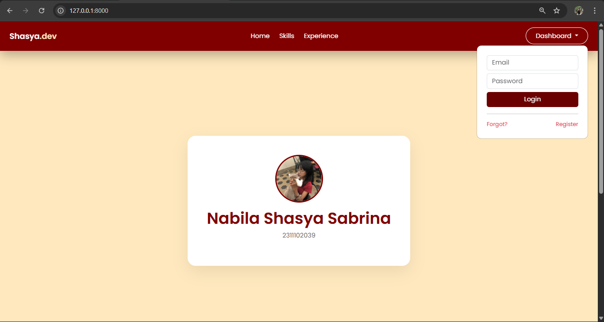
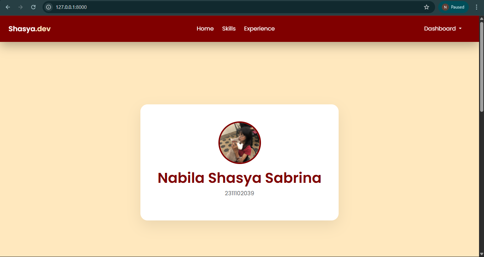
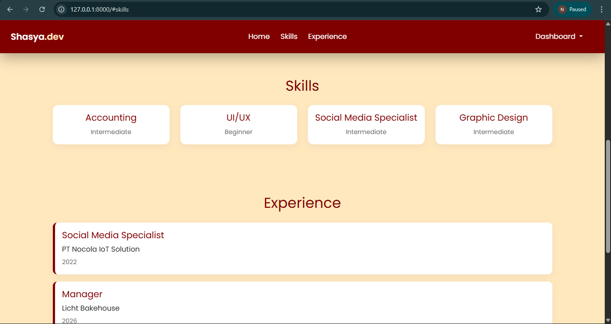
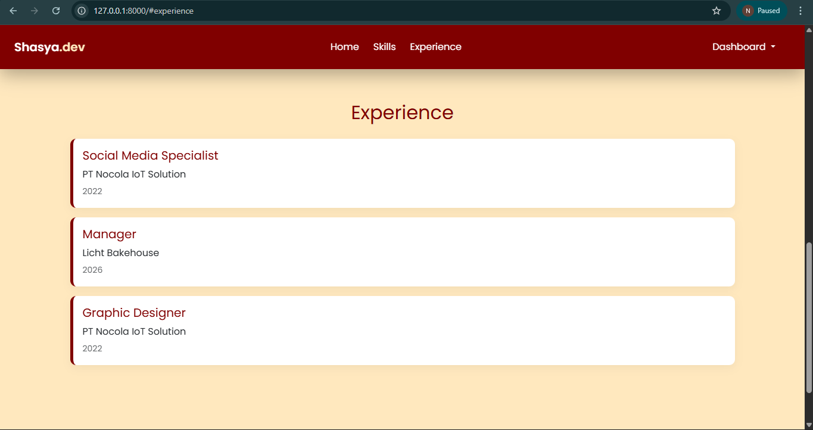
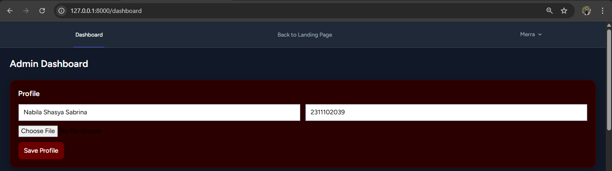
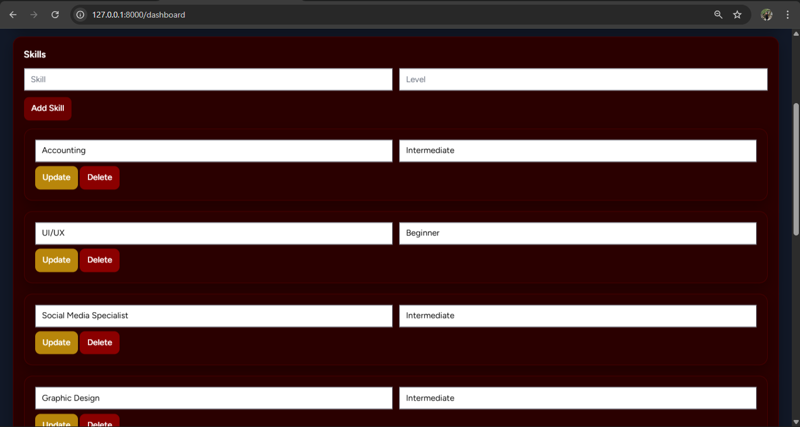
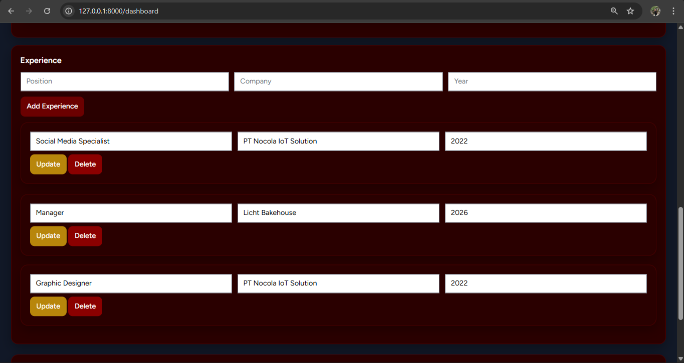
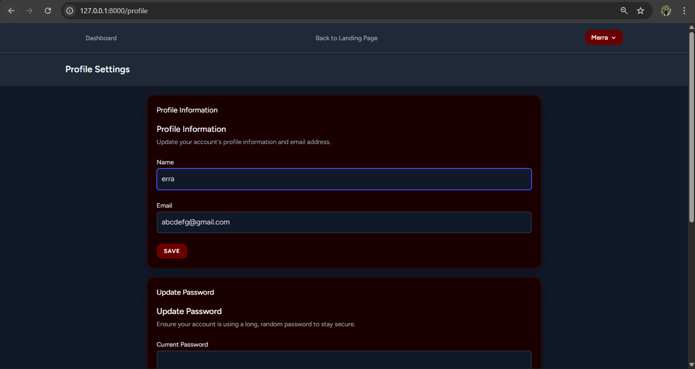
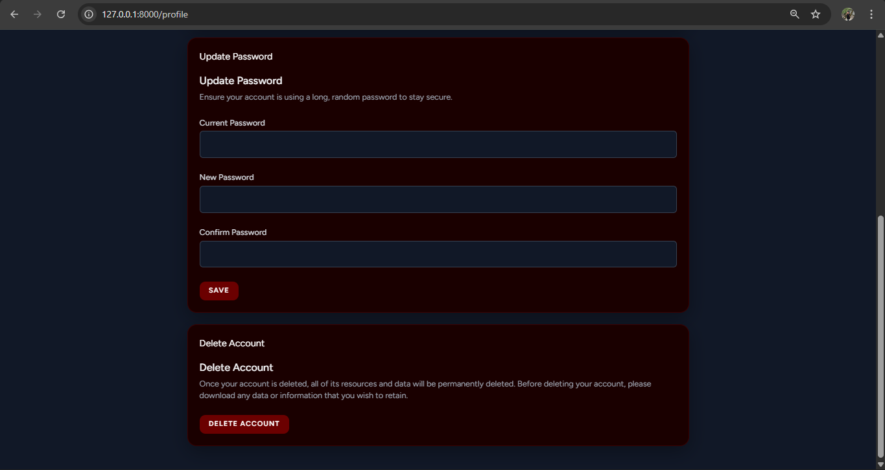

<div align="center">
  <br />
  <h1>LAPORAN PRAKTIKUM <br>APLIKASI BERBASIS PLATFORM</h1>
  <br />
  <h3> UTS <br></h3>
  <br />
  <br />
  
  <br />
  <br />
  <h3>Disusun Oleh :</h3>
  <p>
    <strong>Nabila Shasya Sabrina</strong><br>
    <strong>2311102039</strong><br>
    <strong>S1 IF-11-01</strong>
  </p>
  <br />
  <br />
  <h3>Dosen Pengampu :</h3>
  <p>
    <strong>Dimas Fanny Hebrasianto Permadi, S.ST., M.Kom</strong>
  </p>
  <br />
  <br />
  <h4>Asisten Praktikum :</h4>
  <strong>Apri Pandu Wicaksono</strong> <br>
  <strong>Rangga Pradarrell Fathi</strong>
  <br />
  <h3>LABORATORIUM HIGH PERFORMANCE
 <br>FAKULTAS INFORMATIKA <br>UNIVERSITAS TELKOM PURWOKERTO <br>2026</h3>
</div>
---

## 1. Dasar Teori
Penugasan Ujian Tengah Semester (UTS) ini berfokus pada pengembangan Website Portofolio Personal yang dirancang agar dapat digunakan secara nyata sebagai sarana personal branding dalam bentuk portofolio digital.

Spesifikasi teknis dan fungsional yang diterapkan mengacu pada instruksi ujian, yaitu:

Framework utama yang digunakan adalah Laravel 12 sebagai fondasi backend, dengan PostgreSQL sebagai sistem manajemen basis data relasional.

Untuk aspek tampilan, pengembangan antarmuka dilakukan secara fleksibel menggunakan Bootstrap 5 guna menghasilkan desain halaman (Landing Page dan Dashboard) yang responsif serta terlihat profesional.

Pada sisi pengelolaan konten, disediakan sebuah Admin Dashboard yang memungkinkan administrator untuk mengatur dan memperbarui isi yang ditampilkan di halaman utama. Data seperti profil pribadi, foto, keahlian, riwayat pendidikan, hingga proyek dapat dikelola melalui fitur CRUD. Selain itu, tersedia juga fitur unggah file untuk menyimpan foto profil di direktori public/uploads/profile serta gambar proyek di public/uploads/projects.

Implementasi AJAX menjadi komponen wajib dalam proyek ini. Seluruh data yang ditampilkan pada landing page—mulai dari profil, daftar skill, riwayat pendidikan, hingga proyek—tidak ditampilkan menggunakan mekanisme rendering langsung dari Blade. Sebagai gantinya, data harus diambil secara dinamis dari endpoint backend menggunakan AJAX berbasis Fetch API.

---

## 2. Hasil Praktikum

### **a. Struktur Project**
Project ini dikembangkan menggunakan Laravel dan database MySQL. Web portofolio ini terdiri dari dua bagian utama yaitu:
**Landing page** dan **Dashboard admin**

```
2311102039_Nabila Shasya Sabrina/
│
├── app/
    ├── Http  
    ├── Models
    ├── Providers
    ├── View
├── assets/           
├── bootstrap/          
├── config/             
├── database/           
├── public/             
│   └── uploads/
│       ├── profile/
│       └── projects/
├── resources/
│   └── views/          
├── routes/
│   └── web.php         
├── storage/            
│
├── .env                
├── artisan             
├── composer.json       
├── package.json        
└── README.md
```

### **b. Source Code**

#### `routes/web.php`

```php
<?php

use App\Http\Controllers\ProfileController;
use Illuminate\Support\Facades\Route;

// Landing Page
Route::get('/', function () {
    return view('welcome');
});

// Dashboard (admin)
Route::get('/dashboard', function () {
    return view('dashboard');
})->middleware(['auth', 'verified'])->name('dashboard');

// Profile bawaan Breeze
Route::middleware('auth')->group(function () {
    Route::get('/profile', [ProfileController::class, 'edit'])->name('profile.edit');
    Route::patch('/profile', [ProfileController::class, 'update'])->name('profile.update');
    Route::delete('/profile', [ProfileController::class, 'destroy'])->name('profile.destroy');
});

require __DIR__.'/auth.php';
```

#### `app/Http/Controllers/Admin/ProfileController.php`

```php
<?php

namespace App\Http\Controllers\Admin;

use App\Http\Controllers\Controller;
use App\Models\Profile;
use Illuminate\Http\Request;

class ProfileController extends Controller
{
    // 📄 halaman dashboard admin
    public function index()
    {
        return view('admin.profile');
    }

    // 📥 ambil data (READ)
    public function show()
    {
        return response()->json(Profile::first());
    }

    // ✏️ update data (UPDATE)
    public function update(Request $request)
{
    $profile = Profile::first();

    if ($request->hasFile('photo')) {
        $path = $request->file('photo')->store('profiles', 'public');
        $profile->photo = $path;
    }

    $profile->name = $request->name;
    $profile->description = $request->description;
    $profile->save();

    return response()->json([
        'message' => 'Updated successfully'
    ]);
}
}
```
#### `database/migrations/create_profile_table.php`

```php
<?php

use Illuminate\Database\Migrations\Migration;
use Illuminate\Database\Schema\Blueprint;
use Illuminate\Support\Facades\Schema;

return new class extends Migration
{
    /**
     * Run the migrations.
     */
    public function up(): void
{
    Schema::create('profiles', function (Blueprint $table) {
    $table->id();
    $table->string('name');
    $table->text('description');
    $table->string('photo')->nullable();
    $table->timestamps();
});
}

    /**
     * Reverse the migrations.
     */
    public function down(): void
    {
        Schema::dropIfExists('profiles');
    }
};
```

#### `database/migrations/create_skill_table.php`
```php
<?php

use Illuminate\Database\Migrations\Migration;
use Illuminate\Database\Schema\Blueprint;
use Illuminate\Support\Facades\Schema;

return new class extends Migration
{
    /**
     * Run the migrations.
     */
    public function up(): void
{
    Schema::create('skills', function (Blueprint $table) {
        $table->id();
        $table->string('name');
        $table->string('level');
        $table->timestamps();
    });
}

    /**
     * Reverse the migrations.
     */
    public function down(): void
    {
        Schema::dropIfExists('skills');
    }
};
```
#### `database/migrations/create_experiences_table.php`

```php
<?php

use Illuminate\Database\Migrations\Migration;
use Illuminate\Database\Schema\Blueprint;
use Illuminate\Support\Facades\Schema;

return new class extends Migration
{
    /**
     * Run the migrations.
     */
    public function up(): void
{
    Schema::create('experiences', function (Blueprint $table) {
        $table->id();
        $table->string('position');
        $table->string('company');
        $table->string('year');
        $table->timestamps();
    });
}

    /**
     * Reverse the migrations.
     */
    public function down(): void
    {
        Schema::dropIfExists('experiences');
    }
};
```

#### `resources/views/admin/profile.blade.php`

```php
<!DOCTYPE html>
<html>
<head>
    <title>Admin Dashboard</title>
    <link href="https://cdn.jsdelivr.net/npm/bootstrap@5.3.3/dist/css/bootstrap.min.css" rel="stylesheet">
</head>

<body class="bg-light">

<div class="container py-5">

    <div class="card shadow p-4">

        <h3 class="mb-3">Admin Profile</h3>

        <!-- FORM EDIT -->
        <input id="name" class="form-control mb-2" placeholder="Name">
        <textarea id="description" class="form-control mb-2" placeholder="Description"></textarea>

        <button class="btn btn-primary" onclick="updateData()">
            Update
        </button>

        <p id="status" class="mt-3"></p>

    </div>

</div>

<script>
    // 📥 READ (ambil data)
    fetch('/api/admin/profile')
        .then(res => res.json())
        .then(data => {
            document.getElementById('name').value = data.name;
            document.getElementById('description').value = data.description;
        });

    // ✏️ UPDATE (CRUD update)
    function updateData() {
        fetch('/api/admin/profile', {
            method: 'POST',
            headers: {
                'Content-Type': 'application/json',
                'X-CSRF-TOKEN': '{{ csrf_token() }}'
            },
            body: JSON.stringify({
                name: document.getElementById('name').value,
                description: document.getElementById('description').value
            })
        })
        .then(res => res.json())
        .then(data => {
            document.getElementById('status').innerHTML =
                "<span class='text-success'>" + data.message + "</span>";
        });
    }
</script>

</body>
</html>
```

#### `resources/views/profile/dashboard.blade.php`

```php
<style>
    body {
        font-family: 'Poppins', sans-serif;
        background: #FFE8BE;
        color: white;
    }

    .admin-card {
        background: #2a0000;
        border: 1px solid #4a0000;
        border-radius: 16px;
        padding: 20px;
        margin-bottom: 20px;
        box-shadow: 0 10px 25px rgba(0,0,0,0.3);
        transition: 0.3s;
    }

    input, textarea {
    color: black !important;
}

    .admin-card:hover {
        transform: translateY(-3px);
    }

    .title {
        font-size: 18px;
        font-weight: 600;
        margin-bottom: 12px;
    }

    input {
        background: #1a0000;
        border: 1px solid #4a0000;
        color: #8b0000;
        padding: 10px;
        border-radius: 10px;
        width: 100%;
        outline: none;
    }

    input:focus {
        border-color: #8b0000;
    }

    .btn {
        padding: 10px 14px;
        border-radius: 10px;
        cursor: pointer;
        transition: 0.3s;
        font-weight: 500;
        border: none;
    }

    .btn-maroon { background: #6b0000; color: white; }
    .btn-maroon:hover { background: #8b0000; }

    .btn-yellow { background: #b8860b; color: white; }
    .btn-red { background: #8b0000; color: white; }

    .grid-2 {
        display: grid;
        grid-template-columns: 1fr 1fr;
        gap: 12px;
    }

    .grid-3 {
        display: grid;
        grid-template-columns: 1fr 1fr 1fr;
        gap: 12px;
    }

    .fade-in {
        animation: fadeIn 0.6s ease-in;
    }

    @keyframes fadeIn {
        from {opacity: 0; transform: translateY(10px);}
        to {opacity: 1; transform: translateY(0);}
    }
</style>

<x-app-layout>

<div class="p-6 fade-in">

    <h1 class="text-2xl font-bold mb-6">Admin Dashboard</h1>

    <!-- PROFILE -->
    <div class="admin-card">
        <div class="title">Profile</div>

        <div class="grid-2">
            <input id="nameInput" placeholder="Name">
            <input id="descInput" placeholder="Description">
        </div>

        <input type="file" id="photo" class="mt-3">

        <button onclick="updateProfile()" class="btn btn-maroon mt-3">
            Save Profile
        </button>
    </div>

    <!-- SKILLS -->
    <div class="admin-card">
        <div class="title">Skills</div>

        <div class="grid-2 mb-3">
            <input id="skillName" placeholder="Skill">
            <input id="skillLevel" placeholder="Level">
        </div>

        <button onclick="addSkill()" class="btn btn-maroon mb-4">
            Add Skill
        </button>

        <div id="skillList"></div>
    </div>

    <!-- EXPERIENCE -->
    <div class="admin-card">
        <div class="title">Experience</div>

        <div class="grid-3 mb-3">
            <input id="pos" placeholder="Position">
            <input id="comp" placeholder="Company">
            <input id="year" placeholder="Year">
        </div>

        <button onclick="addExp()" class="btn btn-maroon mb-4">
            Add Experience
        </button>

        <div id="expList"></div>
    </div>

    <div class="admin-card">
        <div class="title">Education</div>

        <div class="grid-3 mb-3">
            <input id="school" placeholder="School">
            <input id="major" placeholder="Major">
            <input id="year" placeholder="Year">
        </div>

        <button onclick="addEdu()" class="btn btn-maroon mb-4">
            Add Education
        </button>

        <div id="eduList"></div>
    </div>

</div>

<script>

// ================= PROFILE =================
function loadProfile() {
    fetch('/api/profile')
    .then(res => res.json())
    .then(data => {
        document.getElementById('nameInput').value = data.name ?? '';
        document.getElementById('descInput').value = data.description ?? '';
    });
}

function updateProfile() {

    let formData = new FormData();
    formData.append('name', nameInput.value);
    formData.append('description', descInput.value);

    let photo = document.getElementById('photo').files[0];
    if (photo) formData.append('photo', photo);

    fetch('/api/admin/profile', {
        method: 'POST',
        body: formData
    })
    .then(res => res.json())
    .then(() => alert('Profile updated'));
}


// ================= SKILLS =================
function loadSkills() {
    fetch('/api/skills')
    .then(res => res.json())
    .then(data => {

        let html = '';

        data.forEach(s => {
            html += `
            <div class="admin-card">
                <div class="grid-2">
                    <input value="${s.name}" id="name-${s.id}">
                    <input value="${s.level}" id="level-${s.id}">
                </div>

                <div class="mt-2">
                    <button onclick="updateSkill(${s.id})" class="btn btn-yellow">Update</button>
                    <button onclick="deleteSkill(${s.id})" class="btn btn-red">Delete</button>
                </div>
            </div>`;
        });

        skillList.innerHTML = html;
    });
}

function addSkill() {
    fetch('/api/skills', {
        method: 'POST',
        headers: {'Content-Type': 'application/json'},
        body: JSON.stringify({
            name: skillName.value,
            level: skillLevel.value
        })
    }).then(() => {
        skillName.value = '';
        skillLevel.value = '';
        loadSkills();
    });
}

function updateSkill(id) {
    fetch(`/api/skills/${id}`, {
        method: 'PUT',
        headers: {'Content-Type': 'application/json'},
        body: JSON.stringify({
            name: document.getElementById(`name-${id}`).value,
            level: document.getElementById(`level-${id}`).value
        })
    }).then(loadSkills);
}

function deleteSkill(id) {
    fetch(`/api/skills/${id}`, { method: 'DELETE' })
    .then(loadSkills);
}


// ================= EXPERIENCE =================
function loadExp() {
    fetch('/api/experiences')
    .then(res => res.json())
    .then(data => {

        let html = '';

        data.forEach(e => {
            html += `
            <div class="admin-card">
                <div class="grid-3">
                    <input value="${e.position}" id="pos-${e.id}">
                    <input value="${e.company}" id="comp-${e.id}">
                    <input value="${e.year}" id="year-${e.id}">
                </div>

                <div class="mt-2">
                    <button onclick="updateExp(${e.id})" class="btn btn-yellow">Update</button>
                    <button onclick="deleteExp(${e.id})" class="btn btn-red">Delete</button>
                </div>
            </div>`;
        });

        expList.innerHTML = html;
    });
}

function addExp() {
    fetch('/api/experiences', {
        method: 'POST',
        headers: {'Content-Type': 'application/json'},
        body: JSON.stringify({
            position: pos.value,
            company: comp.value,
            year: year.value
        })
    }).then(() => {
        pos.value = '';
        comp.value = '';
        year.value = '';
        loadExp();
    });
}

function updateExp(id) {
    fetch(`/api/experiences/${id}`, {
        method: 'PUT',
        headers: {'Content-Type': 'application/json'},
        body: JSON.stringify({
            position: document.getElementById(`pos-${id}`).value,
            company: document.getElementById(`comp-${id}`).value,
            year: document.getElementById(`year-${id}`).value
        })
    }).then(loadExp);
}

function deleteExp(id) {
    fetch(`/api/experiences/${id}`, { method: 'DELETE' })
    .then(loadExp);
}

function loadEdu() {
    fetch('/api/educations')
    .then(res => res.json())
    .then(data => {

        let html = '';

        data.forEach(e => {
            html += `
            <div class="admin-card mb-2">
                <input value="${e.school}" id="school-${e.id}">
                <input value="${e.major}" id="major-${e.id}">
                <input value="${e.year}" id="year-${e.id}">

                <button onclick="updateEdu(${e.id})">Update</button>
                <button onclick="deleteEdu(${e.id})">Delete</button>
            </div>`;
        });

        document.getElementById('eduList').innerHTML = html;
    });
}

function addEdu() {
    fetch('/api/educations', {
        method: 'POST',
        headers: {'Content-Type': 'application/json'},
        body: JSON.stringify({
            school: school.value,
            major: major.value,
            year: eduYear.value
        })
    }).then(loadEdu);
}

function updateEdu(id) {
    fetch(`/api/educations/${id}`, {
        method: 'PUT',
        headers: {'Content-Type': 'application/json'},
        body: JSON.stringify({
            school: document.getElementById(`school-${id}`).value,
            major: document.getElementById(`major-${id}`).value,
            year: document.getElementById(`eduYear-${id}`).value
        })
    }).then(loadEdu);
}

function deleteEdu(id) {
    fetch(`/api/educations/${id}`, { method: 'DELETE' })
    .then(loadEdu);
}


// INIT
loadProfile();
loadSkills();
loadExp();
loadEdu();

</script>

<script>
function addEdu() {
    let school = document.getElementById('school').value;
    let major = document.getElementById('major').value;
    let year = document.getElementById('eduYear').value;

    console.log("DATA:", school, major, year);

    fetch('/api/educations', {
        method: 'POST',
        headers: { 'Content-Type': 'application/json' },
        body: JSON.stringify({ school, major, year })
    })
    .then(res => res.json())
    .then(data => {
        console.log("SUCCESS:", data);
        loadEdu();
    })
    .catch(err => console.log("ERROR:", err));
}
</script>

</x-app-layout>
```

#### `resources/views/profile/welcome.blade.php`
```php
<!DOCTYPE html>
<html lang="en">
<head>
    <meta charset="UTF-8">
    <title>Shasya's Portofolio</title>

    <!-- Bootstrap -->
    <link href="https://cdn.jsdelivr.net/npm/bootstrap@5.3.3/dist/css/bootstrap.min.css" rel="stylesheet">

    <!-- Google Font -->
    <link href="https://fonts.googleapis.com/css2?family=Poppins:wght@300;400;600&display=swap" rel="stylesheet">

    <style>
        body {
            font-family: 'Poppins', sans-serif;
            background-color: #FFE8BE;
        }

         .maroon {
        background: #4a0000;
    }

    .card-dark {
        background: #2a0000;
        border: 1px solid #5a0000;
        border-radius: 16px;
    }

    .fade-in {
        animation: fadeIn 1s ease-in;
    }

    @keyframes fadeIn {
        from {opacity: 0; transform: translateY(20px);}
        to {opacity: 1; transform: translateY(0);}
    }

    .btn-maroon {
        background: #6b0000;
        color: white;
        border-radius: 10px;
        padding: 8px 16px;
        transition: 0.3s;
    }
    

    .btn-maroon:hover {
        background: #8b0000;
    }

        .navbar {
            background-color: #800000 !important;
            position: sticky;
            top: 0;
            z-index: 999;
            backdrop-filter: blur(10px);
        }

        .hero-card {
            background: white;
            border-radius: 20px;
            box-shadow: 0 15px 40px rgba(0,0,0,0.08);
            animation: fadeIn 1s ease;
        }

        .text-maroon {
            color: #800000;
        }

        /* FOTO PROFILE */
        .profile-img {
            width: 120px;
            height: 120px;
            object-fit: cover;
            border-radius: 50%;
            border: 4px solid #800000;
            margin-bottom: 15px;
        }

        /* CARD */
        .card-skill {
            background: white;
            border-radius: 12px;
            transition: 0.3s;
            box-shadow: 0 5px 15px rgba(0,0,0,0.05);
            opacity: 0;
            transform: translateY(20px);
            animation: fadeUp 0.6s forwards;
        }

        .card-skill:hover {
            transform: translateY(-5px);
        }

        .exp-card {
            background: white;
            border-left: 5px solid #800000;
            border-radius: 10px;
            box-shadow: 0 5px 15px rgba(0,0,0,0.05);
            opacity: 0;
            transform: translateY(20px);
            animation: fadeUp 0.6s forwards;
        }

        /* ANIMASI */
        @keyframes fadeIn {
            from {opacity: 0;}
            to {opacity: 1;}
        }

        @keyframes fadeUp {
            to {
                opacity: 1;
                transform: translateY(0);
            }
        }

        section {
            scroll-margin-top: 80px;
        }

        html {
            scroll-behavior: smooth;
        }
    </style>
</head>

<body>

<nav class="navbar navbar-expand-lg px-4 py-3"
     style="background:#1a0000; box-shadow:0 10px 30px rgba(0,0,0,0.3);">

    <!-- LOGO -->
    <a class="navbar-brand text-white fw-bold" href="#">
        Shasya<span style="color: #FFE8BE;">.dev</span>
    </a>

    <!-- MENU -->
    <div class="mx-auto d-none d-lg-flex gap-4">
        <a href="#home" class="text-white text-decoration-none">Home</a>
        <a href="#skills" class="text-white text-decoration-none">Skills</a>
        <a href="#experience" class="text-white text-decoration-none">Experience</a>
    </div>

    <div class="dropdown">

    <!-- BUTTON TRIGGER -->
    <button class="btn text-white px-4 py-2 dropdown-toggle"
        style="background: #FFE8BE);
               border-radius:999px;"
        data-bs-toggle="dropdown">

        Dashboard
    </button>

    <!-- DROPDOWN FORM -->
    <div class="dropdown-menu dropdown-menu-end p-4"
         style="min-width:280px; border-radius:12px;">

        <!-- LOGIN FORM -->
        <form method="POST" action="/login">
            @csrf

            <input type="email"
                   name="email"
                   class="form-control mb-2"
                   placeholder="Email"
                   required>

            <input type="password"
                   name="password"
                   class="form-control mb-2"
                   placeholder="Password"
                   required>

            <button type="submit"
                    class="btn w-100 text-white"
                    style="background:#6b0000;">
                Login
            </button>
        </form>

        <hr>

        <!-- LINKS -->
        <div class="d-flex justify-content-between small">

            <a href="/forgot-password" class="text-decoration-none text-danger">
                Forgot?
            </a>

            <a href="/register" class="text-decoration-none text-danger">
                Register
            </a>

        </div>

    </div>
</div>


</nav>

<body>


<!-- HERO -->
<section id="home" class="vh-100 d-flex align-items-center justify-content-center text-center">

    <div class="hero-card p-5" style="min-width:350px;">

        <!-- LOADING -->
        <div id="loading">
            <div class="spinner-border text-maroon"></div>
            <p class="mt-2 text-muted">Loading profile...</p>
        </div>

        <!-- CONTENT -->
        <div id="content" style="display:none;">

            <!-- FOTO -->
            

            <h1 id="name" class="fw-bold text-maroon"></h1>
            <p id="desc" class="text-muted"></p>

        </div>

    </div>

</section>

<!-- SKILLS -->
<section id="skills" class="container py-5">
    <h2 class="text-center mb-4 text-maroon">Skills</h2>
    <div class="row" id="skillContainer"></div>
</section>

<!-- EXPERIENCE -->
<section id="experience" class="container py-5">
    <h2 class="text-center mb-4 text-maroon">Experience</h2>
    <div id="expContainer"></div>
</section>

<section id="education" class="container py-5">
    <h2 class="text-center mb-4 text-maroon">Education</h2>
    <div id="eduContainer"></div>
</section>

<!-- ================= JS ================= -->
<script>

// PROFILE
fetch('/api/profile')
.then(res => res.json())
.then(data => {

    if (!data) return;

    document.getElementById('name').innerText = data.name ?? '-';
    document.getElementById('desc').innerText = data.description ?? '-';

    // FOTO (kalau ada)
    if (data.photo) {
        document.getElementById('photo').src = '/storage/' + data.photo;
    }

    document.getElementById('loading').style.display = 'none';
    document.getElementById('content').style.display = 'block';

});


// SKILLS
function loadSkills() {
    fetch('/api/skills')
    .then(res => res.json())
    .then(data => {

        let html = '';

        if (data.length === 0) {
            html = "<p class='text-center text-muted'>Belum ada skill</p>";
        }

        data.forEach((s, i) => {
            html += `
            <div class="col-md-3 mb-3">
                <div class="card-skill p-3 text-center" style="animation-delay:${i*0.1}s">
                    <h5 class="text-maroon">${s.name}</h5>
                    <small class="text-muted">${s.level}</small>
                </div>
            </div>`;
        });

        document.getElementById('skillContainer').innerHTML = html;
    });
}


// EXPERIENCE
function loadExp() {
    fetch('/api/experiences')
    .then(res => res.json())
    .then(data => {

        let html = '';

        if (data.length === 0) {
            html = "<p class='text-center text-muted'>Belum ada experience</p>";
        }

        data.forEach((e, i) => {
            html += `
            <div class="exp-card p-3 mb-3" style="animation-delay:${i*0.1}s">
                <h5 class="text-maroon">${e.position}</h5>
                <p class="mb-1">${e.company}</p>
                <small class="text-muted">${e.year}</small>
            </div>`;
        });

        document.getElementById('expContainer').innerHTML = html;
    });
}

function loadEdu() {
    fetch('/api/educations')
    .then(res => res.json())
    .then(data => {

        let html = '';

        if (data.length === 0) {
            html = "<p class='text-center text-muted'>Belum ada pendidikan</p>";
        }

        data.forEach(e => {
            html += `
            <div class="exp-card p-3 mb-3">
                <h5 class="text-maroon">${e.school}</h5>
                <p class="mb-1">${e.major}</p>
                <small class="text-muted">${e.year}</small>
            </div>`;
        });

        document.getElementById('eduContainer').innerHTML = html;
    });
}

loadEdu();


// INIT
loadSkills();
loadExp();

</script>
<script src="https://cdn.jsdelivr.net/npm/bootstrap@5.3.3/dist/js/bootstrap.bundle.min.js"></script>

</body>
</html>
```

### **c. Screenshot Output**

### 1. Halaman Login


### 2. Halaman Publik


### 3. Halaman Publik - Skills & Experiences



### 4. Dashboard Admin — Edit Profile


### 5. Dashboard Admin — Manajemen Skills & Experiences



### 6. Dashboard Admin — CRUD profile user




