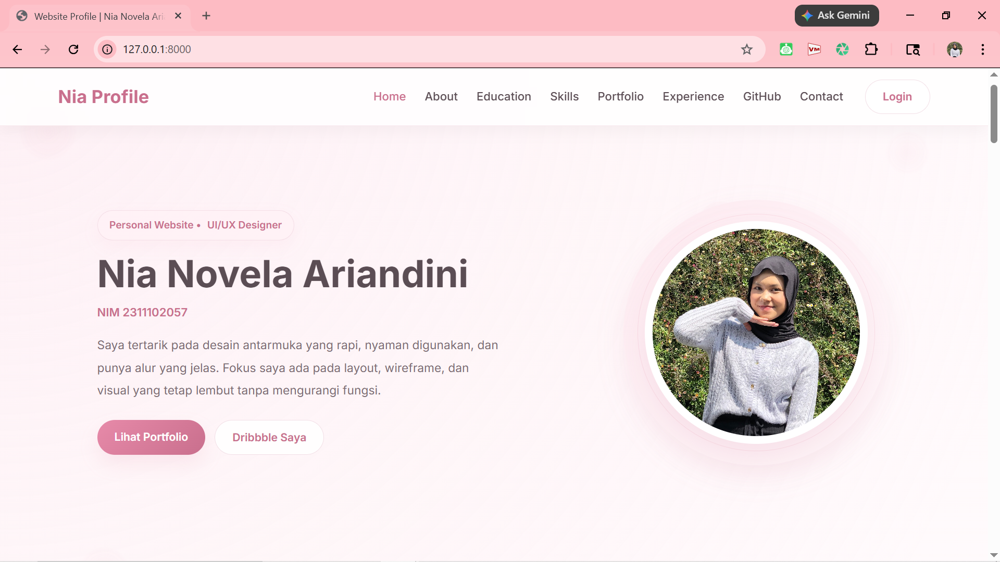
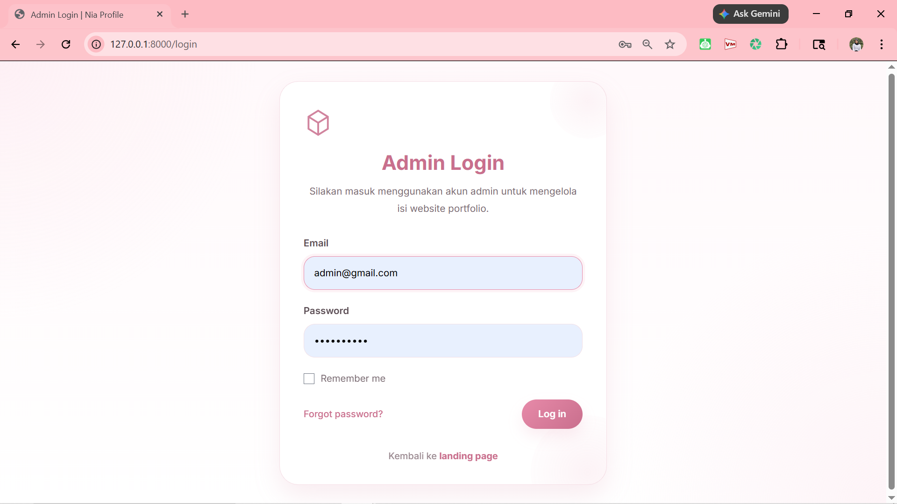
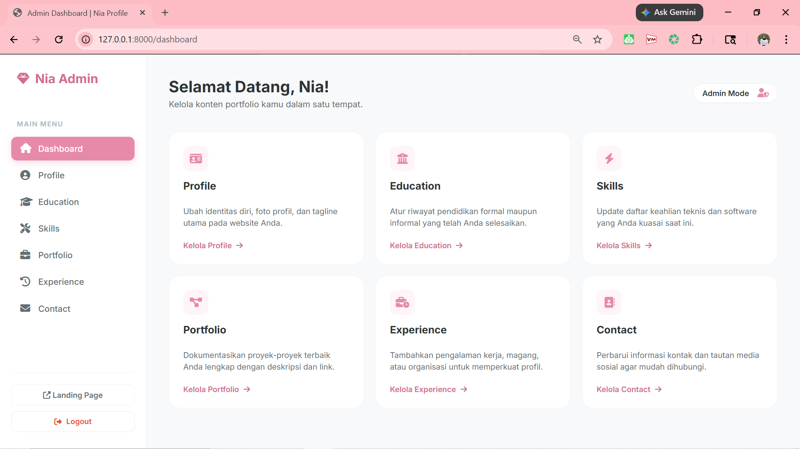
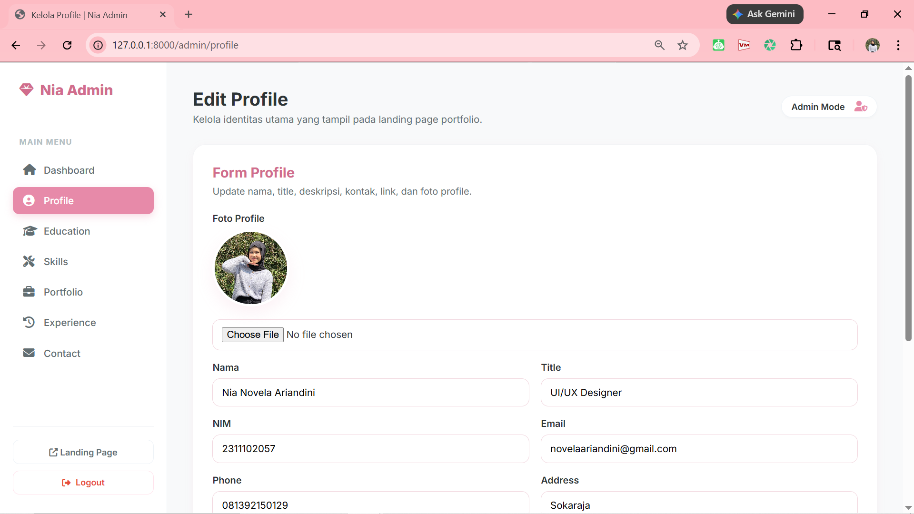
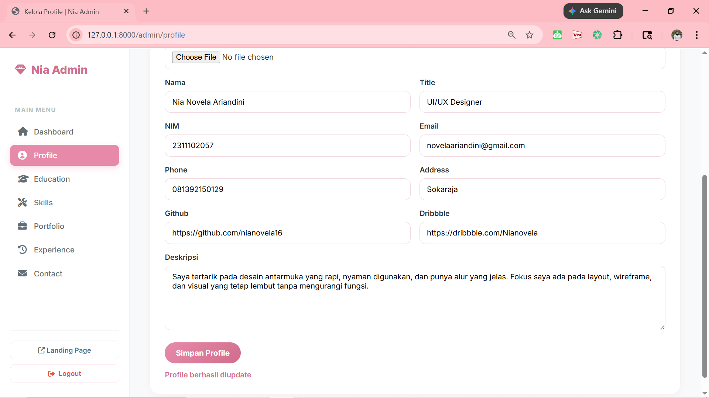

<div align="center">
  <br />
  <h1>LAPORAN UJIAN TENGAH SEMESTER <br> APLIKASI BERBASIS PLATFORM</h1>
  <br />
  <h3>WEB PORTOFOLIO LARAVEL <br> LANDING PAGE, AJAX, API, DAN DASHBOARD ADMIN</h3>
  <br />
  
  <br />
  <br />
  <br />
  <h3>Disusun Oleh :</h3>
  <p>
    <strong>Nia Novela Ariandini</strong><br>
    <strong>2311102057</strong><br>
    <strong>S1 IF-11-01</strong>
  </p>
  <br />
  <h3>Dosen Pengampu :</h3>
  <p>
    <strong>Dimas Fanny Hebrasianto Permadi, S.ST., M.Kom</strong>
  </p>
  <br />
  <br />
  <h4>Asisten Praktikum :</h4>
  <strong>Apri Pandu Wicaksono</strong> <br>
  <strong>Rangga Pradarrell Fathi</strong>
  <br />
  <br />
  <br />
  <br />
  <h3>LABORATORIUM HIGH PERFORMANCE <br> FAKULTAS INFORMATIKA <br> UNIVERSITAS TELKOM PURWOKERTO <br> 2026</h3>
</div>

---

## A. Dasar Teori

### 1. Laravel
Laravel adalah salah satu *framework* PHP yang digunakan untuk membangun aplikasi web secara terstruktur, efisien, dan mudah dikembangkan. Laravel menerapkan pola arsitektur **MVC (Model-View-Controller)** sehingga proses pengembangan aplikasi menjadi lebih rapi karena logika program, tampilan, dan pengolahan data dipisahkan sesuai fungsinya. Dalam proyek ini, Laravel digunakan untuk membangun web portofolio pribadi yang memiliki landing page, dashboard admin, autentikasi, API, serta integrasi database.

### 2. Konsep MVC (*Model-View-Controller*)
MVC merupakan pola perancangan aplikasi yang membagi sistem menjadi tiga bagian utama:
- **Model**, berfungsi untuk mengelola data serta berinteraksi dengan database.
- **View**, berfungsi untuk menampilkan antarmuka kepada pengguna.
- **Controller**, berfungsi sebagai penghubung antara Model dan View, sekaligus mengatur logika aplikasi.

Dengan konsep MVC, struktur program menjadi lebih terorganisir, mudah dipelihara, dan memudahkan pengembangan fitur baru.

### 3. Web Portofolio
Web portofolio adalah sebuah website yang digunakan untuk menampilkan identitas diri, kemampuan, pengalaman, karya, dan kontak seseorang dalam bentuk digital. Website ini berfungsi sebagai media personal branding sekaligus dokumentasi hasil karya yang dapat diakses secara online. Pada proyek ini, web portofolio menampilkan informasi profil, pendidikan, skill, pengalaman, project, GitHub, dan kontak.

### 4. CRUD (*Create, Read, Update, Delete*)
CRUD adalah empat operasi dasar dalam pengelolaan data pada aplikasi:
- **Create**, digunakan untuk menambahkan data baru.
- **Read**, digunakan untuk menampilkan atau membaca data.
- **Update**, digunakan untuk mengubah data yang sudah ada.
- **Delete**, digunakan untuk menghapus data.

Dalam web portofolio ini, CRUD diterapkan pada dashboard admin untuk mengelola data profil dan konten lain yang ditampilkan pada landing page.

### 5. Database dan SQLite
Database adalah kumpulan data yang disimpan secara terstruktur agar dapat dikelola dan diakses dengan mudah. Dalam aplikasi web, database berfungsi sebagai tempat penyimpanan data utama, seperti data profil, skill, pendidikan, pengalaman, project, dan kontak.  
Pada proyek ini, database yang digunakan adalah **SQLite**, yaitu basis data ringan yang dapat langsung digunakan tanpa konfigurasi server database terpisah. SQLite cocok digunakan untuk proyek pembelajaran dan pengembangan aplikasi skala kecil hingga menengah.

### 6. Migration
Migration pada Laravel adalah fitur untuk mengelola struktur tabel database menggunakan kode PHP. Dengan migration, pembuatan, perubahan, maupun penghapusan tabel dapat dilakukan secara terstruktur tanpa harus menulis perintah SQL secara manual. Migration membantu menjaga konsistensi struktur database selama proses pengembangan aplikasi.

### 7. Seeder
Seeder adalah fitur Laravel yang digunakan untuk mengisi database dengan data awal secara otomatis. Pada proyek ini, seeder digunakan untuk mengisi data default seperti profil, skill, pendidikan, pengalaman, project, dan kontak, sehingga aplikasi dapat langsung dijalankan tanpa harus memasukkan semua data secara manual dari awal.

### 8. Eloquent ORM
Eloquent ORM adalah fitur Laravel yang mempermudah interaksi dengan database melalui representasi objek atau model. Dengan Eloquent, pengembang tidak perlu selalu menulis query SQL secara langsung karena proses pengambilan, penyimpanan, pembaruan, dan penghapusan data dapat dilakukan melalui model PHP. Pada proyek ini, Eloquent digunakan untuk mengelola data profile, skill, education, experience, project, dan contact.

### 9. Authentication dan Session
Authentication adalah proses verifikasi identitas pengguna sebelum dapat mengakses sistem. Dalam Laravel, autentikasi dapat diterapkan melalui sistem login berbasis **session**. Session berfungsi menyimpan status login pengguna di server sehingga hanya admin yang sudah login yang dapat mengakses dashboard dan halaman pengelolaan data.

### 10. API (*Application Programming Interface*)
API adalah antarmuka yang memungkinkan pertukaran data antarbagian aplikasi atau antar sistem. Pada proyek ini, API digunakan untuk menyediakan data profil dan data project dalam format JSON agar dapat diambil oleh landing page menggunakan JavaScript. Endpoint seperti `/api/profile` dan `/api/projects` digunakan untuk menampilkan data secara dinamis dari backend ke frontend.

### 11. AJAX (*Asynchronous JavaScript and XML*)
AJAX adalah teknik yang memungkinkan aplikasi web mengambil atau mengirim data ke server tanpa harus me-reload seluruh halaman. Pada proyek ini, AJAX digunakan untuk:
- mengambil data profil dari API,
- menampilkan data secara dinamis di landing page,
- mengirim perubahan data dari dashboard admin ke backend,
- serta mendukung pengalaman pengguna yang lebih interaktif.

### 12. Upload File
Upload file adalah proses mengirim file dari sisi pengguna ke server untuk disimpan dan digunakan dalam aplikasi. Dalam proyek ini, upload file diterapkan pada fitur foto profil admin. File gambar yang diunggah disimpan pada direktori storage Laravel, lalu ditampilkan kembali di landing page melalui path yang terhubung dengan sistem penyimpanan.

### 13. Bootstrap
Bootstrap adalah framework CSS yang digunakan untuk mempercepat pembuatan tampilan web yang responsif dan rapi. Dengan Bootstrap, beberapa komponen seperti navbar, button, grid, dan layout dapat dibuat lebih cepat. Pada proyek ini, Bootstrap digunakan bersama CSS kustom untuk membangun tampilan landing page agar terlihat modern, lembut, dan responsif.

### 14. JavaScript
JavaScript digunakan untuk menambahkan interaksi pada halaman web. Dalam proyek ini, JavaScript dimanfaatkan untuk:
- memanggil API profile dan project,
- menampilkan data ke landing page,
- mengambil data GitHub melalui GitHub Public API,
- serta menangani proses AJAX pada dashboard admin.

---

## B. Penjelasan Kode Utama

Pada bagian ini dijelaskan mengenai alur navigasi aplikasi, antarmuka pengguna, serta manajemen data pada panel admin.

### 1. Sistem Navigasi Utama (`routes/web.php`)

File ini berfungsi sebagai pengatur lalu lintas URL yang menghubungkan permintaan pengguna dengan logika di dalam Controller.

```php
<?php

use App\Http\Controllers\ProfileController;
use App\Http\Controllers\Admin\DashboardController;
use App\Http\Controllers\Admin\ProfileAdminController;
use App\Http\Controllers\Admin\PortfolioAdminController;
use Illuminate\Support\Facades\Route;

// Akses Publik: Halaman Utama
Route::get('/', function () {
    return view('welcome');
});

// Akses Terproteksi: Grup Middleware Auth
Route::middleware(['auth'])->group(function () {
    // Dashboard Utama
    Route::get('/dashboard', [DashboardController::class, 'index'])->name('dashboard');

    // Manajemen Profile
    Route::get('/admin/profile', [ProfileAdminController::class, 'index'])->name('admin.profile');
    Route::post('/admin/profile/update', [ProfileAdminController::class, 'update'])->name('admin.profile.update');

    // Manajemen Portofolio/Project
    Route::get('/admin/portfolio', [PortfolioAdminController::class, 'index'])->name('admin.portfolio');
    Route::post('/admin/portfolio/store', [PortfolioAdminController::class, 'store'])->name('admin.portfolio.store');

    // Akun Login (Bawaan Laravel)
    Route::get('/profile', [ProfileController::class, 'edit'])->name('profile.edit');
    Route::patch('/profile', [ProfileController::class, 'update'])->name('profile.update');
    Route::delete('/profile', [ProfileController::class, 'destroy'])->name('profile.destroy');
});

require __DIR__.'/auth.php';
```

### Penjelasan Alur Route (`routes/web.php`)

Sistem routing pada aplikasi ini dirancang untuk memisahkan hak akses antara pengunjung umum dan administrator. Berikut adalah detail alur navigasi yang diimplementasikan:

* **🌐 Akses Publik (`/`)**
    Mengarahkan pengunjung secara langsung ke halaman `welcome.blade.php`. Halaman ini berfungsi sebagai *landing page* utama untuk menampilkan informasi portofolio kepada publik.

* **🔒 Middleware `auth`**
    Merupakan sistem proteksi keamanan yang memastikan fitur-fitur krusial seperti pengelolaan profil dan portofolio hanya dapat diakses oleh pengguna yang telah melalui proses autentikasi (sudah login). Jika pengguna belum login mencoba mengakses halaman ini, sistem akan otomatis mengarahkan kembali ke halaman login.

* **👤 Route Admin Profile**
    Bagian ini menangani logika *backend* untuk mengambil data profil dari database dan memproses pembaruan informasi biodata diri (seperti nama, NIM, deskripsi, dan foto) melalui Dashboard Admin.

* **💼 Route Admin Portfolio**
    Merupakan fitur untuk manajemen daftar proyek. Route ini mencakup fungsi `index` untuk menampilkan daftar karya dan fungsi `store` yang bertanggung jawab mengirimkan data proyek baru ke dalam database secara permanen.

### 2. Antarmuka Landing Page (`welcome.blade.php`)

Halaman ini berfungsi sebagai wajah utama website (*Frontend*) yang menampilkan informasi portofolio secara dinamis kepada pengunjung.

**Fitur dan Logika Utama:**

* **Penerapan AJAX (Fetch API):** Halaman ini tidak menampilkan data secara statis. Menggunakan JavaScript `async/await` dan `fetch()`, halaman akan meminta data ke endpoint `/api/profile` dan `/api/projects` segera setelah halaman dimuat. Hal ini memungkinkan konten diperbarui tanpa perlu melakukan *refresh* halaman.
    
* **Manipulasi DOM (Document Object Model):** Data yang diterima dari API dalam format JSON kemudian diinjeksikan ke dalam elemen HTML melalui ID spesifik (seperti `profile-name`, `profile-description`, dll).
    
* **Integrasi Storage Link:** Untuk menampilkan aset visual seperti foto profil dan gambar proyek, halaman ini mengakses *symlink* storage Laravel. Logika pengecekan dilakukan di sisi JavaScript: jika data foto tersedia di database, atribut `src` pada elemen gambar akan diisi secara otomatis.
    
* **Desain Responsif dengan Bootstrap:** Tampilan dibangun menggunakan sistem *grid* Bootstrap untuk memastikan website tetap proporsional dan mudah diakses, baik melalui perangkat *mobile* maupun *desktop*.

**Potongan Kode AJAX pada `welcome.blade.php`:**

```javascript
async function loadProfile() {
    const response = await fetch('/api/profile');
    const data = await response.json();

    // Mengisi konten secara dinamis
    document.getElementById('profile-name').textContent = data.name;
    document.getElementById('profile-nim').textContent = data.nim;
    
    // Menampilkan foto dari storage
    if (data.photo) {
        document.getElementById('profile-photo').src = `/storage/${data.photo}`;
    }
}
```
---

## C. Hasil Tampilan 

### Halaman Awal


### Halaman Login


### Halaman Dashboard


### Halaman Edit Profile


### Halaman Edit Profile


## D. Kesimpulan

Berdasarkan hasil pengembangan dan implementasi yang telah dilakukan pada proyek UTS ini, dapat ditarik beberapa kesimpulan utama:

1. **Integrasi Framework yang Efektif**: Penggunaan framework **Laravel** dengan arsitektur **MVC** terbukti memudahkan pengelolaan logika aplikasi, basis data, dan antarmuka secara terstruktur dan efisien.

2. **Pemanfaatan API dan AJAX**: Implementasi **API** yang dipadukan dengan teknik **AJAX (Fetch API)** pada halaman *landing page* memberikan pengalaman pengguna (*User Experience*) yang lebih modern dan interaktif, di mana data dapat dimuat secara dinamis tanpa perlu melakukan pemuatan ulang halaman (*reload*).

3. **Keamanan dan Manajemen Data**: Penggunaan **Middleware Auth** memberikan keamanan pada jalur akses admin, sehingga pengelolaan data profil dan portofolio hanya dapat dilakukan oleh pihak yang berwenang melalui dashboard yang intuitif.

4. **Kemudahan Skalabilitas**: Dengan adanya fitur **Migration** dan **Seeder**, struktur database menjadi lebih konsisten dan mudah untuk dikembangkan lebih lanjut di masa mendatang, baik untuk penambahan fitur maupun perubahan data.

Secara keseluruhan, proyek ini telah memenuhi target kompetensi mata kuliah Aplikasi Berbasis Platform, khususnya dalam penguasaan *full-stack web development* yang mencakup *routing*, *database management*, *authentication*, hingga *dynamic frontend interaction*.

