<div align="center">
  <br />
  <h1>LAPORAN UJIAN TENGAH SEMESTER <br> APLIKASI BERBASIS PLATFORM</h1>
  <br />
  <h3>WEB PORTOFOLIO LARAVEL</h3>
  <br />
  
  <br />
  <br />
  <br />
  <h3>Disusun Oleh :</h3>
  <p>
    <strong>Muhammad Hamzah Haifan Ma'ruf</strong><br>
    <strong>2311102091</strong><br>
    <strong>S1 IF-11-01</strong>
  </p>
  <br />
  <h3>Dosen Pengampu :</h3>
  <p>
    <strong>Dimas Fanny Hebrasianto Permadi, S.ST., M.Kom</strong>
  </p>
  <br />
  <br />
  <h4>Asisten Praktikum :</h4>
  <strong>Apri Pandu Wicaksono</strong> <br>
  <strong>Rangga Pradarrell Fathi</strong>
  <br />
  <br />
  <br />
  <br />
  <h3>LABORATORIUM HIGH PERFORMANCE <br> FAKULTAS INFORMATIKA <br> UNIVERSITAS TELKOM PURWOKERTO <br> 2026</h3>
</div>

---

## Dasar Teori

Website portofolio merupakan media digital yang digunakan untuk menampilkan identitas, kemampuan, riwayat pendidikan, pengalaman, organisasi, dan proyek yang pernah dikerjakan dalam satu tampilan yang terstruktur. Dalam konteks pembelajaran pemrograman web, website portofolio tidak hanya berfungsi sebagai media presentasi data, tetapi juga sebagai sarana implementasi berbagai konsep dasar pengembangan perangkat lunak seperti perancangan antarmuka, pengelolaan data, integrasi database, autentikasi, serta komunikasi antara sisi frontend dan backend.

Pada proyek ini, framework yang digunakan adalah **Laravel**. Laravel merupakan framework PHP yang mendukung pola arsitektur **Model-View-Controller (MVC)**. Arsitektur MVC membagi sistem ke dalam tiga bagian utama. **Model** bertugas menangani data dan interaksi dengan database, **View** bertugas menampilkan antarmuka kepada pengguna, sedangkan **Controller** bertugas mengatur logika proses dan menjadi penghubung antara Model dan View. Dengan pola ini, struktur aplikasi menjadi lebih rapi, mudah dikembangkan, dan mudah dipelihara.

Dari sisi tampilan, antarmuka website modern perlu memperhatikan prinsip **usability** dan **user experience (UX)**. Usability berkaitan dengan kemudahan penggunaan sistem, kejelasan navigasi, konsistensi tata letak, dan efisiensi interaksi pengguna. Sementara itu, UX lebih menekankan pada pengalaman keseluruhan saat pengguna berinteraksi dengan website, termasuk kenyamanan visual, kejelasan informasi, dan responsivitas antarmuka. Oleh karena itu, pada proyek ini diterapkan pendekatan desain gelap (dark futuristic theme), tipografi tegas, layout per slide, serta animasi transisi agar website tampil menarik namun tetap sederhana.

Selain itu, website ini menggunakan konsep **single-page section navigation**, yaitu beberapa bagian konten ditampilkan dalam bentuk slide pada satu halaman utama. Konsep ini memberikan pengalaman navigasi yang lebih mulus karena pengguna dapat berpindah antarbagian tanpa harus membuka banyak halaman berbeda. Setiap slide memiliki identitas visual dan animasi yang berbeda, sehingga halaman terasa lebih hidup namun tetap konsisten.

Pengambilan data pada website dilakukan secara dinamis melalui endpoint **`/api/portofolio`**. Dengan pendekatan ini, konten pada landing page tidak ditulis secara statis di file tampilan, melainkan diambil dari database melalui backend Laravel. Cara ini membuat website lebih fleksibel karena administrator dapat memperbarui isi portofolio dari dashboard admin tanpa harus mengubah kode frontend secara langsung.

Dari sisi basis data, sistem memanfaatkan tabel-tabel terpisah seperti profil, skill, education, experience, organization, dan project. Pemisahan tabel ini mendukung prinsip normalisasi data agar informasi lebih terstruktur, tidak redundan, dan lebih mudah dikelola. Setiap data kemudian ditampilkan kembali pada landing page menggunakan JavaScript setelah respons JSON diterima dari server.

---

## Penjelasan Code

### 1. Struktur Dasar Landing Page

Landing page disusun menggunakan Blade Laravel. Bagian struktur utamanya terdiri atas elemen navigasi, viewport, dan beberapa section slide.

```html
<nav class="floating-nav">
    <button type="button" class="nav-btn active" data-slide="hero">Home</button>
    <button type="button" class="nav-btn" data-slide="about">About</button>
    <button type="button" class="nav-btn" data-slide="skills">Skills</button>
    <button type="button" class="nav-btn" data-slide="education">Education</button>
    <button type="button" class="nav-btn" data-slide="experience">Experience</button>
    <button type="button" class="nav-btn" data-slide="organization">Organization</button>
    <button type="button" class="nav-btn" data-slide="projects">Projects</button>
</nav>

<main class="viewport">
    <section id="slide-hero" class="slide slide-hero active">...</section>
    <section id="slide-about" class="slide slide-about">...</section>
    <section id="slide-skills" class="slide slide-skills">...</section>
    <section id="slide-education" class="slide slide-education">...</section>
    <section id="slide-experience" class="slide slide-experience">...</section>
    <section id="slide-organization" class="slide slide-organization">...</section>
    <section id="slide-projects" class="slide slide-projects">...</section>
</main>
```

Kode tersebut menunjukkan bahwa seluruh isi portofolio disusun dalam satu halaman utama. Tiap bagian memiliki `id` yang berbeda agar dapat dipanggil oleh tombol navigasi menggunakan JavaScript.

### 2. Integrasi Asset Laravel dengan Vite

Aplikasi menggunakan Vite untuk menghubungkan file CSS dan JavaScript ke tampilan Laravel.

```php
@vite(['resources/css/app.css', 'resources/js/app.js'])
```

Kode ini berfungsi memuat asset frontend secara otomatis. Dengan pendekatan ini, proses pengembangan antarmuka menjadi lebih rapi dan mendukung hot reload saat coding.

### 3. Struktur Hero Section

Bagian Home atau Hero menampilkan nama, title, dan foto profil.

```html
<section id="slide-hero" class="slide slide-hero active">
    <div class="slide-content hero-layout">
        <div class="hero-copy">
            <div class="eyebrow reveal delay-1">Digital Identity</div>
            <h1 id="hero-name" class="hero-name metal-text reveal delay-2">Loading...</h1>
            <div id="hero-title" class="hero-role reveal delay-3">Loading...</div>
        </div>

        <div class="hero-visual">
            <div class="photo-wrap reveal delay-4" id="photoWrap">
                <div class="photo-depth-glow"></div>
                <div class="photo-3d" id="photo3d">
                    
                </div>
            </div>
        </div>
    </div>
</section>
```

Kode ini menunjukkan bahwa data nama, title, dan foto belum diisi langsung secara statis, melainkan menunggu data dari API. Karena itu digunakan placeholder `Loading...`.

### 4. CSS 

Tema visual website menggunakan latar belakang gelap, efek glow, dan tipografi metalik.

```css
.page-bg {
    position: fixed;
    inset: 0;
    z-index: -30;
    background:
        radial-gradient(circle at 14% 18%, rgba(255,255,255,0.08), transparent 20%),
        radial-gradient(circle at 85% 74%, rgba(255,255,255,0.05), transparent 24%),
        linear-gradient(135deg, #020202 0%, #080808 36%, #101010 72%, #030303 100%);
}

.metal-text {
    background: linear-gradient(
        90deg,
        #ffffff 0%,
        #d4d4d8 18%,
        #ffffff 42%,
        #a1a1aa 72%,
        #ffffff 100%
    );
    -webkit-background-clip: text;
    background-clip: text;
    color: transparent;
}
```

Kode `.page-bg` membangun nuansa futuristik melalui kombinasi radial gradient dan linear gradient. Sementara itu, `.metal-text` membuat judul tampak seperti teks metalik yang elegan.

### 5. Animasi Reveal dan Perpindahan Slide

Setiap section memiliki efek masuk yang berbeda agar tampilan terasa dinamis.

```css
.reveal {
    opacity: 0;
    transform: translateY(28px);
    filter: blur(10px);
    transition:
        opacity 0.78s var(--ease-smooth),
        transform 0.78s var(--ease-smooth),
        filter 0.78s var(--ease-smooth);
}

.slide.active .reveal {
    opacity: 1;
    transform: translateY(0);
    filter: blur(0);
}
```

Kode di atas membuat elemen dengan class `reveal` muncul secara halus ketika slide aktif. Efek ini digunakan hampir di seluruh section agar transisi terlihat modern.

### 6. Fungsi Navigasi Antar Slide

Perpindahan slide dilakukan oleh fungsi JavaScript berikut:

```javascript
function changeSlide(target) {
    const slides = document.querySelectorAll('.slide');
    const navButtons = document.querySelectorAll('.nav-btn');

    slides.forEach(slide => slide.classList.remove('active'));
    navButtons.forEach(btn => btn.classList.remove('active'));

    const targetSlide = document.getElementById(`slide-${target}`);
    const targetButtons = document.querySelectorAll(`.nav-btn[data-slide="${target}"]`);

    if (targetSlide) {
        resetRevealState(targetSlide);
        targetSlide.classList.add('active');
    }

    targetButtons.forEach(btn => btn.classList.add('active'));
}
```

Kode tersebut bekerja dengan cara menonaktifkan semua slide terlebih dahulu, lalu mengaktifkan slide yang dipilih. Dengan demikian, tampilan berpindah tanpa reload halaman.

### 7. Pengambilan Data dari API

Data portofolio diambil secara asynchronous dari endpoint backend.

```javascript
async function loadPortofolio() {
    const response = await fetch('/api/portofolio', {
        headers: {
            'Accept': 'application/json'
        }
    });

    if (!response.ok) {
        throw new Error(`HTTP error! Status: ${response.status}`);
    }

    const data = await response.json();
}
```

Fungsi ini sangat penting karena seluruh data landing page berasal dari respons API. Jika API gagal, maka sistem akan masuk ke blok `catch`.

### 8. Helper Function untuk Menampilkan Data

Agar kode lebih ringkas, digunakan beberapa helper function.

```javascript
function setText(id, value, fallback = '-') {
    const el = document.getElementById(id);
    if (el) {
        el.textContent = value && value !== '' ? value : fallback;
    }
}

function setHtml(id, value, fallback = '-') {
    const el = document.getElementById(id);
    if (el) {
        el.innerHTML = value && value !== '' ? value : fallback;
    }
}

function safeArray(value) {
    return Array.isArray(value) ? value : [];
}
```

`setText()` dipakai untuk menaruh string biasa, `setHtml()` digunakan ketika isi elemen mengandung tag HTML seperti link, sedangkan `safeArray()` memastikan data yang diproses benar-benar berupa array.

### 9. Rendering Data Profil

Data profil dipasang pada Home dan About.

```javascript
if (profile) {
    setText('hero-name', profile.name, 'Nama belum tersedia');
    setText('hero-title', profile.title, 'Title belum tersedia');

    setText('profile-about', profile.about, 'Deskripsi belum tersedia');
    setHtml('about-phone', formatPhone(profile.phone));
    setHtml('about-email', formatEmail(profile.email));
    setHtml('about-instagram', formatInstagram(profile.instagram));
    setText('about-address', profile.address, '-');

    if (profile.photo && profile.photo !== '') {
        const photo = document.getElementById('profile-photo');
        if (photo) {
            photo.src = `/storage/${profile.photo}`;
        }
    }
}
```

Logika ini menunjukkan bahwa data profil diambil dari database, lalu ditampilkan ke elemen HTML sesuai id masing-masing.

### 10. Rendering Data Skills

Skill ditampilkan dalam bentuk chip dinamis.

```javascript
if (skills.length > 0) {
    skills.forEach((skill, index) => {
        skillsList.innerHTML += `
            <div class="skill-chip ${makeRevealDelay(index, 4, 4)}">
                <div>
                    <div class="skill-index">${String(index + 1).padStart(2, '0')}</div>
                    <div class="skill-name">${skill.skill_name || '-'}</div>
                </div>
                <div class="skill-desc">${skill.description || 'Skill description'}</div>
            </div>
        `;
    });
}
```

Setiap data skill di-loop menggunakan `forEach()`, lalu ditambahkan ke `innerHTML`. Ini membuat jumlah skill fleksibel sesuai isi database.

### 11. Rendering Data Education

Bagian pendidikan ditampilkan dalam timeline.

```javascript
if (educations.length > 0) {
    educations.forEach((education, index) => {
        educationsList.innerHTML += `
            <div class="education-item ${makeRevealDelay(index, 4, 4)}">
                <div class="education-years">${education.start_year || '-'} - ${education.end_year || '-'}</div>
                <div class="education-school">${education.institution || '-'}</div>
                <div class="education-major">${education.major || '-'}</div>
            </div>
        `;
    });
}
```

Dengan format ini, riwayat pendidikan tampil runtut dan mudah dipahami secara kronologis.

### 12. Rendering Data Experience

Bagian pengalaman ditampilkan dalam grid.

```javascript
if (experiences.length > 0) {
    experiences.forEach((experience, index) => {
        experiencesList.innerHTML += `
            <div class="experience-item ${makeRevealDelay(index, 4, 4)}">
                <div class="experience-year">${experience.year || '-'}</div>
                <div class="experience-company">${experience.company || '-'}</div>
                <div class="experience-position">${experience.position || '-'}</div>
                <div class="experience-desc">${experience.description || 'Tidak ada deskripsi pengalaman.'}</div>
            </div>
        `;
    });
}
```

Struktur ini cocok untuk menampilkan beberapa pengalaman dengan bobot visual yang seimbang.

### 13. Rendering Data Organization

Bagian organisasi dirancang menjadi flow editorial, bukan card.

```javascript
if (organizations.length > 0) {
    organizations.forEach((org, index) => {
        organizationsList.innerHTML += `
            <article class="organization-flow-item ${makeRevealDelay(index, 4, 4)}">
                <div class="organization-flow-year">${org.year || '-'}</div>
                <div class="organization-flow-content">
                    <div class="organization-flow-top">
                        <div class="organization-name">${org.organization_name || '-'}</div>
                        <div class="organization-role">${org.role || '-'}</div>
                    </div>
                    <div class="organization-desc">${org.description || 'Tidak ada deskripsi organisasi.'}</div>
                </div>
            </article>
        `;
    });
}
```

Pendekatan ini membuat tampilan lebih bersih dan lebih cocok untuk konsep portofolio modern.

### 14. Rendering Data Projects

Bagian proyek dibagi menjadi featured project dan list project lainnya.

```javascript
const featured = projects[0];
const sideProjects = projects.slice(1, 4);

projectsList.innerHTML = `
    <article class="project-featured-flow ${makeRevealDelay(0, 4, 4)}">
        <div class="project-featured-label">Featured Project</div>
        <div class="project-featured-type">${featured.project_type || 'Project'}</div>
        <div class="project-featured-name">${featured.project_name || '-'}</div>
        <div class="project-featured-desc">${featured.description || 'Tidak ada deskripsi proyek.'}</div>
        <div class="project-featured-meta">
            <div class="project-meta-inline">Type <span>${featured.project_type || '-'}</span></div>
            <div class="project-meta-inline">Status <span>Completed</span></div>
            <div class="project-meta-inline">Focus <span>Design & Build</span></div>
        </div>
    </article>
`;
```

Kode tersebut membuat satu proyek unggulan tampil lebih besar dibanding proyek lainnya, sehingga perhatian pengguna langsung tertuju pada proyek utama.

### 15. Efek Interaktif Foto Profil

Efek 3D tilt pada foto profile dibuat menggunakan event mousemove.

```javascript
photoWrap.addEventListener('mousemove', (e) => {
    const rect = photoWrap.getBoundingClientRect();
    const x = e.clientX - rect.left;
    const y = e.clientY - rect.top;

    const centerX = rect.width / 2;
    const centerY = rect.height / 2;

    const rotateY = ((x - centerX) / centerX) * 10;
    const rotateX = ((centerY - y) / centerY) * 10;

    photo3d.style.transform = `
        translateY(-6px)
        rotateX(${rotateX}deg)
        rotateY(${rotateY}deg)
        scale(1.03)
    `;
});
```

Efek ini membuat foto terasa lebih hidup karena bereaksi terhadap gerakan mouse pengguna.

### 16. Contoh Kode Dashboard Admin

Dashboard admin digunakan untuk mengelola data portofolio. Secara umum, dashboard menampilkan menu navigasi ke data profile, skills, education, experience, organization, dan project. Contoh struktur sederhana dashboard adalah sebagai berikut:

```php
@extends('admin.layouts.app')

@section('content')
<div class="dashboard-wrapper">
    <div class="dashboard-header">
        <h1>Admin Dashboard</h1>
        <p>Kelola seluruh data portofolio dari panel admin.</p>
    </div>

    <div class="dashboard-grid">
        <a href="{{ route('admin.profile.index') }}" class="dashboard-card">Profile</a>
        <a href="{{ route('admin.skills.index') }}" class="dashboard-card">Skills</a>
        <a href="{{ route('admin.education.index') }}" class="dashboard-card">Education</a>
        <a href="{{ route('admin.experience.index') }}" class="dashboard-card">Experience</a>
        <a href="{{ route('admin.organization.index') }}" class="dashboard-card">Organization</a>
        <a href="{{ route('admin.project.index') }}" class="dashboard-card">Projects</a>
    </div>
</div>
@endsection
```

Kode tersebut menunjukkan bahwa dashboard admin berfungsi sebagai pusat kontrol data. Dari panel ini, admin dapat menambah, mengedit, dan menghapus isi portofolio.

---

## Hasil Tampilan

Hasil akhir dari implementasi ini adalah sebuah website portofolio modern berbasis Laravel dengan dashboard admin dan landing page dinamis. Secara umum, hasil tampilannya dapat dijelaskan sebagai berikut:

### 1. Tampilan Landing Page Home
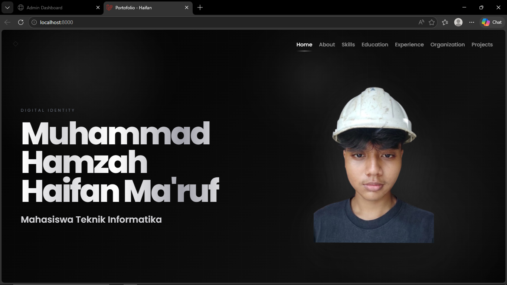
Halaman Home menampilkan nama, title, dan foto profil sebagai identitas utama. Layout dibuat sederhana dengan fokus kuat pada headline sehingga pengguna langsung mengetahui siapa pemilik portofolio. Foto profil diberikan efek interaktif agar tampilan lebih hidup.

### 2. Tampilan Landing Page About
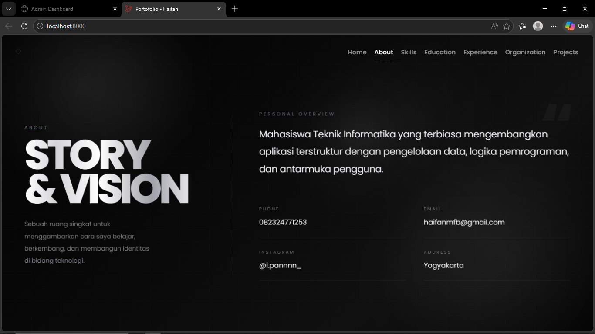
Halaman About menampilkan deskripsi singkat mengenai diri pengguna, visi pribadi, serta informasi kontak seperti nomor telepon, email, Instagram, dan alamat. Layout dibuat lebih formal dan informatif dibanding Home.

### 3. Tampilan Landing Page Skills
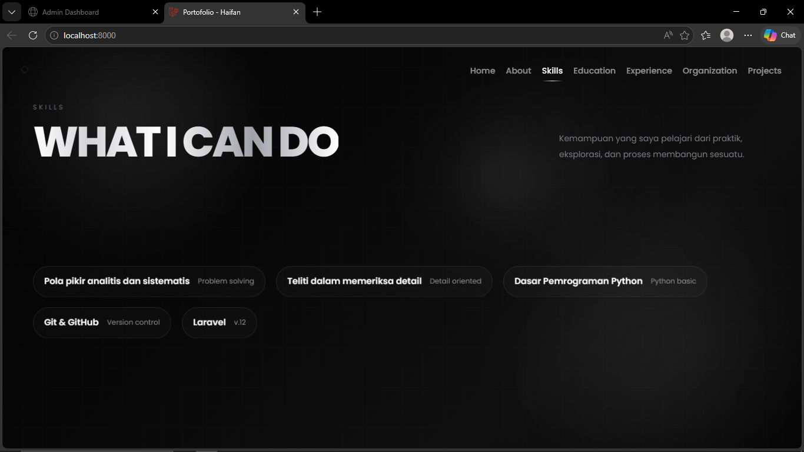
Halaman Skills menampilkan kemampuan dalam bentuk chip agar terlihat rapi dan cepat dipindai. Pengguna dapat langsung melihat daftar skill yang dimiliki tanpa harus membaca paragraf panjang.

### 4. Tampilan Landing Page Education
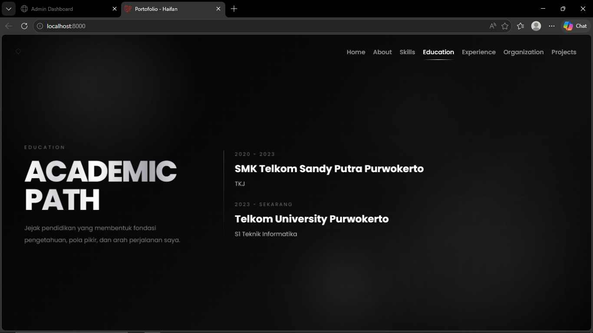
Halaman Education disusun dalam bentuk timeline vertikal. Pendekatan ini memudahkan pembaca memahami urutan perjalanan pendidikan secara kronologis.

### 5. Tampilan Landing Page Experience
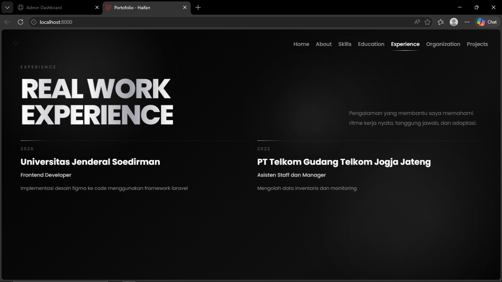
Halaman Experience menampilkan pengalaman kerja atau pengalaman nyata dalam grid. Tata letak ini cocok untuk informasi yang jumlahnya lebih dari satu dan membutuhkan penekanan yang setara antar item.

### 6. Tampilan Landing Page Organization
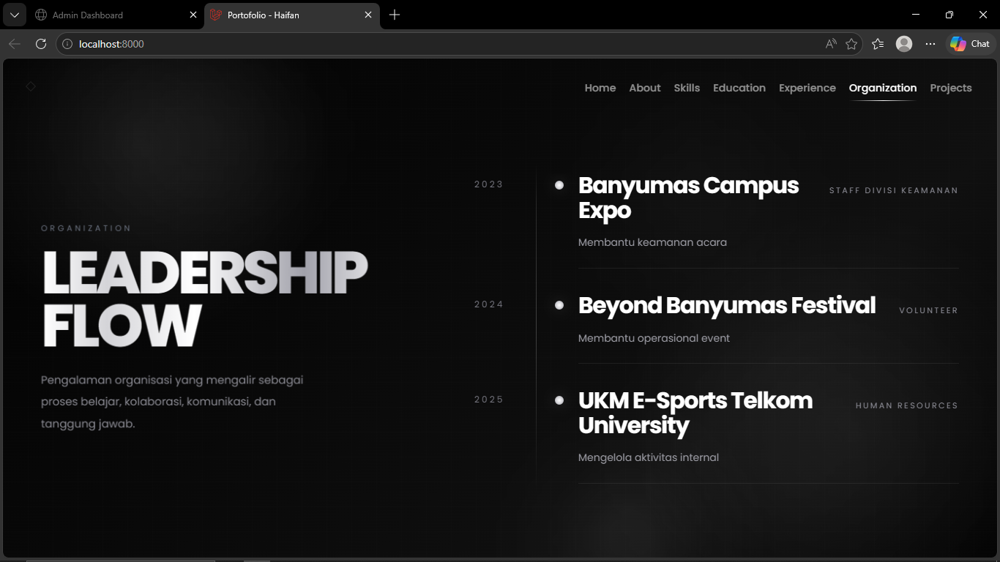
Halaman Organization menampilkan riwayat organisasi dalam bentuk flow timeline editorial. Tampilan ini terlihat lebih dewasa, lebih bersih, dan tidak terlalu penuh elemen kotak. Informasi tahun, organisasi, jabatan, dan deskripsi tetap terbaca jelas.

### 7. Tampilan Landing Page Projects
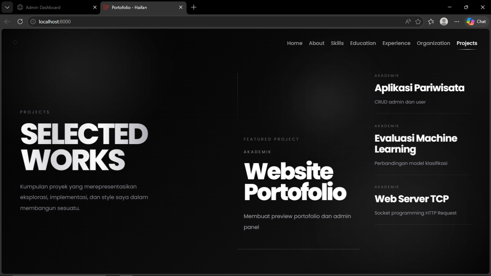
Halaman Projects menampilkan proyek unggulan pada area utama dan proyek lain pada daftar pendukung. Dengan layout ini, perhatian pengguna diarahkan terlebih dahulu ke proyek terbaik, lalu ke proyek lainnya secara bertahap. Hasil tampilannya menjadi lebih estetik, lebih mengalir, dan lebih cocok untuk website portofolio.

### 8. Tampilan Login
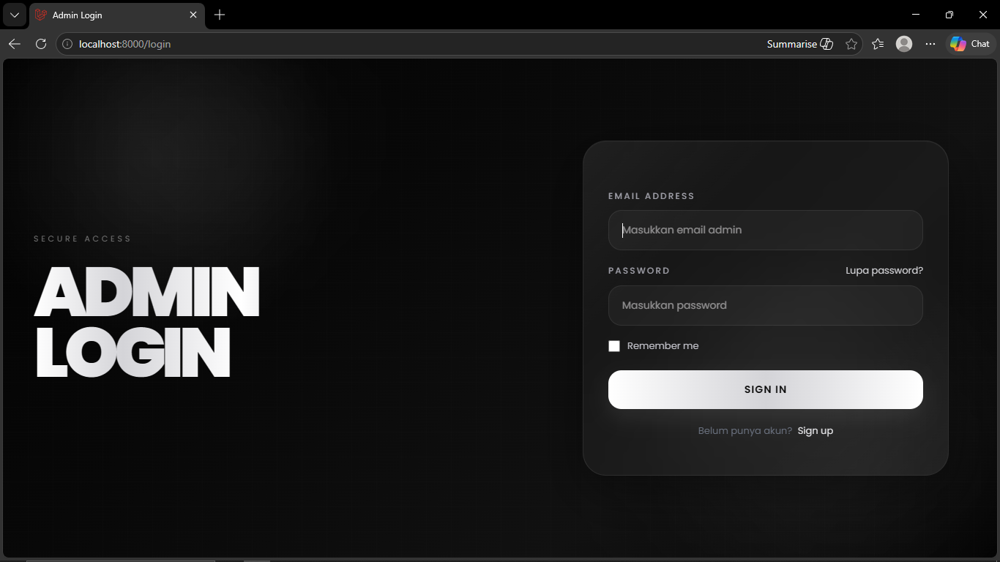
Halaman login dirancang dengan konsep modern futuristik menggunakan dominasi warna hitam, abu-abu, dan putih metalik untuk memberikan kesan elegan serta profesional. Layout dibuat split screen dengan sisi kiri menampilkan identitas sistem dan sisi kanan berisi form login dalam card glassmorphism yang bersih dan fokus. Elemen input, tombol, serta tipografi dibuat minimalis agar nyaman digunakan, responsif, dan mampu memberikan pengalaman login yang aman serta menarik secara visual.

### 8. Tampilan Dashboard Admin
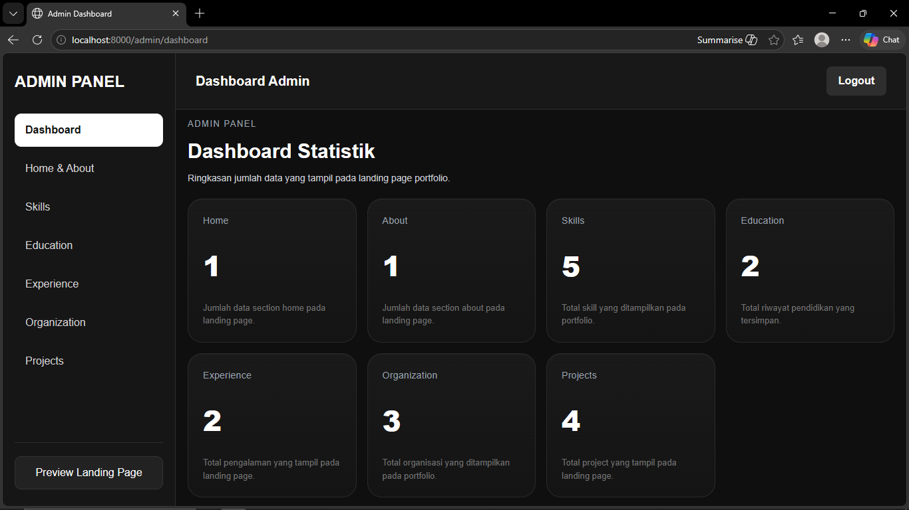
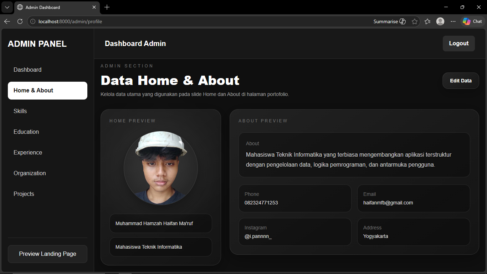
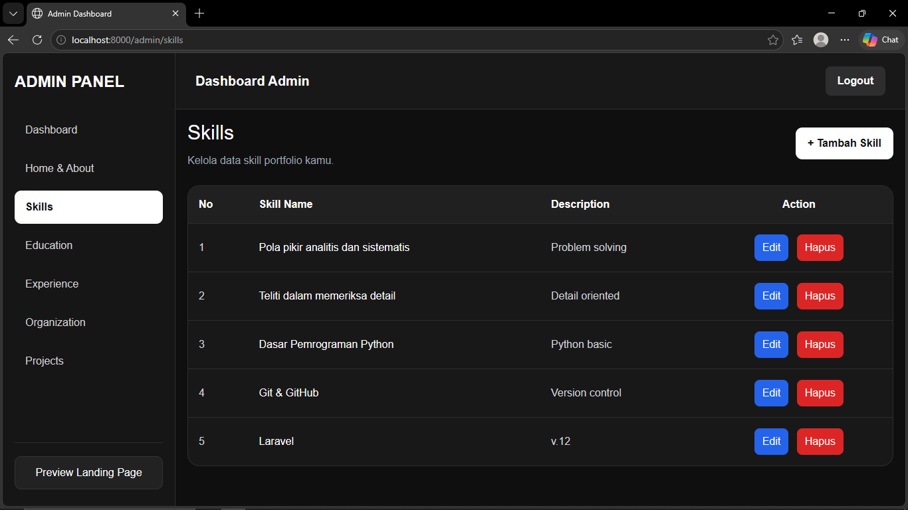
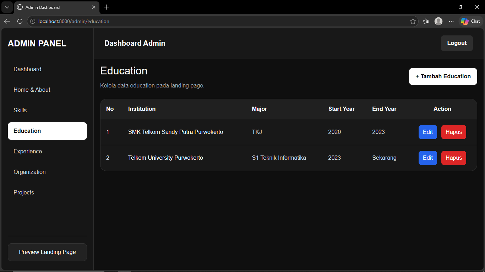
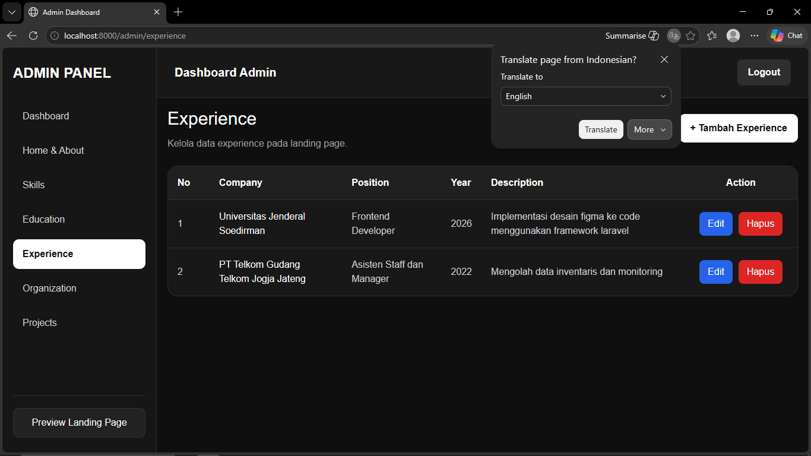
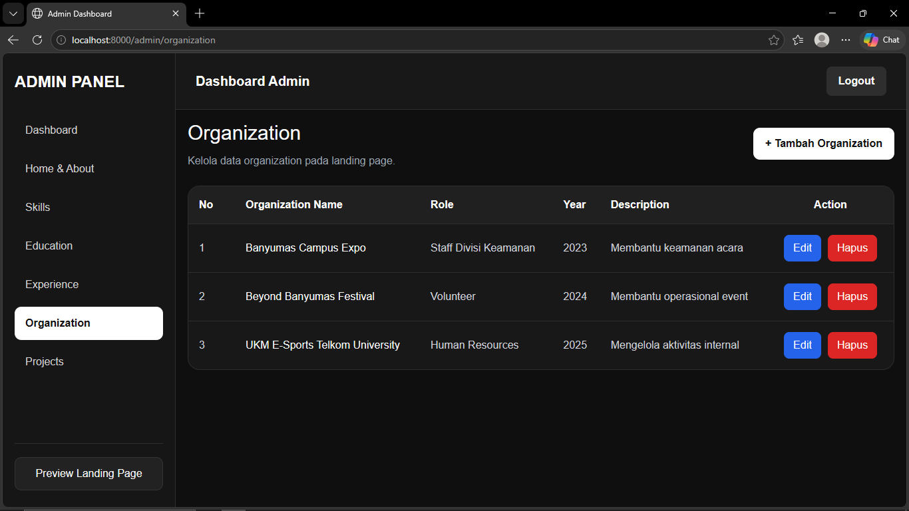
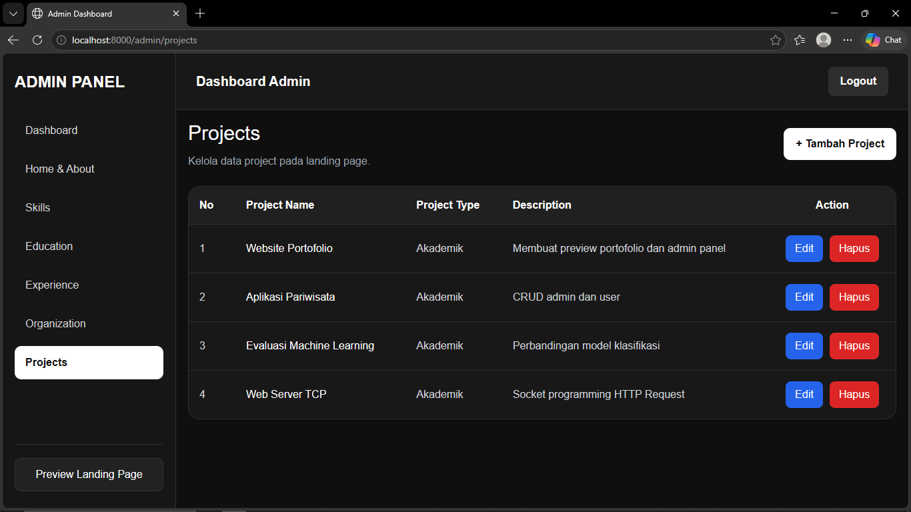
Selain landing page, aplikasi ini juga memiliki dashboard admin sebagai pusat pengelolaan data. Dashboard admin berfungsi untuk memudahkan administrator mengelola isi portofolio tanpa harus mengubah kode secara manual. Dari dashboard ini, admin dapat masuk ke menu profile, skills, education, experience, organization, dan project.

Secara visual, dashboard admin dirancang dengan tema gelap yang konsisten dengan landing page sehingga identitas desain tetap terjaga. Menu-menu ditampilkan dengan layout yang rapi dan mudah dipahami. Fitur utamanya adalah menambah data baru, mengubah data yang sudah ada, menghapus data, serta mengatur isi setiap section yang akan muncul pada landing page.

Dengan adanya dashboard admin, aplikasi ini tidak hanya berfungsi sebagai tampilan frontend, tetapi juga sebagai sistem informasi sederhana yang benar-benar dapat digunakan untuk manajemen konten portofolio.

Secara keseluruhan, hasil tampilan website memenuhi prinsip modern, simple, aesthetic, dan tetap fungsional. Tampilan tidak hanya fokus pada keindahan visual, tetapi juga menjaga keterbacaan dan kemudahan navigasi.

---

## Kesesuaian Ketentuan UTS

### 1. Menggunakan Framework
Aplikasi dibangun menggunakan framework **Laravel**, sehingga memenuhi aspek penggunaan framework modern dalam pengembangan web.

### 2. Menerapkan Arsitektur MVC
Sistem memanfaatkan pemisahan Model, View, dan Controller. Data disimpan pada model dan database, tampilan berada pada Blade, sedangkan logika proses ada pada controller dan endpoint API.

### 3. Terintegrasi dengan Database
Konten portofolio seperti profil, skill, education, experience, organization, dan project diambil dari database. Dengan demikian, aplikasi tidak bersifat statis.

### 4. Memiliki Dashboard/Admin
Terdapat panel admin untuk mengelola data portofolio. Hal ini menunjukkan bahwa aplikasi memiliki mekanisme CRUD dan bukan sekadar landing page biasa.

### 5. Menggunakan Autentikasi/Login
Aplikasi telah mendukung login sehingga akses admin dibatasi. Ini menunjukkan adanya pengamanan dasar terhadap fitur pengelolaan data.

### 6. Menampilkan Data Secara Dinamis
Landing page tidak ditulis secara manual satu per satu, tetapi memanggil data dari API backend dan merendernya menggunakan JavaScript. Hal ini menunjukkan integrasi frontend dan backend berjalan dengan baik.

### 7. Memiliki Desain Antarmuka yang Terstruktur
Website terdiri atas beberapa bagian jelas: Home, About, Skills, Education, Experience, Organization, dan Projects. Struktur ini menunjukkan perancangan antarmuka yang sistematis.

### 8. Responsif dan Interaktif
Terdapat media query untuk menyesuaikan tampilan pada layar lebih kecil, serta efek interaktif seperti transisi slide, hover effect, cursor glow, dan tilt pada foto profil.

### 9. Menunjukkan Kreativitas Desain
Tampilan website mengusung konsep futuristik yang elegan. Tiap slide memiliki identitas visual yang berbeda namun tetap konsisten. Hal ini menambah nilai pada aspek kreativitas dan estetika.

### 10. Layak Dijadikan Produk Portofolio
Selain memenuhi tugas akademik, aplikasi ini juga memiliki nilai praktis karena dapat digunakan sebagai portofolio personal yang nyata dan dapat dikembangkan lebih lanjut.

---

## Kesimpulan

Berdasarkan hasil perancangan dan implementasi, website portofolio berbasis Laravel yang dibuat telah berhasil mengintegrasikan aspek backend, frontend, dan database ke dalam satu sistem yang utuh. Aplikasi ini tidak hanya menampilkan informasi portofolio secara statis, tetapi juga mendukung pengelolaan data secara dinamis melalui dashboard admin dan endpoint API. Penggunaan Laravel dengan arsitektur MVC membuat struktur proyek lebih terorganisasi, mudah dipelihara, dan sesuai untuk pengembangan berkelanjutan.

Dari sisi tampilan, website berhasil menerapkan konsep desain modern, simple, dan aesthetic melalui tema gelap, tipografi tegas, layout per section, serta animasi transisi yang halus. Bagian Organization dan Projects juga telah dikembangkan dengan pendekatan visual yang lebih mengalir dan editorial sehingga tidak terkesan berat atau berlebihan. Selain landing page, dashboard admin juga memberikan nilai tambah karena memudahkan pengelolaan seluruh isi portofolio. Secara keseluruhan, proyek ini telah memenuhi kebutuhan tugas UTS sekaligus menunjukkan kemampuan dalam merancang, membangun, dan menyajikan aplikasi web yang fungsional serta menarik secara visual.

---

## Referensi

1. Balkis, P., & Oktaviani, N. (2023). **Re-Design User Interface Website PT. Gozco Menggunakan Design Thinking**. *Jurnal FASILKOM*. DOI: https://doi.org/10.37859/jf.v13i02.5528

2. Toraman, N., Pekpazar, A., Turgut, G., & Ünalır, M. O. (2023). **Conceptualization and Survey Instrument Development for Website Usability**. *Informatics, 10*(3), 75. DOI: https://doi.org/10.3390/informatics10030075

3. Hasson, R. E., Xie, M., Tadikamalla, D., & Beemer, L. R. (2024). **Using a Human-Centered Design Process to Evaluate and Optimize User Experience of a Website (InPACT at Home) to Promote Youth Physical Activity: Case Study**. *JMIR Human Factors, 11*, e52496. DOI: https://doi.org/10.2196/52496

4. Faudzi, M. A., Sahrir, M. S., Basar, N. S. A., & Zaini, N. H. (2024). **User Interface Design in Mobile Learning Applications: Developing and Evaluating a Questionnaire for Measuring Learners’ Extraneous Cognitive Load**. *Heliyon*. DOI: https://doi.org/10.1016/j.heliyon.2024.e37494

5. Garcia, M. B. (2025). **Self-Coded Digital Portfolios as an Authentic Project-Based Learning Assessment in Computing Education: Evidence from a Web Design and Development Course**. *Education Sciences, 15*(9), 1150. DOI: https://doi.org/10.3390/educsci15091150