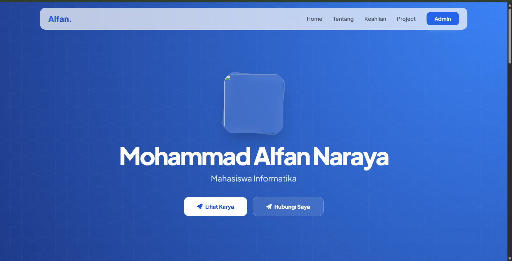
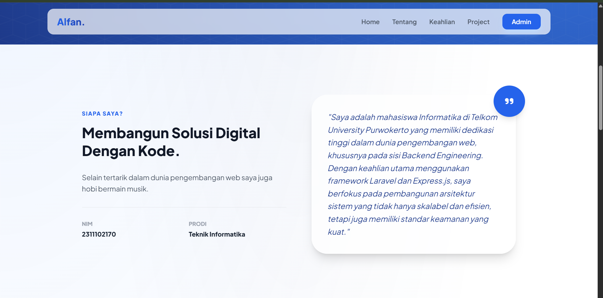
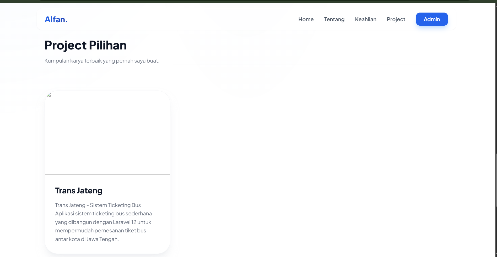
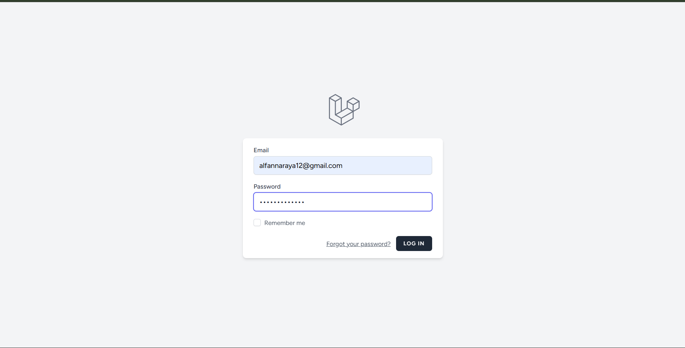
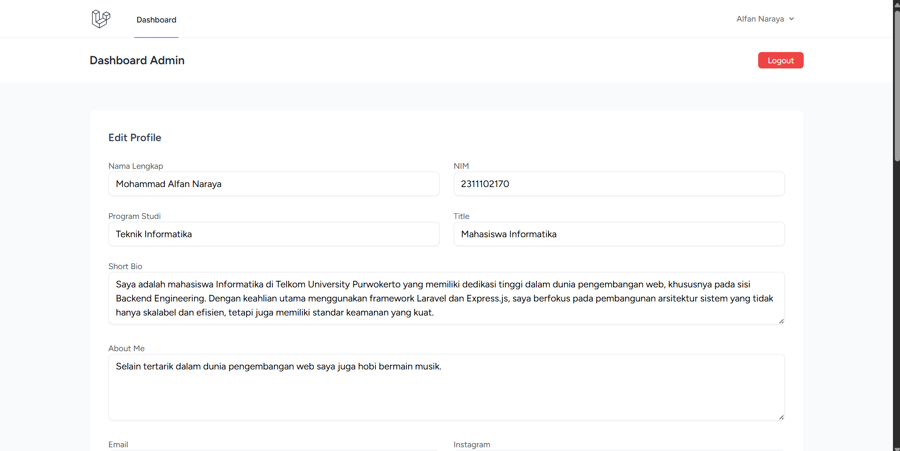

<div align="center">
  <br />
  <h1>LAPORAN PRAKTIKUM <br> APLIKASI BERBASIS PLATFORM</h1>
  <br />
  <h3>UTS <br> Web Profile </h3>
  <br />
  
  <br />
  <br />
  <br />
  <h3>Disusun Oleh :</h3>
  <p>
    <strong>Mohammad Alfan Naraya</strong><br>
    <strong>2311102170</strong><br>
    <strong>S1 IF-11-01</strong>
  </p>
  <br />
  <h3>Dosen Pengampu :</h3>
  <p>
    <strong>Dimas Fanny Hebrasianto Permadi, S.ST., M.Kom</strong>
  </p>
  <br />
  <br />
  <h4>Asisten Praktikum :</h4>
  <strong>Apri Pandu Wicaksono</strong> <br>
  <strong>Rangga Pradarrell Fathi</strong>
  <br />
  <br />
  <br />
  <br />
  <h3>LABORATORIUM HIGH PERFORMANCE <br> FAKULTAS INFORMATIKA <br> UNIVERSITAS TELKOM PURWOKERTO <br> 2026</h3>
</div>

---

## A. Dasar Teori

### 1. Laravel
Laravel adalah salah satu *framework* PHP yang digunakan untuk membangun aplikasi web secara terstruktur, efisien, dan mudah dikembangkan. Laravel employs the **MVC (Model-View-Controller)** architecture, which makes the application development process more efficient since program, tampilan, and data processing are done in accordance with its functions. In this practice, Laravel is used to create an inventory application with features like product data analysis, user authentication, and database integration.

### 2. Web Portofolio Dinamis
Berbeda dengan web statis yang isinya ditulis langsung di HTML, web portofolio dinamis menggunakan database untuk menyimpan informasi. Hal ini memungkinkan konten (seperti deskripsi diri atau daftar keahlian) diubah melalui database tanpa harus menyentuh kode program utama.

### 3. Fetch API & AJAX (Asynchronous JavaScript and XML)
AJAX adalah teknik yang digunakan untuk memperbarui sebagian halaman web tanpa harus melakukan reload secara keseluruhan. Pada proyek ini, Fetch API digunakan untuk mengambil data profil dari server Laravel dan repositori dari GitHub secara asinkron. Ini membuat website terasa lebih cepat dan seamless.

### 4. REST API
API adalah jembatan yang memungkinkan dua aplikasi saling berkomunikasi.
-Internal API: Dibuat di Laravel (/api/profile) untuk mengirimkan data dari MySQL ke halaman depan.
-External API (GitHub API): Digunakan untuk mengambil data publik dari server GitHub (seperti nama repo, bahasa pemrograman, dan jumlah star) untuk ditampilkan di website portofolio.

### 5. JSON (JavaScript Object Notation)
JSON adalah format pertukaran data yang ringan dan mudah dibaca oleh manusia maupun mesin. Data profil dan daftar skill dalam proyek ini dikirimkan dalam format JSON sebelum akhirnya diolah oleh JavaScript untuk ditampilkan dalam bentuk elemen HTML (seperti badges atau cards).

### 6. Laravel Controller & API Routing
Laravel menyediakan sistem routing khusus untuk API yang terletak di routes/api.php atau bisa juga diatur melalui routes/web.php. Controller bertugas mengambil data dari Model dan mengubahnya menjadi respon JSON menggunakan fungsi response()->json().

### 7. Middleware & Security
Meskipun data profil bersifat publik, Laravel menyediakan Middleware untuk melindungi jalur-jalur tertentu. Dalam pengembangan web modern, pemisahan antara jalur akses data (API) dan jalur tampilan (Web) merupakan standar industri untuk menjaga keamanan dan skalabilitas aplikasi.

---

## B. Penjelasan Kode

### 1. Sourcecode routes/web.php
```php
use App\Http\Controllers\PortfolioController;
use Illuminate\Support\Facades\Route;

// Rute untuk Halaman Utama (Portfolio)
Route::get('/', function () {
    return view('welcome');
});

// Rute API untuk mengambil data Profile, Skill, dan Project (AJAX)
Route::get('/api/data-portfolio', [PortfolioController::class, 'getApiData']);

// Rute Dashboard Admin (Hanya bisa diakses setelah Login)
Route::middleware(['auth', 'verified'])->group(function () {
    Route::get('/dashboard', [PortfolioController::class, 'index'])->name('dashboard');
    Route::post('/profile/update', [PortfolioController::class, 'updateProfile'])->name('profile.update');
    // ... rute untuk CRUD Skill dan Project
});

require __DIR__.'/auth.php';
```

### Penjelasan

File routes/web.php berfungsi sebagai pengatur lalu lintas utama yang menentukan bagaimana aplikasi merespons setiap permintaan URL dari pengguna. Di dalam file ini, didefinisikan rute utama yang menampilkan halaman portofolio kepada pengunjung serta rute API khusus yang menyediakan data dalam format JSON untuk diproses secara dinamis oleh AJAX. Selain itu, terdapat pengelompokan rute menggunakan middleware autentikasi yang menjamin keamanan halaman dashboard, sehingga hanya pengguna terdaftar yang dapat mengelola data profil, keahlian, dan proyek. Integrasi dengan sistem autentikasi bawaan Laravel juga diterapkan melalui pemanggilan file rute tambahan untuk memastikan seluruh fungsi manajemen akun berjalan dengan baik.

### 2. Sourcecode ProfileController.php
```php
<?php

namespace App\Http\Controllers;

use App\Models\Profile;
use App\Models\Skill;
use App\Models\Project;
use Illuminate\Http\Request;
use Illuminate\Support\Facades\Storage;

class PortfolioController extends Controller
{
    /**
     * Menampilkan halaman Dashboard Admin dengan data Profile
     */
    public function index()
    {
        $profile = Profile::first(); // Mengambil data profile pertama
        return view('dashboard', compact('profile'));
    }

    /**
     * Menyediakan data JSON untuk dikonsumsi oleh AJAX di halaman depan
     */
    public function getApiData()
    {
        return response()->json([
            'profile'  => Profile::first(),
            'skills'   => Skill::all(),
            'projects' => Project::all(),
        ]);
    }

    /**
     * Memperbarui data profil dan menangani upload foto
     */
    public function updateProfile(Request $request)
    {
        $profile = Profile::first() ?? new Profile();

        // Validasi input
        $request->validate([
            'nama_lengkap' => 'required|string|max:255',
            'foto' => 'nullable|image|mimes:jpeg,png,jpg|max:2048',
        ]);

        // Logika Upload Foto
        if ($request->hasFile('foto')) {
            // Hapus foto lama jika ada
            if ($profile->foto) {
                Storage::disk('public')->delete($profile->foto);
            }
            // Simpan foto baru ke folder storage/app/public/fotos
            $path = $request->file('foto')->store('fotos', 'public');
            $profile->foto = $path;
        }

        // Simpan data teks ke database
        $profile->nama_lengkap = $request->nama_lengkap;
        $profile->nim = $request->nim;
        $profile->program_studi = $request->program_studi;
        $profile->title = $request->title;
        $profile->short_bio = $request->short_bio;
        $profile->about_me = $request->about_me;
        $profile->email = $request->email;
        $profile->instagram = $request->instagram;
        $profile->github = $request->github;
        
        $profile->save();

        return redirect()->back()->with('success', 'Profil berhasil diperbarui!');
    }
}
```

### Penjelasan

PortfolioController.php berfungsi sebagai pusat kendali yang mengatur alur data antara database dan tampilan antarmuka. Melalui fungsi index(), controller ini memuat data profil ke halaman dashboard admin, sementara fungsi getApiData() bertugas menyediakan seluruh informasi profil, skill, dan project dalam format JSON untuk diproses secara dinamis oleh AJAX di halaman depan.

Logika utama pembaruan data terletak pada fungsi updateProfile(), yang menangani validasi input sekaligus manajemen berkas foto profil. Sistem secara otomatis mengelola penyimpanan dengan menghapus foto lama dan menggantinya dengan berkas baru di direktori publik menggunakan storage linking. Setelah seluruh data teks dan jalur file divalidasi, controller akan menyimpan perubahan ke database MySQL dan memberikan umpan balik berupa pesan sukses kepada pengguna.

### 3. Sourcecode Profile.php
```php
<?php

namespace App\Models;

use Illuminate\Database\Eloquent\Factories\HasFactory;
use Illuminate\Database\Eloquent\Model;

class Profile extends Model
{
    use HasFactory;

    protected $table = 'profiles';

    protected $fillable = [
        'nama_lengkap',
        'nim',
        'program_studi',
        'title',
        'short_bio',
        'about_me',
        'foto',
        'email',
        'instagram',
        'github',
    ];
}
```

### Penjelasan

File Profile.php merupakan sebuah Model yang merepresentasikan struktur tabel profiles di dalam database MySQL. Kode ini berfungsi sebagai jembatan Object-Relational Mapping (ORM) yang memungkinkan aplikasi berinteraksi dengan data profil tanpa harus menulis query SQL secara manual. Properti $fillable di dalam kelas ini berperan sebagai pengaman sistem (Mass Assignment protection), yang secara spesifik menentukan kolom mana saja yang diizinkan untuk diisi atau diperbarui melalui input form. Dengan adanya model ini, proses pengambilan, penyimpanan, dan manipulasi data identitas diri, informasi akademik, hingga tautan media sosial dapat dilakukan secara lebih terstruktur dan aman.

### 4. Sourcecode Migration (2026_01_04_20_131949_create_profile_table.php)
```php
<?php

use Illuminate\Database\Migrations\Migration;
use Illuminate\Database\Schema\Blueprint;
use Illuminate\Support\Facades\Schema;

return new class extends Migration
{
    public function up(): void
    {
        Schema::create('profiles', function (Blueprint $table) {
            $table->id();
            $table->string('nama_lengkap');
            $table->string('nim')->nullable();
            $table->string('program_studi')->nullable();
            $table->string('title')->nullable();
            $table->string('short_bio')->nullable();
            $table->text('about_me')->nullable();
            $table->string('foto')->nullable();
            $table->string('email')->nullable();
            $table->string('instagram')->nullable();
            $table->string('github')->nullable();
            $table->timestamps();
        });
    }

    public function down(): void
    {
        Schema::dropIfExists('profiles');
    }
};
```
### Penjelasan

File migrasi ini berfungsi sebagai cetak biru (blueprint) untuk membangun struktur tabel profiles secara otomatis di dalam database MySQL. Melalui metode up(), sistem mendefinisikan berbagai tipe data kolom, seperti string untuk informasi singkat dan text untuk deskripsi profil yang lebih panjang, serta menyertakan atribut nullable() agar pengisian data bersifat opsional. Penggunaan migrasi ini memastikan konsistensi struktur database di seluruh lingkungan pengembangan, sehingga proses pembuatan tabel dapat dilakukan dengan cepat dan akurat hanya melalui perintah baris kode tanpa perlu melakukan konfigurasi manual pada phpMyAdmin.

### 5. Sourcecode ProfileSeeder.php
```php
<?php

namespace Database\Seeders;

use App\Models\Profile;
use Illuminate\Database\Seeder;

class ProfileSeeder extends Seeder
{
    public function run(): void
    {
        Profile::create([
            'nama_lengkap' => 'Mohammad Alfan Naraya',
            'nim' => '2311102170',
            'program_studi' => 'S1 Informatika',
            'title' => 'Fullstack Developer Enthusiast',
            'short_bio' => 'Mahasiswa Informatika yang berfokus pada pengembangan web.',
            'about_me' => 'Saya adalah mahasiswa di Telkom University Purwokerto yang memiliki minat besar dalam Laravel dan Cybersecurity.',
            'email' => 'alfan@example.com',
            'instagram' => 'https://instagram.com/alfan',
            'github' => 'https://github.com/alfan',
        ]);
    }
}
```

### Penjelasan

File ProfileSeeder.php berfungsi untuk melakukan pengisian data otomatis (database seeding) ke dalam tabel profiles saat proses instalasi awal aplikasi. Dengan menggunakan metode run(), pengembang dapat memasukkan data identitas diri standar ke dalam database melalui perintah baris kode tanpa harus mengisinya secara manual satu per satu melalui form. Fasilitas ini sangat berguna dalam tahap pengembangan dan pengujian untuk memastikan bahwa komponen halaman depan website sudah memiliki konten yang dapat ditampilkan segera setelah proses migrasi database selesai dilakukan.

### 6. Sourcecode landing.blade.php
```php
<section class="hero-gradient min-h-screen flex flex-col items-center justify-center text-white text-center">
    <div data-aos="fade-up">
        
        <h1 class="text-5xl md:text-7xl font-extrabold mb-4" id="display-nama">Memuat...</h1>
        <p class="text-xl md:text-2xl font-medium mb-10" id="display-title">Sedang sinkronisasi...</p>
    </div>
</section>

<script>
    $(document).ready(function() {
        AOS.init({ duration: 1000, once: true });
        $.get('/api/data-portfolio', function(res) {
            const p = res.profile;
            if (p) {
                $('#display-nama').text(p.nama_lengkap);
                $('#display-title').text(p.title);
                if (p.foto) {
                    $('#display-foto').attr('src', '/storage/' + p.foto).removeClass('hidden');
                }
            }
        });
    });
</script>
```

### Penjelasan

File welcome.blade.php berfungsi sebagai antarmuka utama (Landing Page) yang menyajikan informasi portfolio kepada pengunjung dengan desain modern berbasis Tailwind CSS. Kode ini mengimplementasikan teknik asinkron menggunakan jQuery AJAX untuk menarik data profil, keahlian, dan proyek dari server tanpa harus memuat ulang seluruh halaman, sehingga memberikan pengalaman pengguna yang lebih responsif. Selain itu, integrasi pustaka Animate On Scroll (AOS) diterapkan pada elemen-elemen kunci untuk memberikan efek visual yang dinamis saat pengguna melakukan navigasi ke bawah, sementara sistem manajemen aset Laravel memastikan foto profil dan gambar proyek ditampilkan dengan benar melalui jalur penyimpanan publik.

---

## C. Penjelasan Implementasi Sistem

Website portfolio ini dibangun menggunakan arsitektur Model-View-Controller (MVC) yang memisahkan antara logika data, pengaturan rute, dan tampilan antarmuka. Pada sisi backend, sistem menggunakan framework Laravel untuk mengelola database MySQL melalui Eloquent ORM, yang memungkinkan manipulasi data profil dan proyek dilakukan secara aman melalui model. Keamanan akses ke halaman manajemen data dijamin oleh sistem autentikasi Laravel Breeze, yang membatasi hak akses pengubahan konten hanya bagi pengguna yang memiliki kredensial sah melalui sesi login yang terenkripsi.

Dari sisi antarmuka (frontend), aplikasi ini menerapkan teknik Single Source of Truth di mana halaman utama bersifat dinamis dan tidak menyimpan data secara statis di dalam kode HTML. Proses sinkronisasi data dilakukan menggunakan teknologi AJAX (Asynchronous JavaScript and XML) yang memanggil endpoint API internal pada server untuk mengambil data dalam format JSON. Implementasi ini dikombinasikan dengan Tailwind CSS untuk menghasilkan desain yang responsif dan estetis, serta library AOS (Animate On Scroll) untuk memberikan pengalaman visual yang interaktif bagi pengunjung saat menjelajahi setiap bagian portfolio.

Sistem penyimpanan berkas juga dikonfigurasi menggunakan fitur filesystem Laravel, di mana setiap foto profil atau gambar proyek yang diunggah melalui dashboard admin akan disimpan ke dalam direktori penyimpanan privat dan dihubungkan ke folder publik melalui perintah storage:link. Hal ini memastikan bahwa seluruh aset multimedia dapat diakses secara cepat oleh browser sambil tetap menjaga integritas struktur folder aplikasi. Secara keseluruhan, implementasi ini menghasilkan platform yang tidak hanya fungsional secara teknis, tetapi juga mudah dikelola dan memiliki performa yang optimal.

---

## D. Hasil Tampilan 

### Halaman Home

---

### Halaman About

---

### Halaman Project

---

### Halaman Admin

---

### Halaman Sesudah Edit

---
## E. Kesimpulan

Kesimpulan dari proyek pengembangan portofolio dinamis ini adalah keberhasilan pengimplementasian integrasi antara framework Laravel dengan teknik komunikasi data asinkron (AJAX). Melalui proyek ini, dapat dibuktikan bahwa penggunaan Fetch API mampu meningkatkan kualitas antarmuka pengguna menjadi lebih responsif dan interaktif karena proses pengambilan data, baik dari database internal MySQL maupun dari pihak ketiga seperti GitHub API, dapat dilakukan secara latar belakang tanpa mengganggu alur navigasi halaman.

Selain itu, penerapan arsitektur Model-View-Controller (MVC) memberikan kemudahan dalam pengelolaan konten melalui panel admin yang terpusat. Hal ini menunjukkan bahwa sistem tidak hanya berfungsi sebagai media presentasi statis, tetapi juga sebagai aplikasi web fungsional yang memiliki manajemen data yang baik. Secara keseluruhan, tugas UTS ini berhasil memenuhi standar pengembangan web modern dengan menggabungkan aspek keamanan data, efisiensi performa melalui API, dan estetika desain yang adaptif.
---

## Referensi

[1] Modul Praktikum Aplikasi Berbasis Platform (ABP) Modul 11  
[2] Modul Praktikum Aplikasi Berbasis Platform (ABP) Modul 12  
[3] Modul Praktikum Aplikasi Berbasis Platform (ABP) Modul 13  
[4] Modul Praktikum Aplikasi Berbasis Platform (ABP) Modul 6
[5] Modul Praktikum Aplikasi Berbasis Platform (ABP) Modul 7
[6] Modul Praktikum Aplikasi Berbasis Platform (ABP) Modul 8
[7] Modul Praktikum Aplikasi Berbasis Platform (ABP) Modul 9
[8] Modul Praktikum Aplikasi Berbasis Platform (ABP) Modul 10
[9] W3Schools. https://www.w3schools.com  
