<div align="center">
  <br />
  <h1>LAPORAN PROYEK UTS <br>APLIKASI BERBASIS PLATFORM</h1>
  <br />
  <h3>UTS</h3>
  <br />
  <br />
  
  <br />
  <br />
  <br />
  <h3>Disusun Oleh :</h3>
  <p>
    <strong>M. Faleno Albar Firjatulloh</strong><br>
    <strong>2311102297</strong><br>
    <strong>S1 IF-11-01</strong>
  </p>
  <br />
  <h3>Dosen Pengampu :</h3>
  <p>
    <strong>Dimas Fanny Hebrasianto Permadi, S.ST., M.Kom</strong>
  </p>
  <br />
  <h4>Asisten Praktikum :</h4>
  <strong>Apri Pandu Wicaksono</strong> <br>
  <strong>Rangga Pradarrell Fathi</strong>
  <br />
  <h3>LABORATORIUM HIGH PERFORMANCE
 <br>FAKULTAS INFORMATIKA <br>UNIVERSITAS TELKOM PURWOKERTO <br>2026</h3>
</div>

---

## 1. Spesifikasi dan Implementasi Sistem (Kebutuhan Fungsional)

Penugasan Ujian Tengah Semester (UTS), proyek ini merupakan pengembangan **Website Portofolio Personal** yang didesain agar benar-benar dapat dimanfaatkan di dunia nyata sebagai portofolio digital (*Personal Branding*).

Adapun spesifikasi teknis dan fungsionalitas utama yang diterapkan berdasarkan instruksi ujian mencakup:

1. **Framework Utama**: Menjadikan **Laravel 11** sebagai pondasi *backend* utama dengan **MySQL** sebagai sistem manajemen basis data relasional.
2. **Kebebasan Desain Antarmuka (Styling)**: Memanfaatkan **Tailwind CSS** untuk perancangan visual halaman web (*Landing Page* & *Dashboard*) secara responsif dan profesional dengan tema *dark mode* berbasis efek *glassmorphism*.
3. **Pengelolaan Konten (Admin Dashboard)**: Menyediakan *dashboard* khusus yang ditujukan bagi administrator untuk mengonfigurasi dan melakukan perubahan konten yang tampil di halaman depan. Rincian seperti data profil, foto diri, keahlian (*skills*), riwayat pengalaman, serta jejak proyek dapat dikontrol melalui operasi CRUD di area ini. Fitur unggah berkas (*file upload*) turut disediakan untuk foto profil yang tersimpan di `storage/app/public/photos`, berkas CV di `storage/app/public/cv`, serta gambar proyek di `storage/app/public/projects`.
4. **Implementasi AJAX Terpadu (Wajib)**: Seluruh tampilan data profil, perolehan *skill*, riwayat pengalaman, hingga pencapaian proyek pada *landing page* sama sekali tidak menggunakan operan variabel Blade reguler (*direct rendering*). Tampilan halaman utama mutlak diisi dengan menarik data (*fetching*) yang di-*supply* oleh *backend endpoint* menggunakan **AJAX** berbasis Fetch API JavaScript.

---

## 2. Penjelasan Kode Sumber

### 2.1 Backend API untuk AJAX (Routing & Logic)

Untuk mewujudkan aturan penampilan data yang harus memanggil *request* melewati AJAX, sistem menyediakan *endpoint* khusus yang sekadar mengirim respon kembalian berupa format tipe JSON untuk dibaca oleh kode sisi *client*.

*File Referensi: `routes/api.php`*

```php
<?php

use App\Http\Controllers\Api\ProfileController;
use App\Http\Controllers\Api\SkillController;
use App\Http\Controllers\Api\ProjectController;
use App\Http\Controllers\Api\ExperienceController;
use Illuminate\Support\Facades\Route;

// Public API - dapat diakses tanpa autentikasi
Route::get('/profile', [ProfileController::class, 'show']);
Route::get('/skills', [SkillController::class, 'index']);
Route::get('/projects', [ProjectController::class, 'index']);
Route::get('/experiences', [ExperienceController::class, 'index']);

// Protected API - hanya dapat diakses oleh admin yang sudah login
Route::middleware(['web', 'auth'])->group(function () {
    Route::post('/profile', [ProfileController::class, 'update']);
    Route::put('/profile', [ProfileController::class, 'update']);

    Route::post('/skills', [SkillController::class, 'store']);
    Route::put('/skills/{skill}', [SkillController::class, 'update']);
    Route::delete('/skills/{skill}', [SkillController::class, 'destroy']);

    Route::post('/projects', [ProjectController::class, 'store']);
    Route::put('/projects/{project}', [ProjectController::class, 'update']);
    Route::delete('/projects/{project}', [ProjectController::class, 'destroy']);

    Route::post('/experiences', [ExperienceController::class, 'store']);
    Route::put('/experiences/{experience}', [ExperienceController::class, 'update']);
    Route::delete('/experiences/{experience}', [ExperienceController::class, 'destroy']);
});
```

*File Referensi: `app/Http/Controllers/Api/ProfileController.php`*

```php
<?php

namespace App\Http\Controllers\Api;

use App\Http\Controllers\Controller;
use App\Models\Profile;
use Illuminate\Http\Request;
use Illuminate\Support\Facades\Storage;

class ProfileController extends Controller
{
    public function show()
    {
        $profile = Profile::first();
        if (!$profile) {
            return response()->json(['message' => 'Profile not found'], 404);
        }
        if ($profile->photo) {
            $profile->photo_url = asset('storage/' . $profile->photo);
        }
        return response()->json($profile);
    }

    public function update(Request $request)
    {
        $request->validate([
            'name'      => 'required|string|max:255',
            'title'     => 'required|string|max:255',
            'bio'       => 'required|string',
            'email'     => 'required|email',
            'phone'     => 'nullable|string',
            'location'  => 'nullable|string',
            'github'    => 'nullable|url',
            'linkedin'  => 'nullable|url',
            'instagram' => 'nullable|string',
            'photo'     => 'nullable|image|max:2048',
        ]);

        $profile = Profile::firstOrCreate([]);
        $data = $request->except(['photo', 'cv_file', '_method']);

        if ($request->hasFile('photo')) {
            if ($profile->photo) Storage::disk('public')->delete($profile->photo);
            $data['photo'] = $request->file('photo')->store('photos', 'public');
        }

        if ($request->hasFile('cv_file')) {
            if ($profile->cv_file) Storage::disk('public')->delete($profile->cv_file);
            $data['cv_file'] = $request->file('cv_file')->store('cv', 'public');
        }

        $profile->update($data);
        if ($profile->photo) {
            $profile->photo_url = asset('storage/' . $profile->photo);
        }
        return response()->json(['message' => 'Profile updated successfully', 'profile' => $profile]);
    }
}
```

*File Referensi: `app/Http/Controllers/Api/SkillController.php`*

```php
<?php

namespace App\Http\Controllers\Api;

use App\Http\Controllers\Controller;
use App\Models\Skill;
use Illuminate\Http\Request;

class SkillController extends Controller
{
    public function index()
    {
        $skills = Skill::orderBy('category')->orderBy('order')->get();
        $grouped = $skills->groupBy('category');
        return response()->json($grouped);
    }

    public function store(Request $request)
    {
        $request->validate([
            'name'     => 'required|string|max:255',
            'category' => 'required|string',
            'level'    => 'required|integer|min:0|max:100',
            'icon'     => 'nullable|string',
        ]);
        $skill = Skill::create($request->all());
        return response()->json(['message' => 'Skill added', 'skill' => $skill], 201);
    }

    public function update(Request $request, Skill $skill)
    {
        $request->validate([
            'name'     => 'required|string|max:255',
            'category' => 'required|string',
            'level'    => 'required|integer|min:0|max:100',
            'icon'     => 'nullable|string',
        ]);
        $skill->update($request->all());
        return response()->json(['message' => 'Skill updated', 'skill' => $skill]);
    }

    public function destroy(Skill $skill)
    {
        $skill->delete();
        return response()->json(['message' => 'Skill deleted']);
    }
}
```

*File Referensi: `app/Http/Controllers/Api/ProjectController.php`*

```php
<?php

namespace App\Http\Controllers\Api;

use App\Http\Controllers\Controller;
use App\Models\Project;
use Illuminate\Http\Request;
use Illuminate\Support\Facades\Storage;

class ProjectController extends Controller
{
    public function index()
    {
        $projects = Project::orderBy('order')->get()->map(function ($project) {
            if ($project->image) {
                $project->image_url = asset('storage/' . $project->image);
            }
            return $project;
        });
        return response()->json($projects);
    }

    public function store(Request $request)
    {
        $data = $request->except('image');
        if (is_string($data['tech_stack'])) {
            $data['tech_stack'] = json_decode($data['tech_stack'], true) ?? explode(',', $data['tech_stack']);
        }
        if ($request->hasFile('image')) {
            $data['image'] = $request->file('image')->store('projects', 'public');
        }
        $project = Project::create($data);
        if ($project->image) {
            $project->image_url = asset('storage/' . $project->image);
        }
        return response()->json(['message' => 'Project added', 'project' => $project], 201);
    }

    public function update(Request $request, Project $project)
    {
        $data = $request->except(['image', '_method']);
        if (isset($data['tech_stack']) && is_string($data['tech_stack'])) {
            $data['tech_stack'] = json_decode($data['tech_stack'], true) ?? explode(',', $data['tech_stack']);
        }
        if ($request->hasFile('image')) {
            if ($project->image) Storage::disk('public')->delete($project->image);
            $data['image'] = $request->file('image')->store('projects', 'public');
        }
        $project->update($data);
        if ($project->image) {
            $project->image_url = asset('storage/' . $project->image);
        }
        return response()->json(['message' => 'Project updated', 'project' => $project]);
    }

    public function destroy(Project $project)
    {
        if ($project->image) Storage::disk('public')->delete($project->image);
        $project->delete();
        return response()->json(['message' => 'Project deleted']);
    }
}
```

*File Referensi: `app/Http/Controllers/Api/ExperienceController.php`*

```php
<?php

namespace App\Http\Controllers\Api;

use App\Http\Controllers\Controller;
use App\Models\Experience;
use Illuminate\Http\Request;

class ExperienceController extends Controller
{
    public function index()
    {
        $experiences = Experience::orderBy('order')->orderByDesc('start_date')->get();
        return response()->json($experiences);
    }

    public function store(Request $request)
    {
        $request->validate([
            'company'     => 'required|string|max:255',
            'position'    => 'required|string|max:255',
            'description' => 'required|string',
            'start_date'  => 'required|string',
            'end_date'    => 'nullable|string',
            'is_current'  => 'boolean',
        ]);
        $exp = Experience::create($request->all());
        return response()->json(['message' => 'Experience added', 'experience' => $exp], 201);
    }

    public function update(Request $request, Experience $experience)
    {
        $experience->update($request->all());
        return response()->json(['message' => 'Experience updated', 'experience' => $experience]);
    }

    public function destroy(Experience $experience)
    {
        $experience->delete();
        return response()->json(['message' => 'Experience deleted']);
    }
}
```

---

### 2.2 Client-Side Load AJAX (`portfolio/index.blade.php`)

Semua *scripting* yang menyusun bagian deskripsi di halaman depan terbuat dari struktur *asynchronous*. Hal ini memastikan bahwa data mentah berhasil dijemput dari API *backend* Laravel barulah ditempelkan pada *Document Object Model* (DOM) yang bersangkutan. Selama proses *fetching* berlangsung, halaman menampilkan animasi *skeleton loading* sebagai *placeholder* konten.

*File Referensi: `resources/views/portfolio/index.blade.php`*

```javascript
const API_BASE = '/api';

// Load Profile via AJAX - mengambil data profil dari endpoint /api/profile
async function loadProfile() {
    try {
        const res = await fetch(`${API_BASE}/profile`);
        const data = await res.json();

        // Manipulasi DOM secara dinamis dengan data dari API
        document.getElementById('nav-name').textContent = data.name;
        document.getElementById('profile-name').textContent = data.name;
        document.getElementById('profile-title').textContent = data.title;
        document.getElementById('hero-bio').textContent = data.bio;

        // Sembunyikan skeleton loader, tampilkan konten asli
        ['hero-name-skeleton','hero-title-skeleton','hero-bio-skeleton','hero-buttons-skeleton'].forEach(id => {
            document.getElementById(id).style.display = 'none';
        });
        document.getElementById('hero-name').classList.remove('hidden');
        document.getElementById('hero-title-wrap').classList.remove('hidden');
        document.getElementById('hero-bio').classList.remove('hidden');
        document.getElementById('hero-buttons').classList.remove('hidden');

        // Set foto profil dari storage Laravel
        if (data.photo_url) {
            document.getElementById('profile-photo').src = data.photo_url;
        } else {
            document.getElementById('profile-photo').src =
                `https://ui-avatars.com/api/?name=${encodeURIComponent(data.name)}&background=6366f1&color=fff&size=300`;
        }
        document.getElementById('photo-skeleton').style.display = 'none';
        document.getElementById('profile-photo').classList.remove('hidden');

        // Set CV download link jika tersedia
        if (data.cv_file) {
            document.getElementById('cv-download').href = `/storage/${data.cv_file}`;
        }

        // Render social media links secara dinamis
        const socials = [
            { key: 'github',    icon: 'fab fa-github',    label: 'GitHub' },
            { key: 'linkedin',  icon: 'fab fa-linkedin',  label: 'LinkedIn' },
            { key: 'instagram', icon: 'fab fa-instagram', label: 'Instagram' },
        ];
        socials.forEach(s => {
            if (data[s.key]) {
                const href = s.key === 'instagram'
                    ? `https://instagram.com/${data[s.key].replace('@','')}`
                    : data[s.key];
                document.getElementById('hero-social').innerHTML +=
                    `<a href="${href}" target="_blank"
                        class="w-10 h-10 glass rounded-full flex items-center justify-center text-gray-400 transition-all hover:scale-110">
                        <i class="${s.icon}"></i>
                    </a>`;
                document.getElementById('contact-links').innerHTML +=
                    `<a href="${href}" target="_blank"
                        class="glass border border-white/10 text-gray-300 hover:text-white px-6 py-3 rounded-full font-medium">
                        <i class="${s.icon} mr-2"></i>${s.label}
                    </a>`;
            }
        });
    } catch (e) {
        console.error('Error loading profile:', e);
    }
}

// Load Skills via AJAX - data dikelompokkan berdasarkan kategori
async function loadSkills() {
    try {
        const res = await fetch(`${API_BASE}/skills`);
        const grouped = await res.json();
        const container = document.getElementById('skills-container');
        container.innerHTML = '';

        // Mapping warna per kategori skill
        const categoryColors = {
            'Backend':   'from-indigo-500/20 to-indigo-600/10 border-indigo-500/30',
            'Frontend':  'from-purple-500/20 to-purple-600/10 border-purple-500/30',
            'Tools':     'from-pink-500/20 to-pink-600/10 border-pink-500/30',
            'UI Design': 'from-cyan-500/20 to-cyan-600/10 border-cyan-500/30',
        };
        const barColors = {
            'Backend':   'from-indigo-500 to-indigo-400',
            'Frontend':  'from-purple-500 to-purple-400',
            'Tools':     'from-pink-500 to-pink-400',
            'UI Design': 'from-cyan-500 to-cyan-400',
        };

        let totalSkills = 0;
        Object.entries(grouped).forEach(([category, skills]) => {
            totalSkills += skills.length;
            const skillItems = skills.map(skill => `
                <div class="mb-3">
                    <div class="flex justify-between items-center mb-1">
                        <span class="text-sm text-gray-300 flex items-center gap-2">
                            <i class="${skill.icon || 'fas fa-code'} text-xs"></i>
                            ${skill.name}
                        </span>
                        <span class="text-xs text-gray-500">${skill.level}%</span>
                    </div>
                    <div class="h-2 bg-gray-800 rounded-full overflow-hidden">
                        <div class="skill-bar h-full bg-gradient-to-r ${barColors[category] || 'from-gray-500 to-gray-400'} rounded-full w-0"
                             data-width="${skill.level}"></div>
                    </div>
                </div>
            `).join('');

            const card = document.createElement('div');
            card.className = `glass bg-gradient-to-br ${categoryColors[category] || ''} border rounded-2xl p-6 card-hover`;
            card.innerHTML = `
                <h3 class="font-bold text-lg mb-4 flex items-center gap-2">
                    <span class="w-8 h-8 rounded-lg bg-white/10 flex items-center justify-center text-sm">${skills.length}</span>
                    ${category}
                </h3>
                ${skillItems}
            `;
            container.appendChild(card);
            skillObserver.observe(card);
        });
        animateCount(document.getElementById('skills-count'), totalSkills);
    } catch (e) {
        console.error('Error loading skills:', e);
    }
}

// Load Projects via AJAX - render card project secara dinamis
async function loadProjects() {
    try {
        const res = await fetch(`${API_BASE}/projects`);
        const projects = await res.json();
        const container = document.getElementById('projects-container');
        container.innerHTML = '';

        animateCount(document.getElementById('projects-count'), projects.length);

        projects.forEach(project => {
            const techBadges = Array.isArray(project.tech_stack)
                ? project.tech_stack.map(t =>
                    `<span class="text-xs bg-indigo-500/20 text-indigo-300 px-2 py-1 rounded-full">${t}</span>`
                  ).join('')
                : '';
            const imgSrc = project.image_url || `https://picsum.photos/seed/${project.id}/600/400`;
            const card = document.createElement('div');
            card.className = 'glass rounded-2xl overflow-hidden card-hover group';
            card.innerHTML = `
                <div class="relative overflow-hidden h-52">
                    
                    <div class="absolute inset-0 bg-gradient-to-t from-gray-900 to-transparent"></div>
                    ${project.featured
                        ? '<div class="absolute top-3 right-3 bg-gradient-to-r from-yellow-500 to-orange-500 text-black text-xs font-bold px-3 py-1 rounded-full">⭐ Featured</div>'
                        : ''}
                </div>
                <div class="p-6">
                    <h3 class="text-xl font-bold mb-2">${project.title}</h3>
                    <p class="text-gray-400 text-sm mb-4 line-clamp-2">${project.description}</p>
                    <div class="flex flex-wrap gap-2 mb-4">${techBadges}</div>
                    <div class="flex gap-3">
                        ${project.github_url
                            ? `<a href="${project.github_url}" target="_blank"
                                class="flex items-center gap-2 text-gray-400 hover:text-white text-sm transition-colors">
                                <i class="fab fa-github"></i> Code</a>`
                            : ''}
                        ${project.live_url
                            ? `<a href="${project.live_url}" target="_blank"
                                class="flex items-center gap-2 text-indigo-400 hover:text-indigo-300 text-sm transition-colors">
                                <i class="fas fa-external-link-alt"></i> Live Demo</a>`
                            : ''}
                    </div>
                </div>
            `;
            container.appendChild(card);
        });
    } catch (e) {
        console.error('Error loading projects:', e);
    }
}

// Load Experience via AJAX - timeline pengalaman kerja
async function loadExperience() {
    try {
        const res = await fetch(`${API_BASE}/experiences`);
        const experiences = await res.json();
        const container = document.getElementById('experience-container');
        container.innerHTML = '<div class="absolute left-8 top-0 bottom-0 w-0.5 bg-gradient-to-b from-indigo-500 to-purple-600"></div>';

        experiences.forEach(exp => {
            const endDate = exp.is_current
                ? '<span class="text-green-400 font-semibold">Present</span>'
                : exp.end_date;
            const item = document.createElement('div');
            item.className = 'ml-20 mb-8 relative';
            item.innerHTML = `
                <div class="absolute -left-12 top-2 w-4 h-4 bg-gradient-to-br from-indigo-500 to-purple-600 rounded-full border-4 border-gray-950"></div>
                <div class="glass rounded-2xl p-6 card-hover">
                    <div class="flex flex-wrap justify-between items-start gap-2 mb-2">
                        <div>
                            <h3 class="text-lg font-bold">${exp.position}</h3>
                            <p class="text-indigo-400 font-medium">${exp.company}</p>
                        </div>
                        <span class="text-xs glass px-3 py-1 rounded-full text-gray-400">
                            ${exp.start_date} — ${endDate}
                        </span>
                    </div>
                    <p class="text-gray-400 text-sm leading-relaxed">${exp.description}</p>
                </div>
            `;
            container.appendChild(item);
        });
    } catch (e) {
        console.error('Error loading experience:', e);
    }
}

// Inisialisasi semua AJAX secara paralel saat halaman selesai dimuat
document.addEventListener('DOMContentLoaded', async () => {
    await Promise.all([loadProfile(), loadSkills(), loadProjects(), loadExperience()]);
});
```

---

### 2.3 Migration & Model Basis Data Portofolio

Sistem diatur agar menyuplai empat koleksi basis data utama, yaitu `profiles`, `skills`, `projects`, dan `experiences`. Melalui utilitas *Migration*, pendefinisian cetak biru basis data mempermudah pemindahan struktur antar *environment* pengembangan dengan MySQL sebagai mesin basis data.

*File: `database/migrations/2024_01_01_000001_create_profiles_table.php`*

```php
public function up(): void
{
    Schema::create('profiles', function (Blueprint $table) {
        $table->id();
        $table->string('name');
        $table->string('title');
        $table->text('bio');
        $table->string('email');
        $table->string('phone')->nullable();
        $table->string('location')->nullable();
        $table->string('photo')->nullable();
        $table->string('github')->nullable();
        $table->string('linkedin')->nullable();
        $table->string('instagram')->nullable();
        $table->string('cv_file')->nullable();
        $table->timestamps();
    });
}
```

*File: `database/migrations/2024_01_01_000002_create_skills_table.php`*

```php
public function up(): void
{
    Schema::create('skills', function (Blueprint $table) {
        $table->id();
        $table->string('name');
        $table->string('category'); // frontend, backend, tools, etc
        $table->integer('level');   // 0-100
        $table->string('icon')->nullable();
        $table->integer('order')->default(0);
        $table->timestamps();
    });
}
```

*File: `database/migrations/2024_01_01_000003_create_projects_table.php`*

```php
public function up(): void
{
    Schema::create('projects', function (Blueprint $table) {
        $table->id();
        $table->string('title');
        $table->text('description');
        $table->string('image')->nullable();
        $table->string('tech_stack'); // JSON string
        $table->string('github_url')->nullable();
        $table->string('live_url')->nullable();
        $table->boolean('featured')->default(false);
        $table->integer('order')->default(0);
        $table->timestamps();
    });
}
```

*File: `database/migrations/2024_01_01_000004_create_experiences_table.php`*

```php
public function up(): void
{
    Schema::create('experiences', function (Blueprint $table) {
        $table->id();
        $table->string('company');
        $table->string('position');
        $table->text('description');
        $table->string('start_date');
        $table->string('end_date')->nullable(); // null = present
        $table->boolean('is_current')->default(false);
        $table->integer('order')->default(0);
        $table->timestamps();
    });
}
```

---

### 2.4 Database Seeder

Seeder digunakan untuk mengisi data awal ke dalam database, meliputi akun admin, data profil Faleno, skill berdasarkan kategori (UI Design, Frontend, Backend, Tools), proyek portofolio, dan pengalaman.

*File Referensi: `database/seeders/DatabaseSeeder.php`*

```php
<?php

namespace Database\Seeders;

use App\Models\Profile;
use App\Models\Skill;
use App\Models\Project;
use App\Models\Experience;
use App\Models\User;
use Illuminate\Database\Seeder;

class DatabaseSeeder extends Seeder
{
    public function run(): void
    {
        // Buat akun admin
        User::firstOrCreate(
            ['email' => 'admin@portfolio.com'],
            ['name' => 'Admin', 'password' => bcrypt('password')]
        );

        // Data profil utama
        Profile::updateOrCreate(
            ['id' => 1],
            [
                'name'      => 'M. Faleno Albar Firjatulloh',
                'title'     => 'UI Designer & Frontend Developer',
                'bio'       => 'Halo! Saya M. Faleno Albar Firjatulloh, mahasiswa Universitas Telkom yang passionate di bidang UI Design & Frontend Development. Saya senang menciptakan tampilan web yang indah, intuitif, dan memberikan pengalaman terbaik bagi pengguna. Di luar coding, saya mengisi waktu dengan bermain gitar dan sepak bola — dua hal yang mengajarkan saya tentang kreativitas dan kerja tim.',
                'email'     => 'faleno@student.telkomuniversity.ac.id',
                'phone'     => '+62 812 3456 7890',
                'location'  => 'Bandung, Jawa Barat',
                'github'    => 'https://github.com/faleno',
                'linkedin'  => 'https://linkedin.com/in/faleno',
                'instagram' => '@faleno',
                'photo'     => null,
                'cv_file'   => null,
            ]
        );

        // Data skill berdasarkan kategori
        Skill::truncate();
        $skills = [
            ['name' => 'Figma',        'category' => 'UI Design',  'level' => 88, 'icon' => 'fas fa-pen-nib',    'order' => 0],
            ['name' => 'UI/UX Design', 'category' => 'UI Design',  'level' => 85, 'icon' => 'fas fa-palette',    'order' => 1],
            ['name' => 'Prototyping',  'category' => 'UI Design',  'level' => 80, 'icon' => 'fas fa-object-group','order' => 2],
            ['name' => 'HTML & CSS',   'category' => 'Frontend',   'level' => 92, 'icon' => 'fab fa-html5',      'order' => 3],
            ['name' => 'JavaScript',   'category' => 'Frontend',   'level' => 78, 'icon' => 'fab fa-js',         'order' => 4],
            ['name' => 'Tailwind CSS', 'category' => 'Frontend',   'level' => 88, 'icon' => 'fab fa-css3-alt',   'order' => 5],
            ['name' => 'Vue.js',       'category' => 'Frontend',   'level' => 72, 'icon' => 'fab fa-vuejs',      'order' => 6],
            ['name' => 'Laravel',      'category' => 'Backend',    'level' => 75, 'icon' => 'fab fa-laravel',    'order' => 7],
            ['name' => 'MySQL',        'category' => 'Backend',    'level' => 70, 'icon' => 'fas fa-database',   'order' => 8],
            ['name' => 'Git & GitHub', 'category' => 'Tools',      'level' => 80, 'icon' => 'fab fa-github',     'order' => 9],
            ['name' => 'VS Code',      'category' => 'Tools',      'level' => 90, 'icon' => 'fas fa-code',       'order' => 10],
        ];
        foreach ($skills as $skill) { Skill::create($skill); }

        // Data proyek portofolio
        Project::truncate();
        $projects = [
            [
                'title'       => 'Personal Portfolio Website',
                'description' => 'Website portofolio pribadi dengan desain modern dark-theme, dibangun menggunakan Laravel dan Tailwind CSS dengan sistem AJAX untuk fetching data.',
                'tech_stack'  => json_encode(['Laravel', 'Tailwind CSS', 'JavaScript', 'MySQL']),
                'github_url'  => 'https://github.com/faleno/portfolio',
                'live_url'    => null,
                'featured'    => true,
                'order'       => 0,
            ],
            [
                'title'       => 'UI Redesign — Mobile App',
                'description' => 'Redesign tampilan aplikasi mobile dengan pendekatan user-centered design. Fokus pada keterbacaan, konsistensi warna, dan kemudahan navigasi.',
                'tech_stack'  => json_encode(['Figma', 'Prototyping', 'UI/UX']),
                'github_url'  => null,
                'live_url'    => null,
                'featured'    => true,
                'order'       => 1,
            ],
            [
                'title'       => 'Dashboard Admin UI Kit',
                'description' => 'Komponen UI kit untuk dashboard admin dengan desain yang bersih dan konsisten. Mencakup tabel, chart, form, dan berbagai komponen interaktif.',
                'tech_stack'  => json_encode(['Figma', 'HTML', 'CSS', 'Tailwind CSS']),
                'github_url'  => 'https://github.com/faleno/ui-kit',
                'live_url'    => null,
                'featured'    => false,
                'order'       => 2,
            ],
        ];
        foreach ($projects as $project) { Project::create($project); }

        // Data pengalaman
        Experience::truncate();
        Experience::create([
            'company'     => 'Universitas Telkom',
            'position'    => 'Mahasiswa Aktif — Teknik Informatika',
            'description' => 'Sedang menempuh pendidikan S1 dengan fokus pada pengembangan web dan desain antarmuka. Aktif mengikuti berbagai proyek kampus dan kompetisi desain UI/UX.',
            'start_date'  => '2022-09',
            'end_date'    => null,
            'is_current'  => true,
            'order'       => 0,
        ]);
    }
}
```

---

### 2.5 Area Khusus Admin (Middleware Autentikasi)

Agar keleluasaan fungsi *dashboard* terlindungi dari publik, rute divalidasi terhadap pengunjung menggunakan *middleware* autentikasi Laravel Breeze. Tombol **Admin Panel** tersedia di navbar *landing page* — jika belum login diarahkan ke `/login`, jika sudah login langsung ke `/admin`.

*File Referensi: `routes/web.php`*

```php
<?php

use Illuminate\Support\Facades\Route;
use App\Http\Controllers\AdminController;

Route::get('/', function () {
    return view('portfolio.index');
});

Route::middleware(['auth'])->prefix('admin')->group(function () {
    Route::get('/', [AdminController::class, 'index'])->name('admin.dashboard');
});

require __DIR__.'/auth.php';
```

*File Referensi: `app/Http/Controllers/AdminController.php`*

```php
<?php

namespace App\Http\Controllers;

class AdminController extends Controller
{
    public function index()
    {
        return view('admin.dashboard');
    }
}
```

---

### 2.6 Halaman Dashboard CRUD Admin

Sebagai papan pengatur, *Dashboard* didesain mengakomodir empat area pengelolaan data sekaligus: profil, keahlian, proyek, dan pengalaman kerja. Admin dapat memantau dan mengelola seluruh konten portofolio melalui antarmuka yang intuitif berbasis Tailwind CSS dengan desain *glassmorphism*. Setiap operasi CRUD menggunakan AJAX sehingga tidak perlu *reload* halaman. Terdapat sistem *toast notification* untuk umpan balik operasi dan *modal* konfirmasi untuk penghapusan data.

*File Referensi: `resources/views/admin/dashboard.blade.php`*

```html
<!-- Sidebar navigasi admin dengan 4 menu utama -->
<aside class="w-64 min-h-screen glass border-r border-white/10 flex flex-col fixed left-0 top-0 bottom-0 z-40">
    <nav class="flex-1 p-4 space-y-1">
        <button onclick="showSection('profile')" class="sidebar-link active w-full text-left px-4 py-3 rounded-xl" data-section="profile">
            <i class="fas fa-user w-5"></i> Profile
        </button>
        <button onclick="showSection('skills')" class="sidebar-link w-full text-left px-4 py-3 rounded-xl" data-section="skills">
            <i class="fas fa-code w-5"></i> Skills
        </button>
        <button onclick="showSection('projects')" class="sidebar-link w-full text-left px-4 py-3 rounded-xl" data-section="projects">
            <i class="fas fa-briefcase w-5"></i> Projects
        </button>
        <button onclick="showSection('experience')" class="sidebar-link w-full text-left px-4 py-3 rounded-xl" data-section="experience">
            <i class="fas fa-history w-5"></i> Experience
        </button>
        <a href="/" target="_blank" class="sidebar-link w-full text-left px-4 py-3 rounded-xl flex items-center gap-3">
            <i class="fas fa-eye w-5"></i> View Portfolio
        </a>
    </nav>
    <!-- Logout via Laravel Breeze -->
    <div class="p-4 border-t border-white/10">
        <p class="text-sm font-medium text-white">{{ auth()->user()->name }}</p>
        <form method="POST" action="{{ route('logout') }}">
            @csrf
            <button type="submit" class="w-full text-left px-3 py-2 text-red-400 text-sm rounded-lg hover:bg-red-500/10">
                <i class="fas fa-sign-out-alt"></i> Logout
            </button>
        </form>
    </div>
</aside>
```

```javascript
const CSRF = document.querySelector('meta[name="csrf-token"]').content;
const API  = '/api';

// Submit profile menggunakan FormData untuk support file upload (foto & CV)
document.getElementById('profile-form').addEventListener('submit', async function(e) {
    e.preventDefault();
    const formData = new FormData(this);
    formData.append('_method', 'PUT');

    const res = await fetch(`${API}/profile`, {
        method: 'POST',
        headers: { 'X-CSRF-TOKEN': CSRF },
        body: formData
    });
    if (res.ok) { showToast('Profile saved successfully!'); }
    else        { showToast('Error saving profile', 'error'); }
});

// Navigasi antar section tanpa reload halaman
function showSection(name) {
    document.querySelectorAll('.section').forEach(s => s.classList.add('hidden'));
    document.getElementById('section-' + name).classList.remove('hidden');
    document.querySelectorAll('.sidebar-link').forEach(l => l.classList.remove('active'));
    document.querySelector(`[data-section="${name}"]`)?.classList.add('active');
    loadSection(name);
}

// Toast notification untuk feedback operasi CRUD
function showToast(message, type = 'success') {
    const colors = { success: 'bg-green-500', error: 'bg-red-500', info: 'bg-indigo-500' };
    const toast = document.createElement('div');
    toast.className = `toast ${colors[type]} text-white px-5 py-3 rounded-xl shadow-xl flex items-center gap-3 text-sm font-medium`;
    toast.innerHTML = message;
    document.getElementById('toast-container').appendChild(toast);
    setTimeout(() => toast.remove(), 3200);
}
```

---

## 3. Hasil Tampilan (Screenshots) Aplikasi

### 3.1 Halaman Landing Page

Halaman utama portofolio yang dapat diakses oleh publik. Seluruh data profil, keahlian, riwayat pengalaman, dan proyek yang tampil ditarik dari *backend* menggunakan *fetch API* (AJAX). Terdapat animasi *skeleton loading* selama proses *fetching* berlangsung, tombol **Admin Panel** di navbar, serta partikel animasi di *background*.

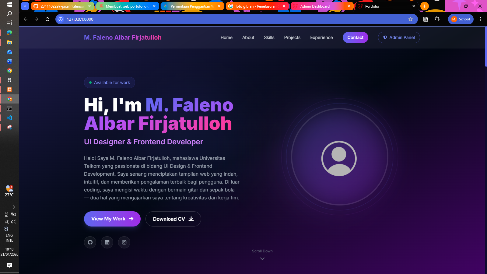
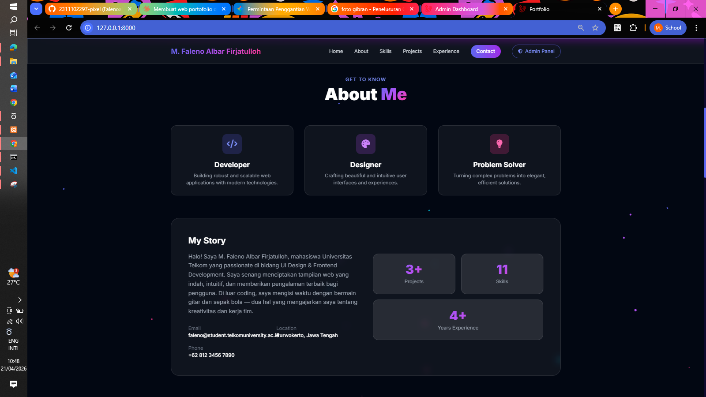
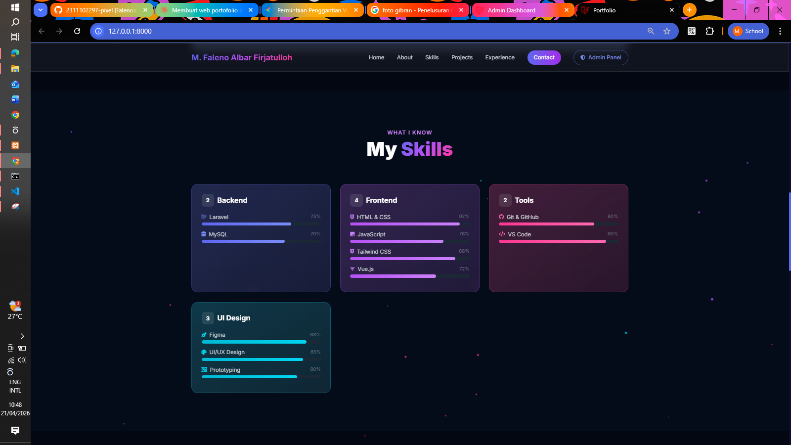
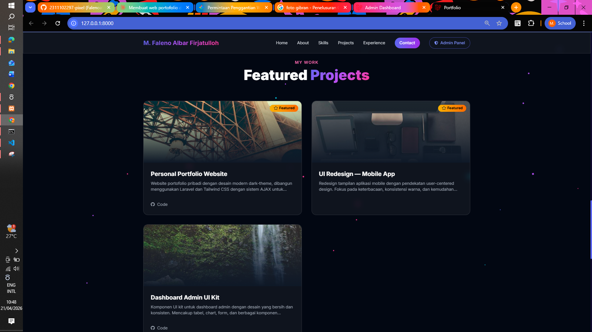
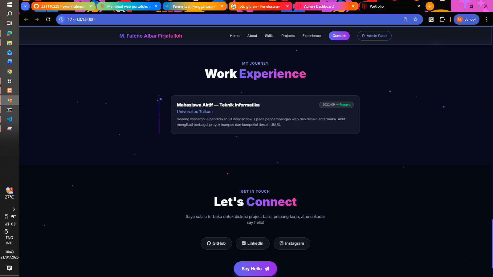

---

### 3.2 Halaman Login

Halaman autentikasi administrator menggunakan Laravel Breeze. Hanya pengguna yang terdaftar pada *database* yang dapat masuk untuk mengakses *dashboard* pengelolaan data.

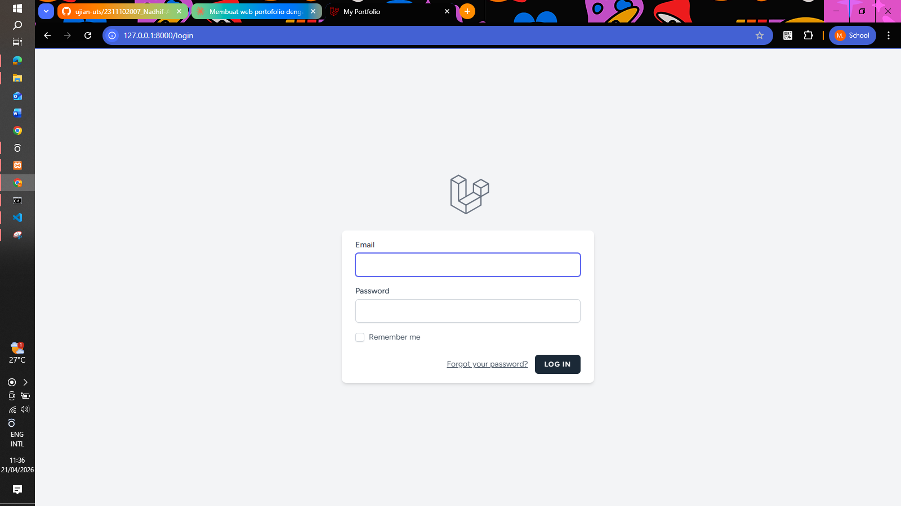

---

### 3.3 Halaman Dashboard Admin — Profile Settings

Halaman pengisian untuk mengelola dan memperbarui informasi identitas profil utama, meliputi nama, judul profesional, teks bio, unggah foto profil, unggah CV (PDF), serta tautan media sosial LinkedIn, GitHub, dan Instagram.

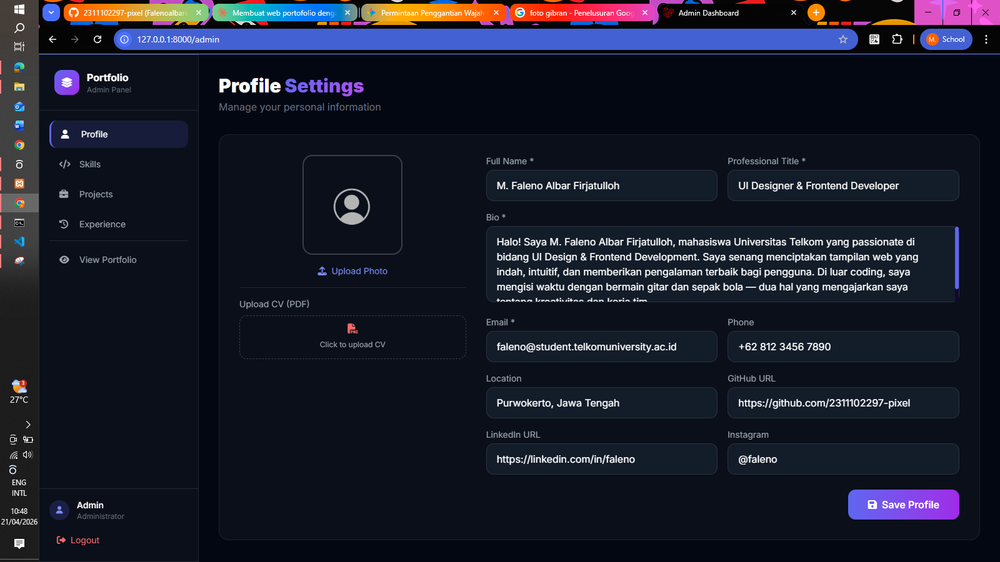

---

### 3.4 Halaman Dashboard Admin — Skills Management

Halaman manajemen data keahlian dalam format tabel. Admin dapat menambah *skill* baru, memperbarui nama, kategori, level (ditampilkan sebagai *progress bar*), dan ikon *Font Awesome*, serta menghapus *skill* yang tidak relevan.

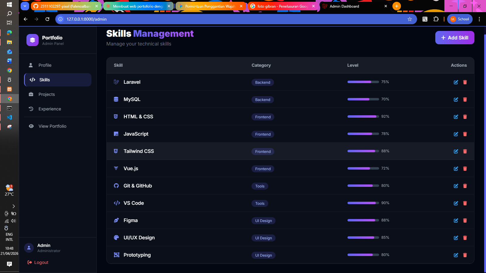)
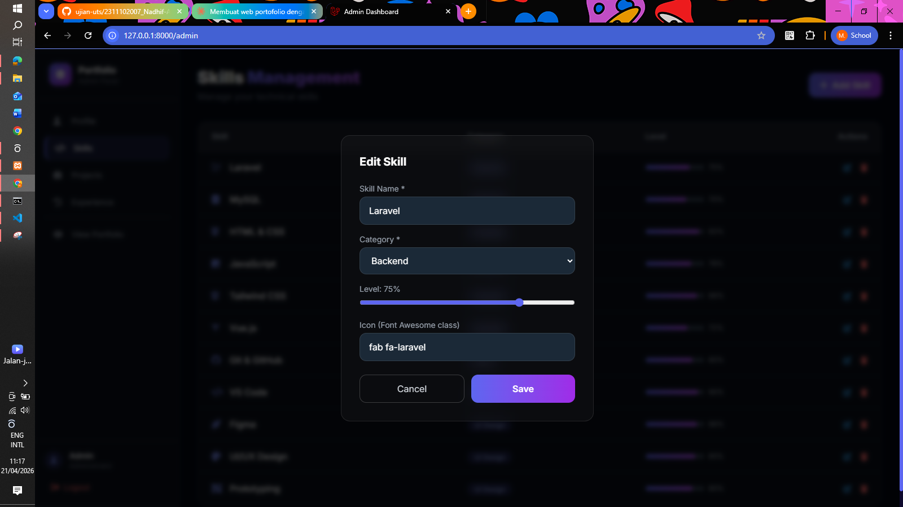)

---

### 3.5 Halaman Dashboard Admin — Projects Management

Halaman pengelolaan portofolio proyek dalam tampilan *card grid*. Admin dapat menambahkan gambar proyek melalui fitur *upload*, melengkapi deskripsi, *tech stack* (dipisahkan koma), link GitHub dan Live Demo, serta menandai sebagai *Featured Project*.

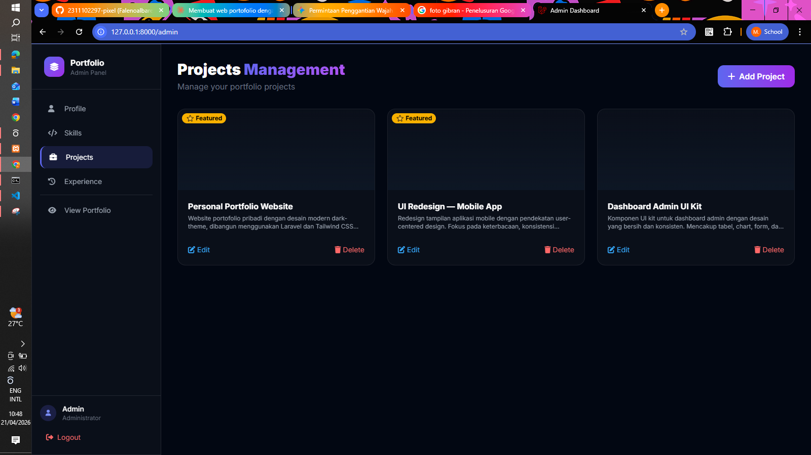
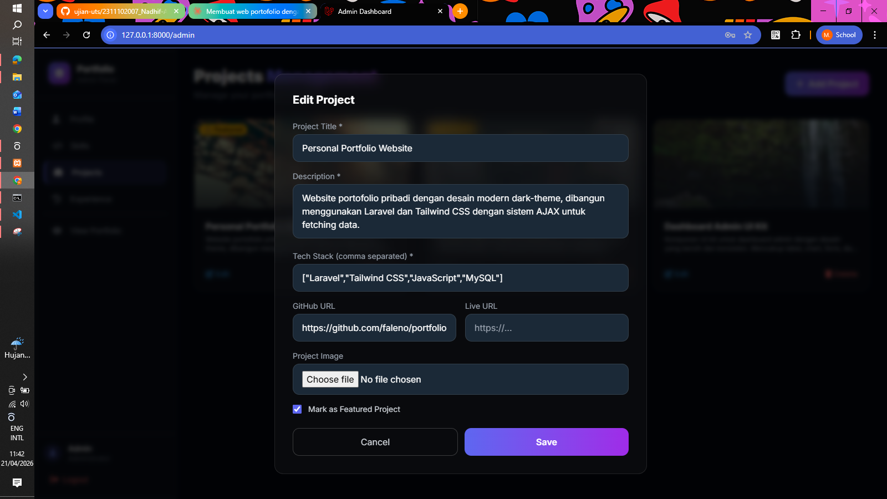

---

### 3.6 Halaman Dashboard Admin — Experience Management

Halaman manajemen riwayat pengalaman. Admin dapat menambah, mengedit, dan menghapus data pengalaman beserta periode waktu. Terdapat checkbox *"Currently working here"* untuk menandai pekerjaan yang masih aktif (*Present*).

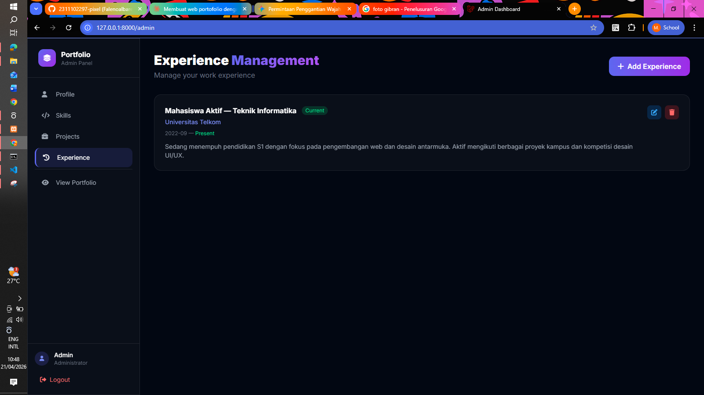
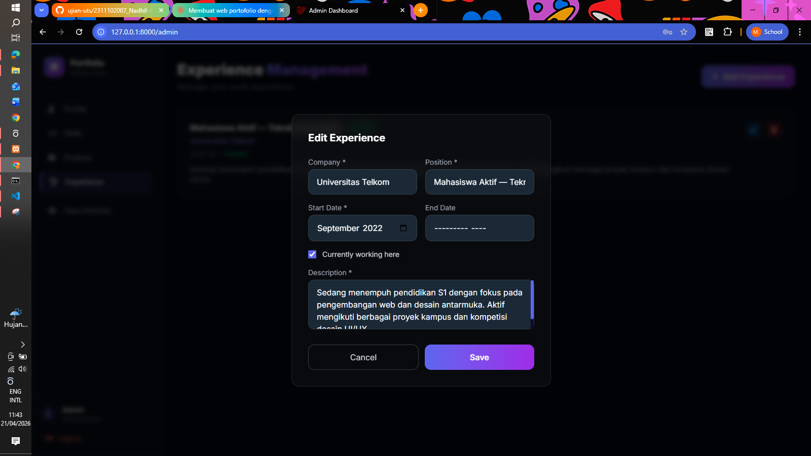

---

## 4. Kesimpulan

Proyek portofolio personal berbasis web yang dirancang ini membuktikan diri sukses menjawab setiap detail tuntutan penugasan di masa evaluasi UTS secara kohesif. Spesifikasi pilar layaknya kerangka integrasi **Laravel 11** bersama **MySQL** sebagai basis data relasional, pemakaian tata busana HTML melalui **Tailwind CSS** dengan desain *dark mode glassmorphism*, proteksi pengelolaan data spesifik *dashboard* kontrol admin menggunakan *middleware* autentikasi **Laravel Breeze**, fitur unggah berkas untuk foto profil, berkas CV maupun gambar proyek menggunakan **Laravel Storage**, beserta mekanisme aliran data non-konvensional **AJAX** berbasis Fetch API (memisahkan pengaksesan data secara asinkron, menepis integrasi *direct view rendering*) semuanya terlaksana seutuhnya. Karya akhirnya bukan sekadar prototipe tugas mentah, melainkan sebuah web personal sungguhan yang mantap diakomodasi untuk kepentingan karir perorangan ke depannya.

---

## 5. Cara Menjalankan Aplikasi

```bash
# 1. Clone repository
git clone https://github.com/2311102297-pixel/portfolio.git
cd portfolio

# 2. Install dependencies PHP & JavaScript
composer install
npm install

# 3. Setup environment
cp .env.example .env
php artisan key:generate

# 4. Konfigurasi database di file .env
# DB_CONNECTION=mysql
# DB_HOST=127.0.0.1
# DB_PORT=3306
# DB_DATABASE=portfolio
# DB_USERNAME=root
# DB_PASSWORD=

# 5. Jalankan migrasi dan seeder
php artisan migrate --seed

# 6. Buat symlink storage untuk akses file publik
php artisan storage:link

# 7. Build assets Tailwind CSS
npm run build

# 8. Jalankan development server
php artisan serve
```

**Akses Aplikasi:**

| URL | Keterangan |
|-----|------------|
| `http://127.0.0.1:8000` | Landing Page Portfolio |
| `http://127.0.0.1:8000/login` | Halaman Login Admin |
| `http://127.0.0.1:8000/admin` | Dashboard Admin |

**Kredensial Admin Default:**

| Field | Value |
|-------|-------|
| Email | `admin@portfolio.com` |
| Password | `password` |

---

## 6. Referensi

- **Laravel Documentation**: [https://laravel.com/docs](https://laravel.com/docs)
- **Laravel Breeze**: [https://laravel.com/docs/starter-kits#laravel-breeze](https://laravel.com/docs/starter-kits#laravel-breeze)
- **Laravel Storage**: [https://laravel.com/docs/filesystem](https://laravel.com/docs/filesystem)
- **Tailwind CSS**: [https://tailwindcss.com/docs](https://tailwindcss.com/docs)
- **Font Awesome Icons**: [https://fontawesome.com](https://fontawesome.com)
- **Fetch API (AJAX)**: [https://developer.mozilla.org/en-US/docs/Web/API/Fetch_API](https://developer.mozilla.org/en-US/docs/Web/API/Fetch_API)